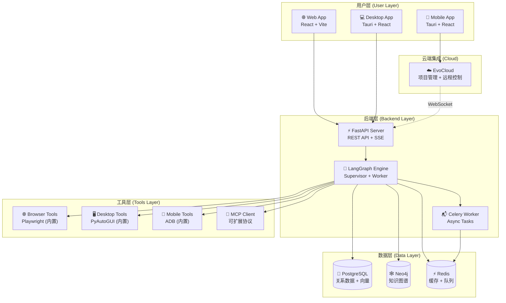
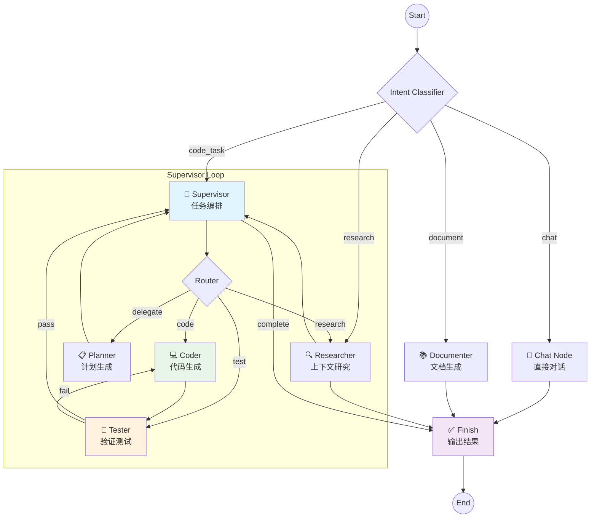
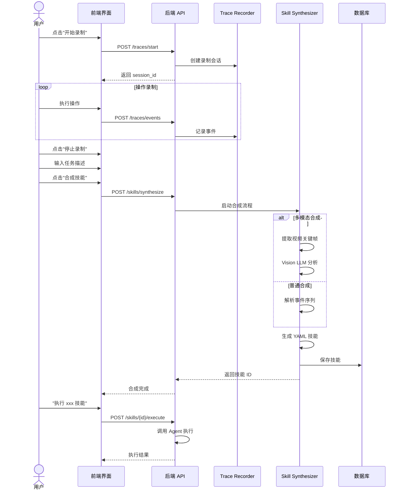
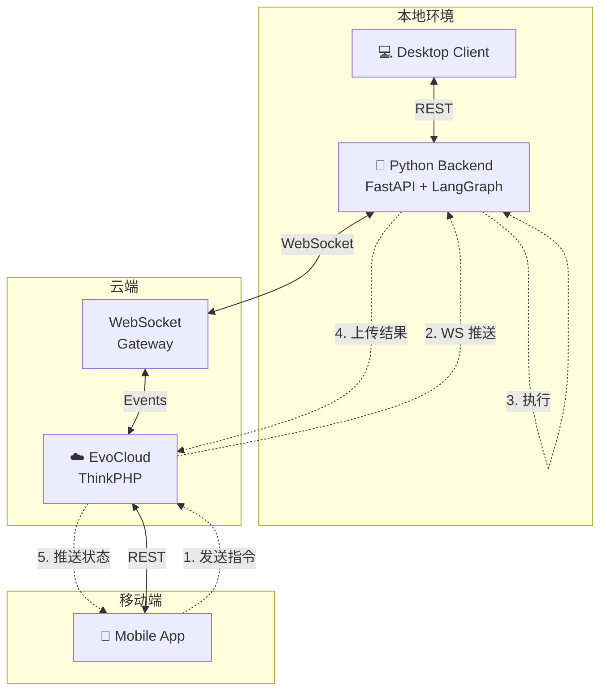
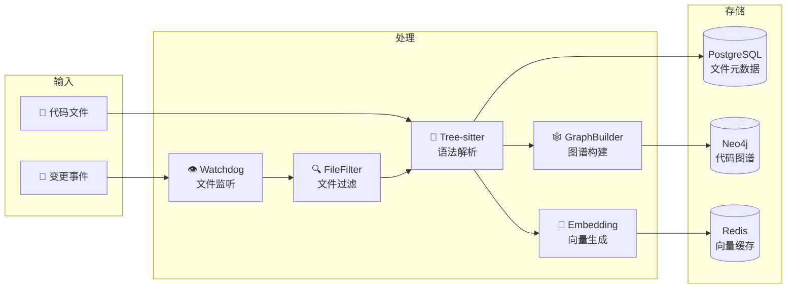

# EvoLoop - 通用智能体系统 (Universal Agent System)

EvoLoop 是一个先进的**通用智能体系统**，旨在跨多个环境（Web、桌面和移动端）自主规划、研究、编码和执行任务。基于 **LangGraph** 构建，它编排了一组专业的智能体（Agent）来处理复杂的**任务循环 (Task Loops)**，具备自我纠错和深度上下文感知能力。

## 🌟 核心特性

- **🧠 自主编排 (Multi-Agent Orchestration)**: 基于 LangGraph 的多智能体工作流，支持 Supervisor 动态路由和 Worker 节点执行，实现无限层级任务委派
- **🕸️ 图谱情节记忆 (Graph-RAG Episodic Memory)**: 将任务经验存储为 Neo4j 知识图谱，Agent 自动回忆相似历史，避免重复错误
- **🧩 动态工具与 MCP 扩展**:
  - **Runtime Tool Creation**: Agent 能在运行时编写 Python 工具并立即注册
  - **MCP Management**: 支持动态挂载/卸载符合 Model Context Protocol 的外部工具服务
- **🌐 全平台控制 (Omni-Platform Control)**: 内置 Browser/Desktop/Mobile 控制工具，基于 Playwright/PyAutoGUI/ADB
- **☁️ EvoCloud 集成**: 本地智能体与云端项目管理实时同步，支持 WebSocket 远程控制
- **📚 深度代码理解**: 使用 Neo4j + Tree-sitter 进行语义索引和架构推断
- **🗣️ 多模态交互**: 支持图片输入、视频录制分析、移动端拍照指令
- **🛡️ Human-in-the-Loop 2.0**: 关键决策挂起审批、随时中断恢复、自主模式切换
- **📖 自动化文档**: 一键生成项目 Wiki 和架构文档

---

## 📋 目录

- [系统架构](#系统架构)
- [安装部署](#安装部署)
- [使用示例](#使用示例)
- [开发指南](#开发指南)
- [API 文档](#api-文档)
- [许可证](#许可证)

---

## 🏗 系统架构

### 整体架构



### 核心组件

| 层级 | 组件 | 技术 | 说明 |
|------|------|------|------|
| 前端 | Desktop | Tauri v2 + React 19 | 跨平台桌面应用 |
| 前端 | Mobile | Tauri v2 + React 19 | Android/iOS 应用 |
| 后端 | API Server | FastAPI | REST API 和 SSE 流 |
| 后端 | Agent Engine | LangGraph | 多智能体工作流编排 |
| 后端 | Async Worker | Celery + Redis | 异步任务处理 |
| 工具 | Browser Tools | Playwright | Web 自动化 |
| 工具 | Desktop Tools | PyAutoGUI + AppleScript | 桌面控制 |
| 工具 | Mobile Tools | ADB + UIAutomator2 | 移动设备控制 |
| 工具 | MCP Client | Model Context Protocol | 外部工具扩展 |
| 数据 | PostgreSQL | pgvector | 关系数据 + 向量存储 |
| 数据 | Neo4j | 图数据库 | 知识图谱和代码索引 |
| 数据 | Redis | 内存数据库 | 缓存和消息队列 |

### Agent 工作流 (LangGraph)



### 技能学习流程



### EvoCloud 远程控制架构



### 代码索引架构



---

## 🚀 安装部署

### 环境要求

- **Docker & Docker Compose** (v2.0+)
- **Python** 3.11+ (推荐 3.12)
- **uv** (Python 包管理器) - [安装指南](https://docs.astral.sh/uv/)
- **Node.js** 20+ 和 npm
- **Rust** (用于 Tauri 构建) - [安装指南](https://www.rust-lang.org/tools/install)
- **macOS** (桌面控制功能需要) / Linux / Windows

### 1. 克隆仓库

```bash
git clone <repository-url>
cd evoloop
```

### 2. 环境配置

#### 2.1 根目录配置

```bash
# 复制根目录环境变量
cp .env.example .env
```

编辑 `.env` 文件，配置基础环境变量。

#### 2.2 后端配置

```bash
cd backend
cp .env.example .env
```

编辑 `backend/.env`，配置以下关键变量：

```bash
# LLM 配置 (必须)
OPENAI_API_KEY=your_openai_api_key
# 或
ANTHROPIC_API_KEY=your_anthropic_api_key

# 数据库配置
POSTGRES_USER=postgres
POSTGRES_PASSWORD=your_secure_password
POSTGRES_DB=app

# Neo4j 配置
NEO4J_USER=neo4j
NEO4J_PASSWORD=your_neo4j_password

# EvoCloud 配置 (可选，用于云端同步)
EVOCLOUD_API_URL=https://your-evocloud-instance.com
EVOCLOUD_CLIENT_ID=your_client_id
EVOCLOUD_CLIENT_SECRET=your_client_secret
```

#### 2.3 前端配置

```bash
cd ../frontend
cp .env.example .env
```

### 3. 启动基础设施

```bash
# 返回根目录
cd ..

# 启动 PostgreSQL, Redis, Neo4j
docker compose up -d db redis neo4j

# 等待数据库就绪 (约 30 秒)
docker compose ps
```

### 4. 后端部署

#### 4.1 安装依赖

```bash
cd backend

# 使用 uv 安装依赖
uv sync

# 激活虚拟环境
source .venv/bin/activate
```

#### 4.2 数据库迁移

```bash
# 初始化 Alembic (首次运行)
# alembic init alembic (已初始化，跳过)

# 执行迁移
alembic upgrade head
```

#### 4.3 启动后端服务

```bash
# 启动 API 服务器 (开发模式)
uv run uvicorn app.main:app --host 0.0.0.0 --port 8000 --reload

# 或使用 fastapi cli
# fastapi dev app/main.py
```

服务启动后，访问 http://localhost:20160/docs 查看 API 文档。

#### 4.4 启动 Celery Worker (新终端)

```bash
cd backend
source .venv/bin/activate

# 启动 Worker
uv run celery -A app.celery_app worker -l info -P solo -Q celery

# 启动 Beat 调度器 (另一个终端)
uv run celery -A app.celery_app beat --loglevel=info
```

### 5. 前端部署

#### 5.1 安装依赖

```bash
cd frontend

# 使用 npm 安装依赖
npm install

# 或使用 pnpm
pnpm install
```

#### 5.2 启动 Web 开发服务器

```bash
npm run dev
```

访问 http://localhost:5173

#### 5.3 启动桌面应用 (Tauri)

```bash
# macOS
npm run tauri dev

# 首次构建需要较长时间，Rust 依赖编译较慢
```

### 6. 移动端部署 (可选)

```bash
cd frontend

# Android
npm run tauri android dev

# iOS (macOS  only)
npm run tauri ios dev
```

### 7. 生产部署

#### Docker 部署

```bash
# 构建并启动所有服务
docker compose up -d --build

# 查看日志
docker compose logs -f backend
docker compose logs -f frontend
```

#### 手动部署

1. 后端: 使用 Gunicorn + Uvicorn
2. 前端: 构建静态文件，使用 Nginx 托管
3. 配置反向代理 (Traefik/Nginx)
4. 配置 SSL 证书

---

## 📖 使用示例

### 示例 1: 基础代码任务

```bash
# 1. 打开桌面应用，新建对话
# 2. 输入以下指令:

"帮我写一个 Python 函数，计算斐波那契数列的第 n 项，要求使用递归并添加缓存优化"
```

Agent 将:
1. 识别为代码生成任务
2. 路由到 Coder 节点
3. 生成带 `@functools.lru_cache` 的递归实现
4. 返回结果并展示代码

### 示例 2: 代码库理解

```bash
# 1. 在项目设置中添加代码库路径
# 2. 输入以下指令:

"分析 backend/app/core/engine 目录的架构，解释各个模块的职责"
```

Agent 将:
1. 调用 `explore_codebase` 工具读取目录结构
2. 使用 LSP 获取符号信息
3. 分析文件依赖关系
4. 生成架构分析报告

### 示例 3: 桌面自动化

```bash
# 输入指令:

"打开 Safari，访问 https://github.com，搜索 'langgraph' 项目"
```

Agent 将:
1. 调用 `window_focus` 激活/打开 Safari
2. 调用 `open_url` 访问 GitHub
3. 调用 `click_element` 点击搜索框
4. 调用 `input_text` 输入 "langgraph"
5. 调用 `press_key` 回车搜索

### 示例 4: 技能录制与学习

```bash
# 1. 点击界面上的 "录制" 按钮开始录制
# 2. 手动执行操作流程 (如: 打开微信 -> 点击通讯录 -> 搜索联系人)
# 3. 点击 "停止录制"
# 4. 输入任务描述: "搜索微信联系人"
# 5. 点击 "合成技能"

# 之后可以直接调用:
"执行搜索微信联系人技能，联系人: 张三"
```

### 示例 5: 多模态视频合成

```bash
# 1. 点击 "开始录屏" 录制操作视频
# 2. 执行复杂操作流程
# 3. 点击 "停止录屏"
# 4. 输入: "将此操作合成为 Expert Guide Skill"

# 系统将:
# - 提取视频关键帧
# - 分析事件序列
# - 使用 Vision LLM 理解界面
# - 生成结构化技能指南
```

### 示例 6: 需求文档分析

```bash
# 1. 在项目中上传需求文档 (PDF/Word/Markdown)
# 2. Agent 自动分析文档内容
# 3. 展示分析结果并请求确认
# 4. 确认后自动拆解为任务列表
# 5. 同步到 EvoCloud 项目管理
```

### 示例 7: MCP 工具扩展

```bash
# 1. 进入设置 -> MCP 管理
# 2. 添加新的 MCP 服务器:

名称: filesystem
命令: npx
参数: ["-y", "@modelcontextprotocol/server-filesystem", "/path/to/dir"]

# 3. Agent 即可使用文件系统工具
"列出 /path/to/dir 下的所有文件"
```

### 示例 8: 远程控制 (移动端)

```bash
# 1. 桌面端登录 EvoCloud 账号
# 2. 移动端安装 App 并登录同一账号
# 3. 在移动端 "设备" 页面绑定桌面端
# 4. 移动端发送指令:

"帮我在电脑上打开 VSCode，并打开 backend 项目"

# 桌面端 Agent 接收指令并执行
```

### 示例 9: 代码重构任务

```bash
# 输入指令:

"重构 backend/app/api/routes/users.py，将数据库操作提取到 service 层"
```

Agent 将:
1. Researcher 读取现有代码
2. Architect 设计新架构
3. Coder 生成新 service 文件
4. Coder 修改 routes 文件
5. Tester 验证修改
6. 展示 Diff 等待确认

### 示例 10: Wiki 生成

```bash
# 输入指令:

"为 backend/app/core 模块生成项目 Wiki"
```

Agent 将:
1. 扫描项目结构
2. 分析模块依赖
3. 生成 Markdown 文档
4. 创建目录和索引
5. 保存到项目 wiki 目录

---

## 🔧 开发指南

### 后端开发

```bash
cd backend

# 运行测试
uv run pytest

# 运行特定测试
uv run pytest tests/unit/core/test_engine.py -v

# 代码格式化
uv run ruff format .
uv run ruff check . --fix

# 类型检查
uv run pyright
```

### 前端开发

```bash
cd frontend

# 运行测试
npm run test

# 代码格式化
npm run lint
npm run format

# 类型检查
npm run typecheck
```

### 添加新工具

1. 在 `backend/app/domain/tools/` 创建工具文件
2. 使用 `@evoloop_tool` 装饰器注册
3. 在 `agent_main.yaml` 中配置工具权限

```python
from app.core.tools import evoloop_tool

@evoloop_tool()
async def my_custom_tool(param: str) -> str:
    """工具描述 (会被 LLM 读取)"""
    return f"Result: {param}"
```

### 添加新 Agent 角色

在 `backend/app/core/engine/config/` 创建 YAML 文件:

```yaml
name: my_specialist
version: "1.0"
nodes:
  - id: worker
    path: "app.core.engine.nodes.worker.worker_node"
    config:
      system_prompt: "You are a specialist in..."
      tools: ["tool_a", "tool_b"]
edges:
  - from: worker
    to: END
```

---

## 📚 API 文档

启动后端后访问:
- **Swagger UI**: http://localhost:20160/docs
- **ReDoc**: http://localhost:20160/redoc

主要 API 端点:

| 端点 | 方法 | 说明 |
|------|------|------|
| `/api/v1/chat` | POST | 发送消息 |
| `/api/v1/stream/chat/{thread_id}` | GET | SSE 流式输出 |
| `/api/v1/learning/skills` | GET/POST | 技能管理 |
| `/api/v1/mcp/servers` | GET/POST | MCP 服务器管理 |
| `/api/v1/projects` | GET/POST | 项目管理 |

---

## 🐛 故障排除

### 常见问题

**1. Neo4j 连接失败**
```bash
# 检查 Neo4j 状态
docker compose ps neo4j

# 查看日志
docker compose logs neo4j

# 重置 Neo4j (会清空数据)
docker compose down -v neo4j
docker compose up -d neo4j
```

**2. Celery Worker 未启动**
```bash
# 检查 Redis 连接
redis-cli ping

# 手动启动 Worker
cd backend
uv run celery -A app.celery_app worker -l debug -P solo
```

**3. Tauri 构建失败**
```bash
# 更新 Rust
cd frontend/src-tauri
rustup update

# 重新安装依赖
npm install
npm run tauri dev
```

**4. LLM 调用失败**
- 检查 `backend/.env` 中的 API Key
- 检查网络连接
- 查看后端日志: `tail -f backend/logs/app.log`

---

## 🤝 贡献指南

1. Fork 仓库
2. 创建特性分支: `git checkout -b feature/my-feature`
3. 提交更改: `git commit -am 'Add new feature'`
4. 推送分支: `git push origin feature/my-feature`
5. 创建 Pull Request

---

## 📄 许可证

本项目采用 MIT 许可证。详情请参阅 [LICENSE](./LICENSE) 文件。

---

## 💬 社区与支持

- **Issues**: [GitHub Issues](https://github.com/your-org/evoloop/issues)
- **文档**: [Wiki](https://github.com/your-org/evoloop/wiki)
- **邮件**: support@evoloop.dev

---

<p align="center">
  <b>Built with ❤️ by EvoLoop Team</b>
</p>
