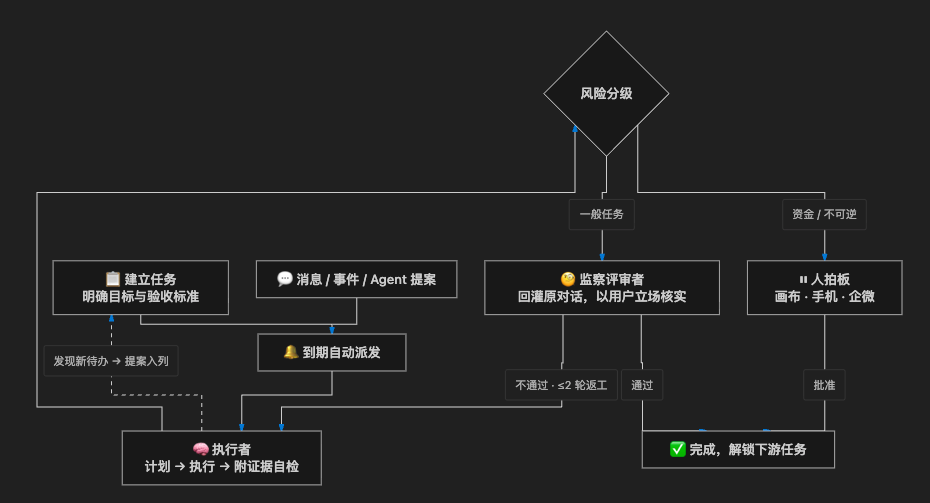

<p align="center">
  
</p>
<p align="center"><b>EvoLoop - 自主值守式任务智能体</b></p>

<p align="center">
  
  
  
  <a href="https://github.com/wonderful-team/evoloop/wiki"></a>
</p>

<p align="center">
  <a href="https://github.com/wonderful-team/evoloop/releases">Releases</a> &nbsp;·&nbsp;
  <a href="https://www.evoloop.cn">Website</a> &nbsp;·&nbsp;
  <a href="https://www.evoloop.cn/agent_multi">Try Online</a> &nbsp;·&nbsp;
  <a href="https://github.com/wonderful-team/evoloop/issues">Issues</a>
</p>

<p align="center">
  <a href="docs/README_EN.md">English</a> | <a href="docs/README_CN.md">中文</a> | <a href="docs/README_JA.md">日本語</a> | <a href="docs/README_KO.md">한국어</a>
</p>

---

EvoLoop 是一个**自主值守式任务智能体**：它不像聊天机器人那样一问一答，而是 7×24 守在你的业务旁边——任务排队、执行、监察验收，遇疑挂起问人。用户只做三件事：**规划任务、验收结果、处理异常**。

覆盖 Web、桌面、移动三端，支持唤醒词的自然语音对话。Agent 底座采用 [OpenHands](https://github.com/All-Hands-AI/OpenHands)。

🌐 官网 [evoloop.cn](https://evoloop.cn) · 💻 [GitHub](https://github.com/wonderful-team/evoloop)

## 🌟 核心特性

| 能力 | 说明 |
|---|---|
| **长时程执行** | 单任务 300+ 连续步数，小时级稳定运行，自动错误恢复 |
| **跨设备 A2A 协作** | 设备间 Agent 发现、委派、回传，异步完成 |
| **值守执行** | 任务到点自动排队干活，每一步进度实时留底，做完了附上可核对的证据；执行者说「做完了」不算数——结果会以你的名义送回你提需求的对话，由监察评审者替你核实「是不是真做对了」。钱和不可逆的操作，永远等人拍板才动手 |
| **模仿学习** | 你演示一遍，它学会一套——你点鼠标走流程它记轨迹，丢一段录屏它逐帧看懂，提炼成可复用的技能或「宏」；之后同样的活机械复跑、不烧算力，遇到环境变化自动交回 AI 想办法；AI 自己写的流程，必须实测通过才允许上岗 |
| **随叫随到** | 语音、网页、企微/微信客服、手机——消息从哪来都一视同仁。常见指令直接秒办、不惊动大模型；说不清或太复杂的，才交给 AI 认真想 |
| **语音对话** | 喊一声「你好Evo」就能开口，说话可以打断它播报，也能帮你听写代发，语音不出你的设备 |
| **替你动手** | 在你已有的设备上干活——浏览器里的网页、电脑桌面上的应用、Android / iOS / 鸿蒙手机，它都能亲自操作；人不在电脑前，手机上也能拍板、验收 |
| **会找人帮忙（A2A）** | 这台机器上的 Agent 可以把活儿转给你另一台设备上的 Agent 去干——任务派出去时主线自动等待，结果回传立刻接续，整个委派过程在界面上实时可见 |
| **有保险丝** | 拿不准就停下来问人，绝不编一个答案糊弄；危险操作有权限门卡着，密码密钥不会出现在输出里，发现原地打转会果断掐停 |
| **接得进生态** | 外部工具按 MCP 协议随时接入或摘除；业务知识打包成能力包按需装配——今天接管商城，明天换接管别的系统，不用改核心代码 |

---

## 📋 目录

- [产品演示](#产品演示)
- [系统架构](#系统架构)
- [值守任务系统](#值守任务系统-autonomous-duty)
- [安装部署](#安装部署)
- [构建与发布](#构建与发布)
- [开发指南](#开发指南)

---

## 🎬 产品演示

**EvoLoop 完整功能演示**

https://www.evoloop.cn/assets/video/demo.mp4

**值守任务系统演示 1**

https://www.evoloop.cn/assets/video/duty1.webm

**值守任务系统演示 2**

https://www.evoloop.cn/assets/video/duty2.webm

<table>
  <tr>
    <td valign="top">
      
      <p align="center"><em>Desktop</em></p>
    </td>
    <td valign="top">
      
      <p align="center"><em>Mobile</em></p>
    </td>
  </tr>
</table>

---

## 🏗 系统架构

| 层 | 组成 |
|------|------|
| 客户端 | Web（React + Vite）、桌面端（Tauri + Rust 语音管线）、移动端（React Native，支持远程拍板/验收） |
| 服务 | FastAPI：REST + SSE + 语音 WebSocket 通道 |
| 引擎 | 基于 [OpenHands](https://github.com/All-Hands-AI/OpenHands) SDK 的 Agent 引擎：计划 → 工具执行 → 结构化自检 → 存疑挂起问人 |
| 路由 | 指令分流：常见指令直接执行，拿不准的才交给 Agent 思考 |
| 值守 | 任务队列 + Supervisor 调度：到期执行、崩溃收敛、熔断护栏 |
| 扩展 | MCP 工具服务、能力包（SOP）、运行时工具创建、宏引擎（确定性回放 + 自愈） |
| 数据 | 桌面内置（SQLite + LanceDB，数据不出本机）/ SaaS 服务端（PostgreSQL + Redis） |

---

## ⏱ 值守任务系统 (Autonomous Duty)

### 解决什么问题

把长程、复杂任务交给对话式 Agent，常见结局是：上下文被噪音淹没甚至「腐烂」，模型疲惫提前退出、谎称完成、不正面回复、交付物偏离目标。而传统「固定话术 + 固定间隔」的自动巡检里，任务没有状态、没有验收、没有依赖，Agent 干活发现的待办也无处回流——「把业务交给 Agent 自动运转」不成立。

### 目标

让 Agent 可靠地长期运转一个业务：每个任务建立时就带着场景、目标与验收标准；执行结果必须经过**监察评审者**以用户立场核实，「谎称完成」过不了关；资金与不可逆操作永远由人拍板。人只需在拍板、验收、仲裁三个时刻出现。

### 任务执行流程

<p></p>

### 适合的场景

- **电商 / 零售运营托管**：选品调研 → 定价 → 上架 → 日常巡检（缺货、差评、异常订单）——首个试点场景是「接管一座商城」
- **内容与增长流水线**：策划 → 写稿 → 素材制作 → 多平台发布 → 投放复盘，每步留痕、每步验收
- **数据与巡检机器人**：经营日报、库存 / 资金 / 指标定时巡检，异常即告警、即提案
- **第三方事件持续响应**：订单、工单、审核消息自动入列处理，全程可审计
- **企业后台 SOP**：审批辅助、对账、盘点等可重复、可验收的流程
- **研发项目管家**：代码库巡检、依赖安全检查、备份验证、需求池整理
- **客服接待**：企微 / 微信客服轮巡自动应答，资金类问题转人工
- **人不盯盘**：7×24 值守循环，人只在拍板、验收、仲裁三个时刻出现

换一个接管对象（商城 → CRM → 供应链 → 内容站），只需更换能力包与任务数据，调度与执行层零改动。

### 工作台

无限画布主视图：异构产物卡 + 依赖连线，视觉焦点自动跟随 Agent 当前节点；拍板 / 验收 / 评审卡内嵌在节点上。人随时可答三问——**Agent 正在干什么、此前干了什么、还要干什么**。

---

## 🚀 安装部署

EvoLoop 有三种部署形态，按需选择：

| 模式 | 场景 | 栈 | 配置文件 |
|---|---|---|---|
| **桌面内置** | 个人电脑、本地使用 | SQLite + LanceDB + Huey | `.env.prod.desktop` |
| **Web 单用户** | 个人服务器 | SQLite + LanceDB + Huey | `.env.prod.web.single` |
| **Web 多用户** | 团队 / 企业生产 | PostgreSQL + Redis + Meilisearch + Neo4j + Celery | `.env.prod.web.multi` |

### 开发模式（推荐）

```bash
git clone https://github.com/wonderful-team/evoloop.git
cd evoloop
./deploy/dev.sh
```

启动后访问 `http://localhost:20160/docs` 查看交互式 API 说明。

### 桌面内置模式（个人电脑，零外部依赖）

后端内置 SQLite + LanceDB + Huey，随桌面应用单机即起，数据不出本机：

```bash
# 克隆仓库
git clone https://github.com/wonderful-team/evoloop.git
cd evoloop

# 后端
cd backend
cp .env.prod.desktop .env      # 填入 LLM API Key
uv sync
uv run python bin/run.py api

# 桌面端（Tauri，含语音唤醒；后端作为 sidecar 随应用启动）
cd frontend
npm install
npm run tauri dev
```

### Web 单用户模式（个人服务器）

```bash
cp .env.prod.web.single .env
uv run python bin/run.py api
# 前端: npm run dev
```

### Web 多用户模式（团队 / 企业生产）

```bash
cp .env.prod.web.multi .env
# 配置 PostgreSQL / Redis / Meilisearch / Neo4j
docker compose up -d
```

---

## 📦 构建与发布

```bash
# 桌面端打包
./deploy/build.sh macos-arm64 --env-file=.env.prod.desktop
./deploy/build.sh macos-x86_64 --env-file=.env.prod.desktop
./deploy/build.sh windows --env-file=.env.prod.desktop

# Web 静态资源构建
./deploy/build.sh web --env-file=.env.prod.web.multi

# 模型下载
./deploy/download_models.sh --models nomic-embed,paraformer-zh
```

---

## 🔧 开发指南

```bash
# 后端：测试 / 格式化 / 类型检查
cd backend
uv run pytest
uv run ruff format . && uv run ruff check . --fix
uv run pyright

# 前端：测试 / lint / 类型检查
cd frontend
npm run test
npm run lint && npm run typecheck
```

添加工具：在 `backend/app/domain/tools/` 新建文件并用 `@evoloop_tool` 装饰器注册；业务能力（SOP）以能力包 / 技能形式挂载，不改引擎。

---

## 🤝 贡献指南

1. Fork 仓库
2. 创建特性分支: `git checkout -b feature/my-feature`
3. 提交更改: `git commit -am 'Add new feature'`
4. 推送分支: `git push origin feature/my-feature`
5. 创建 Pull Request

---

## 💬 社区与支持

- **官网**: [evoloop.cn](https://evoloop.cn)
- **GitHub**: [wonderful-team/evoloop](https://github.com/wonderful-team/evoloop)
- **Issues**: [GitHub Issues](https://github.com/wonderful-team/evoloop/issues)
- **邮件**: [preterchan@gmail.com](mailto:preterchan@gmail.com)
- **微信**: 扫码加入交流群

<p align="center">
  
</p>

---

<p align="center">
  <b>Built with ❤️ by EvoLoop Team</b>
</p>
