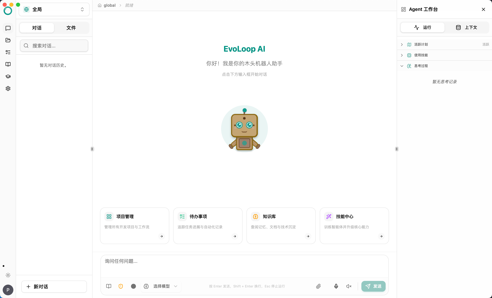
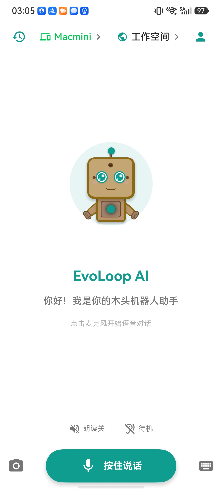
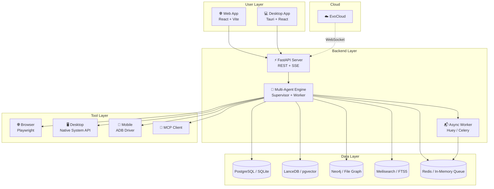

<p align="center">
  
</p>
<p align="center"><b>EvoLoop Agent</b></p>

<p align="center">
  Universal Agent System · One Person, One Digital Fleet
</p>

<p align="center">
  
  
  
  <a href="https://github.com/wonderful-team/evoloop/wiki"></a>
</p>

<p align="center">
  <a href="https://github.com/wonderful-team/evoloop/releases">Releases</a> &nbsp;·&nbsp;
  <a href="https://www.evoloop.cn">Website</a> &nbsp;·&nbsp;
  <a href="https://www.evoloop.cn/agent_multi">Try Online</a> &nbsp;·&nbsp;
  <a href="https://github.com/wonderful-team/evoloop/issues">Issues</a>
</p>

<p align="center">
  <a href="README.md">English</a> | <a href="docs/README_CN.md">中文</a> | <a href="docs/README_JA.md">日本語</a> | <a href="docs/README_KO.md">한국어</a>
</p>

---

**EvoLoop** is a cross-platform, long-horizon, collaborative universal agent system. It plans complex tasks autonomously, controls browsers, desktops, and external devices directly, and remembers historical experience — getting better the more you use it.

From personal computers to Linux servers, from single devices to distributed multi-agent networks, EvoLoop evolves AI from a "chat box" into an autonomous employee that can execute and close loops in real business workflows.

<table>
  <tr>
    <td valign="top">
      
      <p align="center"><em>Desktop</em></p>
    </td>
    <td valign="top">
      
      <p align="center"><em>Mobile</em></p>
    </td>
  </tr>
</table>

---

## 🌟 Highlights

| Capability | Description |
| :--- | :--- |
| **Long-Horizon Execution** | 300+ continuous steps per task, stable for hours, with automatic error recovery |
| **A2A Multi-Agent Collaboration** | Agents across devices discover, delegate, and return results asynchronously |
| **Cross-Device Swarm Control** | Phones and computers control each other; one PC can manage multiple Android devices |
| **Imitation Learning** | Generate reusable automation skills from screen recordings or operation traces |
| **Chat + Terminal Dual Mode** | Natural language chat and native terminal in one unified desktop interface |
| **Server / Edge Deployment** | Deploy as a persistent node on Linux servers, cloud hosts, or embedded devices |
| **Graph-RAG Episodic Memory** | Archive experiences automatically and avoid repeating the same mistakes |
| **Dynamic Tools + MCP** | Create Python tools at runtime and mount MCP services natively |
| **Deep Code Understanding** | Tree-sitter + vectors + code graph for navigating large codebases |
| **Human-in-the-Loop** | High-risk actions require human confirmation; core data stays local by default |

---

## 🏗 System Architecture



> The mobile app is part of EvoLoop's commercial offering and is not included in this open-source repository. This repo controls external mobile devices via ADB.

---

## 🚀 Quick Start

### 1. Clone the repository

```bash
git clone https://github.com/wonderful-team/evoloop.git
cd evoloop
```

### 2. Choose an environment template

```bash
# Desktop / local development (embedded, zero middleware)
cp .env.prod.desktop .env

# Web single-user server (embedded)
# cp .env.prod.web.single .env

# Web multi-user production (requires PostgreSQL/Redis/Meilisearch/Neo4j)
# cp .env.prod.web.multi .env
```

### 3. Start the development environment

```bash
./deploy/dev.sh
```

Once started, visit http://localhost:20160/docs for the API docs.

### 4. Server deployment

```bash
# One-line Docker install for Linux / macOS
./deploy/install.sh

# CentOS / RHEL / Baota panel
./deploy/install_centos.sh

# Remote Linux server deployment
./deploy/deploy.sh --host=your-server-ip --env-file=.env.prod.web.multi
```

For more details, see [deploy/README.md](./deploy/README.md).

---

## 🖥️ Deployment Modes

| Mode | Scenario | Stack | Config File |
| :--- | :--- | :--- | :--- |
| **Desktop Embedded** | Personal computer, local use | SQLite + LanceDB + Huey | `.env.prod.desktop` |
| **Web Single-User** | Personal server | SQLite + LanceDB + Huey | `.env.prod.web.single` |
| **Web Multi-User** | Team / enterprise production | PostgreSQL + Redis + Meilisearch + Neo4j + Celery | `.env.prod.web.multi` |

---

## 🤖 Models

EvoLoop connects to mainstream LLMs through EvoCloud, and you can switch models with one click in the Web console — no manual config editing required.

| Type | Representative Models |
| :--- | :--- |
| Chat | GPT-4o, Claude, Kimi, DeepSeek, Qwen, Doubao |
| Vision | GPT-4o Vision, Claude 3.5 Sonnet, Kimi Vision |
| Embedding | nomic-embed, BGE, OpenAI Embedding |
| ASR/TTS | FunASR, paraformer-zh, System TTS |

---

## 🧠 Memory & Knowledge

- **Three-tier memory**: short-term conversation context → long-term experience archive → project hot memory (MEMORY.md)
- **Automatic distillation**: extracts valuable information after each task to avoid repeated mistakes
- **Project profile**: auto-detects project structure, generates tech-stack summaries, and builds code graphs
- **Knowledge capture**: captures concepts, decisions, and SOPs from conversations and code changes

---

## 🧩 Tools & Skills

**Tools**: file I/O, terminal, browser, web search, code retrieval, scheduler, memory recall, MCP, and more.

**Skills**: generate reusable skills from natural language descriptions or screen recordings, with parameterization and one-click invocation.

---

## 📦 Build & Release

```bash
# Desktop
./deploy/build.sh macos-arm64 --env-file=.env.prod.desktop
./deploy/build.sh macos-x86_64 --env-file=.env.prod.desktop
./deploy/build.sh windows --env-file=.env.prod.desktop

# Web static assets
./deploy/build.sh web --env-file=.env.prod.web.multi

# Model download
./deploy/download_models.sh --models nomic-embed,paraformer-zh
```

---

## 📋 Changelog

> **v0.7.0** — Cross-device swarm control, long-horizon execution, Chat + Terminal dual mode, imitation learning, server/edge deployment, A2A multi-agent collaboration.

For full history, see [Releases](https://github.com/wonderful-team/evoloop/releases).

---

## 🤝 Community & Support

- **Issues**: [GitHub Issues](https://github.com/wonderful-team/evoloop/issues)
- **Docs**: [Wiki](https://github.com/wonderful-team/evoloop/wiki)
- **Email**: wonderful@develop-assistant.cn

---

## ⚠️ Disclaimer

1. This project is licensed under the [MIT License](LICENSE) for technical research and learning.
2. Agent mode consumes significantly more tokens than regular chat — please monitor costs. The Agent can access your local operating system, so use it only in trusted environments.
3. High-risk operations trigger human confirmation. Please keep your EvoCloud credentials and local data secure.
