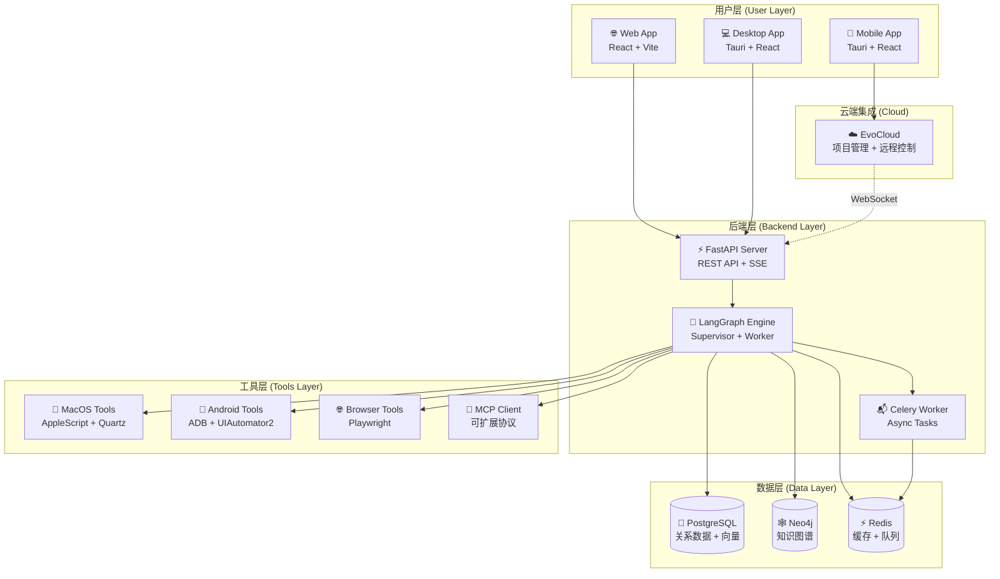
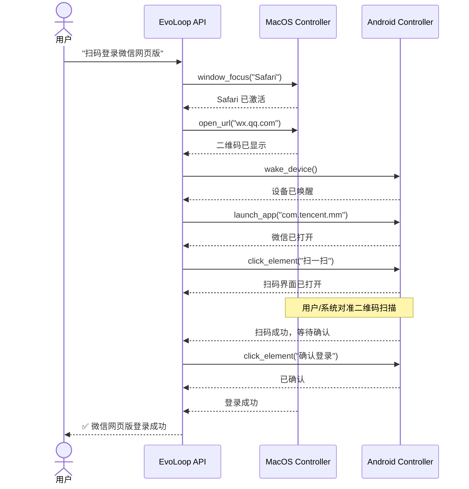
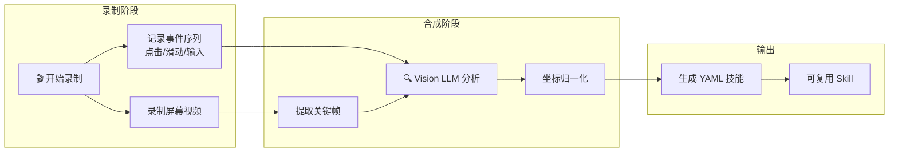

# EvoLoop - 通用全自主式AI智能体 (Universal Autonomous AI Agent)

> **只需说一句话，EvoLoop 就能帮你完成跨 MacOS 与 Android 的复杂任务。**

EvoLoop 是一个**通用全自主式 AI 智能体**，能够像人类一样理解、规划和执行跨平台任务。只需一句自然语言指令，它就能自动操作 **MacOS 桌面**、控制 **Android 手机**，甚至协调两端协同完成复杂工作流（如"在电脑上打开网页，用手机扫码登录，然后抓取数据"）。

基于 **LangGraph** 构建的多智能体架构，EvoLoop 不仅能执行任务，更能通过**技术模仿学习**观察你的操作，自动转化为可复用的技能。

---

## 🎬 30 秒快速了解

```
你："帮我登录微信公众号后台，下载昨天的数据报表"

EvoLoop：
  1. 打开 Mac 上的 Chrome
  2. 访问 mp.weixin.qq.com
  3. 显示二维码
  4. 【自动】操作 Android 手机打开微信
  5. 【自动】点击"扫一扫"
  6. 【自动】对准 Mac 屏幕扫码
  7. 【自动】点击手机上"确认登录"
  8. 等待页面跳转
  9. 点击"数据统计" → "昨日概况"
  10. 点击"导出报表"
  11. 保存到桌面
  ✅ 完成！报表已保存：~/Desktop/微信数据报表_2024-01-15.xlsx
```

---

## 🌟 核心能力

### 🖥️ MacOS 全能力控制

EvoLoop 能够像专业 Mac 用户一样操作你的电脑：

| 能力类别 | 具体功能 | 示例场景 |
|---------|---------|---------|
| **窗口管理** | 激活、移动、调整大小、最小化/最大化 | "把 Safari 窗口放到右边，VSCode 放左边" |
| **菜单操作** | 点击任意菜单项（支持多级路径） | "点击 Safari 的文件 > 导出为 PDF" |
| **Dock 控制** | 启动应用、读取角标、点击图标 | "查看微信 Dock 角标有多少未读消息" |
| **快捷键** | 发送任意组合键 | "按 Command+Shift+4 截图" |
| **Spaces 切换** | 切换桌面空间、移动窗口 | "把当前窗口移到第二个 Space" |
| **系统截图** | 全屏/区域截图、元素标注 | "截图并标注当前页面的所有按钮" |

**核心技术**：基于 AppleScript + Quartz + PyAutoGUI 的原生级控制

---

### 📱 Android 设备控制

通过 USB 或 WiFi 连接，EvoLoop 可以控制 Android 手机/平板：

| 能力类别 | 具体功能 | 示例场景 |
|---------|---------|---------|
| **屏幕操作** | 点击、滑动、长按、手势 | "向上滑动查看下一页" |
| **输入操作** | 文本输入、键盘事件 | "在搜索框输入'张三'" |
| **应用控制** | 启动、关闭、切换应用 | "打开微信，进入通讯录" |
| **屏幕录制** | 录制操作视频 | "录下我接下来的操作" |
| **UI 解析** | 获取界面元素结构 | "列出当前页面的所有按钮" |

**核心技术**：基于 ADB + UIAutomator2 + scrcpy

---

### 🔗 跨端协同（独家能力）

EvoLoop 的核心亮点是能够**协调 MacOS 和 Android 两端协同工作**，完成单端无法完成的复杂任务：

#### 场景 1: 扫码登录
```
指令："登录网页版微信"

MacOS 端:                 Android 端:
  打开 Safari               打开微信
  访问 wx.qq.com            点击"扫一扫"
  显示二维码        ←────   对准屏幕扫码
  等待确认          ←────   点击"确认登录"
  登录成功 ✓
```

#### 场景 2: 双端数据同步
```
指令："把手机上刚拍的截图传到电脑桌面"

Android:                  MacOS:
  打开相册                  等待接收
  选择最新截图     ────→   保存到桌面
  点击分享
  选择"发送到电脑"
```

#### 场景 3: 验证码自动填充
```
指令："登录网银"

MacOS:                    Android:
  打开银行网站              等待验证码短信
  输入用户名密码   ────→   读取短信验证码
  等待验证码       ←────   返回验证码
  自动填充并登录
```

---

### 🧠 技术模仿学习（Technical Imitation Learning）

EvoLoop 能**观察你的操作并学习**，将人工演示转化为可复用的自动化技能。

#### 录制模式

```bash
# 1. 开始录制
你："我要录制一个'发送微信模板消息'的技能"

# 2. 执行操作（EvoLoop 在后台记录）
你：打开微信 → 搜索"微信公众平台" → 点击菜单 → 输入内容 → 发送

# 3. 结束录制
你："保存技能，命名为'发送模板消息'"

# 4. 之后直接使用
你："执行发送模板消息技能，内容为：今日销售额 10,000 元"
EvoLoop: ✅ 已发送
```

#### 多模态视频合成（独家）

不仅记录操作步骤，更能分析录制的视频：

```
输入: 操作视频 + 事件序列
    ↓
Vision LLM 分析关键帧
    ↓
生成结构化 Skill Guide:
  - 步骤 1: 点击微信图标 (B1)
  - 步骤 2: 等待界面加载
  - 步骤 3: 点击搜索框 (T1)
  - ...
    ↓
保存为可复用的 YAML 技能
```

**核心技术**：关键帧提取 + 坐标归一化 + Vision LLM (Kimi)

---

### 🤖 多智能体编排

复杂任务自动拆解为子任务，由不同专业 Agent 协作完成：

```
用户: "重构用户认证模块"

Engineering Manager:
  └── 分析需求 → 创建计划
      ├── 委派给 Architect: "设计新架构"
      │       └── 输出: 架构文档
      ├── 委派给 Researcher: "分析现有代码"
      │       └── 输出: 代码分析报告
      └── 委派给 Engineer: "实现代码"
              ├── 编写新 Service 层
              ├── 修改 Controller
              └── 编写单元测试

Tester: "验证修改"
  └── 运行测试 → 发现问题 → 返回 Engineer 修复

✅ 最终交付: 重构后的代码 + 测试报告 + 文档
```

---

## 🏗 系统架构

### 整体架构



### 跨端协同架构



### 技能学习架构



---

## 🚀 安装部署

### 环境要求

- **macOS 12+** (桌面控制功能需要)
- **Docker & Docker Compose** (v2.0+)
- **Python** 3.11+ (推荐 3.12)
- **uv** (Python 包管理器) - [安装指南](https://docs.astral.sh/uv/)
- **Node.js** 20+ 和 npm
- **Rust** (用于 Tauri 构建)
- **ADB** (Android 调试桥，用于手机控制)

### 1. 克隆仓库

```bash
git clone <repository-url>
cd evoloop
```

### 2. 环境配置

```bash
# 根目录配置
cp .env.example .env

# 后端配置
cd backend && cp .env.example .env
# 编辑 backend/.env，配置 LLM API Key

# 前端配置
cd ../frontend && cp .env.example .env
```

### 3. 启动基础设施

```bash
docker compose up -d db redis neo4j
```

### 4. 启动后端

```bash
cd backend
uv sync
source .venv/bin/activate
alembic upgrade head
uv run uvicorn app.main:app --host 0.0.0.0 --port 8000 --reload
```

**启动 Celery Worker (新终端):**
```bash
cd backend
source .venv/bin/activate
uv run celery -A app.celery_app worker -l info -P solo -Q celery
```

### 5. 启动前端

```bash
cd frontend
npm install
npm run tauri dev  # 桌面应用
```

### 6. 连接 Android 设备

```bash
# 启用手机开发者模式和 USB 调试
# 连接 USB，授权调试
adb devices  # 确认设备已连接
```

---

## 📖 使用示例

### 示例 1: MacOS 窗口管理

```
指令："把 VSCode 窗口放到屏幕左边，Safari 放右边，各占一半"

EvoLoop 执行:
  1. window_focus("Visual Studio Code")
  2. window_set_bounds(x=0, y=0, width=960, height=1080)
  3. window_focus("Safari")
  4. window_set_bounds(x=960, y=0, width=960, height=1080)
```

### 示例 2: Android 单端操作

```
指令："打开抖音，搜索'美食教程'，点赞第一个视频"

EvoLoop 执行:
  1. wake_device()
  2. launch_app("com.ss.android.ugc.aweme")
  3. click_element("搜索框")
  4. input_text("美食教程")
  5. press_key("ENTER")
  6. wait_for(seconds=2)
  7. click_element("第一个视频")
  8. click_element("点赞按钮")
```

### 示例 3: 跨端协同 - 微信扫码

```
指令："在电脑上登录微信网页版"

EvoLoop 执行:
  MacOS:                    Android:
    window_focus("Safari")    wake_device()
    open_url("wx.qq.com")     launch_app("com.tencent.mm")
    wait_for_qr_code()        click_element("扫一扫")
    # 显示二维码      ←────   # 对准屏幕
    wait_for_login()  ←────   click_element("确认登录")
  ✅ 登录成功
```

### 示例 4: 跨端协同 - 文件传输

```
指令："把手机上最新的截图传到桌面"

EvoLoop 执行:
  1. Android: 打开相册，获取最新截图路径
  2. Android: adb pull /sdcard/DCIM/Screenshots/latest.png
  3. MacOS: 移动到 ~/Desktop/
  ✅ 文件已保存到桌面
```

### 示例 5: 技能录制与学习

```
# 步骤 1: 录制
指令："开始录制，我要演示如何在淘宝上买东西"
[用户执行操作]
指令："停止录制，命名为'淘宝购物'"

# 步骤 2: 复用
指令："执行淘宝购物技能，搜索关键词：机械键盘"
EvoLoop: 自动复现之前的操作流程
```

### 示例 6: 多模态视频合成

```
指令："开始录屏，我要演示一个复杂的审批流程"
[用户操作 3 分钟]
指令："停止录屏，合成为 Expert Guide"

EvoLoop:
  1. 提取 15 个关键帧
  2. Vision LLM 分析每个界面
  3. 识别点击元素、输入内容
  4. 生成带坐标的 YAML 技能
  5. 保存为"审批流程"技能
```

### 示例 7: 代码理解与重构

```
指令："分析 backend/app/core 目录，重构过于复杂的函数"

EvoLoop:
  1. Researcher: 扫描目录，识别复杂函数
  2. Architect: 设计重构方案
  3. Coder: 执行重构
  4. Tester: 运行测试验证
  5. 展示 Diff 等待确认
```

### 示例 8: 自动化工作流

```
指令："每天早上 9 点执行：打开邮件，下载附件，解压到指定文件夹"

EvoLoop:
  1. 创建定时任务 (Celery Beat)
  2. 录制"下载邮件附件"技能
  3. 配置定时执行
  ✅ 每天自动执行
```

---

## 🔧 开发指南

### 后端开发

```bash
cd backend

# 运行测试
uv run pytest

# 格式化代码
uv run ruff format .
uv run ruff check . --fix

# 类型检查
uv run pyright
```

### 添加新的 MacOS 工具

```python
# backend/app/domain/tools/environment/desktop.py

@evoloop_tool()
async def window_set_bounds(
    app_name: str,
    x: int,
    y: int,
    width: int,
    height: int
) -> str:
    """设置应用窗口位置和大小"""
    script = f'''
    tell application "System Events"
        tell application process "{app_name}"
            set position of front window to {{{x}, {y}}}
            set size of front window to {{{width}, {height}}}
        end tell
    end tell
    '''
    return run_applescript(script)
```

### 添加新的 Android 工具

```python
# backend/app/domain/tools/environment/mobile.py

@evoloop_tool()
async def swipe_screen(
    direction: Literal["up", "down", "left", "right"],
    duration: int = 300
) -> str:
    """在屏幕上滑动"""
    coords = {
        "up": (500, 1000, 500, 200),
        "down": (500, 200, 500, 1000),
        "left": (800, 500, 200, 500),
        "right": (200, 500, 800, 500)
    }
    x1, y1, x2, y2 = coords[direction]
    await adb_driver.shell(f"input swipe {x1} {y1} {x2} {y2} {duration}")
    return f"Swiped {direction}"
```

---

## 📚 API 文档

启动后端后访问:
- **Swagger UI**: http://localhost:8000/docs
- **ReDoc**: http://localhost:8000/redoc

---

## 🤝 贡献指南

1. Fork 仓库
2. 创建特性分支: `git checkout -b feature/my-feature`
3. 提交更改: `git commit -am 'Add new feature'`
4. 推送分支: `git push origin feature/my-feature`
5. 创建 Pull Request

---

## 📄 许可证

本项目采用 MIT 许可证。详情请参阅 [LICENSE](./LICENSE) 文件。

---

<p align="center">
  <b>Built with ❤️ by EvoLoop Team</b>
</p>
