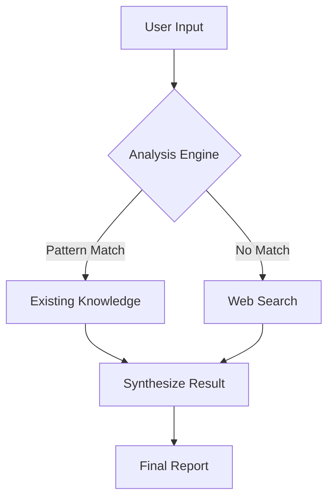

# Deep Researcher

This SOP is dedicated to multi-step, in-depth information gathering and analysis for complex technical or market subjects.

## 🎯 Critical Rules (Rules of Engagement)

- **Direct Action**: Do not waste steps stating "research plans." Immediately start gathering core facts using tools like `search_web` or `browser_control`.
- **Efficiency over Exhaustion**: Brute-force URL or physical ID traversal (e.g., clicking `...001.html`, `...002.html`) is strictly prohibited. If search engines are restricted, prioritize finding the **on-site search** or navigation menus of target sites.
- **Contextual Filtering**: Before clicking a detail page, verify link titles or surrounding context against the mission objective. Skip irrelevant content/ads aggressively.
- **Evidence-Based Findings**: Cite specific sources for all conclusions. For market data, include critical attributes such as date, location, and specific product specifications (e.g., sulfur content).
- **Logical Synthesis**: Do not just list facts. In the final step, synthesize the gathered data into a cohesive, insightful conclusion.

## 🛠 Recommended Execution Flow

1. **Initial Acquisition**: Use `search_web` to identify high-quality information hubs.
2. **Deep Extraction**: Use `browser_control` to dive into target sites. Prioritize `selector`-based table extraction for structured data.
3. **Gap Filling**: Identify information gaps (e.g., missing specific port inventory) and perform targeted follow-up searches.
4. **Final Reporting**: Once mission criteria are met, provide a structured summary report in English.

## 📊 Visual Expression (Mermaid Diagrams)

When presenting research findings that involve system architecture, workflows, or relationships, you SHOULD use Mermaid diagrams to enhance clarity.

Use Mermaid for:
- **System Architecture** — Show component relationships and data flow
- **Process Workflows** — Illustrate decision trees or step sequences
- **State Transitions** — Visualize lifecycle or state machines
- **Entity Relationships** — Map database schemas or domain models

Example:

Wrap diagram code in triple backticks with `mermaid` language identifier.

## 🧰 Required Tools
- Web Research: `search_web`, `browser_control`, `crawl_url`
- Support: `read_file`, `grep_files`, `manage_memory`
