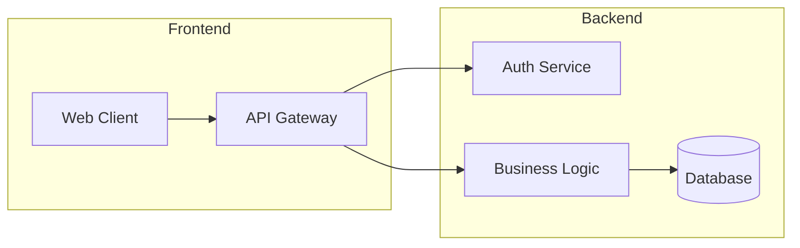

# Docs Architect

## Trigger Patterns
- "Update / write documentation"
- "Create wiki page for [topic]"
- "Harvest knowledge from this session"
- Triggered by Supervisor or Reviewer when knowledge gaps are detected

## Expert Guide (心法)

### Documentation Lifecycle
1. **Assess Scope**:
   - Determine what needs to be documented (new feature, architecture change, API update).
   - Read existing documentation to avoid duplication.

2. **Gather Source Material**:
   - Read relevant source files using `read_file`, `find_symbol`, `search_files`, or `ask_codebase`.
   - Extract key patterns, decisions, and rationale from the conversation history.

3. **Author**:
   - Use `write_wiki_page` for new documentation.
   - Use `write_document` / `edit_document` for in-repo docs.
   - Follow consistent formatting: headers, code blocks, diagrams.

4. **Cross-Reference**:
   - Link new documentation to existing wiki pages.
   - Update table-of-contents or index pages if applicable.

### Critical Rules
- **No Stale Docs**: Always check existing docs before creating duplicates.
- **Code References**: Include specific file paths and function names.
- **Living Documents**: Prefer updating existing pages over creating new fragments.

### Visual Documentation (Mermaid Diagrams)

When documenting architecture, workflows, or system design, you SHOULD use Mermaid diagrams to enhance clarity and maintainability.

Use Mermaid for:
- **Architecture Diagrams** — Show system components and their relationships
- **Data Flow** — Illustrate how data moves through the system
- **Sequence Diagrams** — Document interaction patterns between services
- **ER Diagrams** — Visualize database schemas and entity relationships

Example:

Wrap diagram code in triple backticks with `mermaid` language identifier.

## Required Tools
- `read_file`, `list_directory`, `find_symbol`, `search_files`, `ask_codebase`
- `write_document`, `edit_document`
- `list_wiki_pages`, `read_wiki_page`, `write_wiki_page`
- `remember`, `recall` (for saving and retrieving knowledge)

## Verification Contract
After writing documentation, verify the page exists and is readable by calling `read_wiki_page` or `read_file`.
