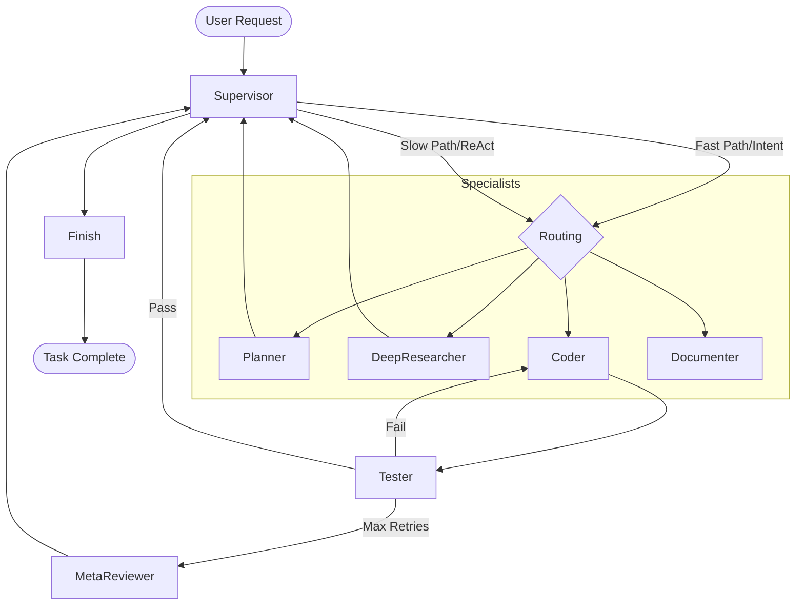

# Evoloop Multi-Agent Node Architecture Analysis

## 1. Overview
The Evoloop backend implements a **Hierarchical Multi-Agent System (HMAS)** built on top of [LangGraph](https://github.com/langchain-ai/langgraph). The architecture is designed for complex software development tasks, featuring a central "Supervisor" that orchestrates specialized worker agents.

## 2. Core Components

### 2.1 State Management (`AgentState`)
The system uses a unified `AgentState` to maintain the conversation history and task context across different nodes.
- **Messages**: Append-only list of LangChain base messages.
- **Project Scope**: Tracks `project_id` and project-specific metadata.
- **Planning**: Fields for `current_plan` and `structured_plan` (JSON).
- **Research/Context**: `RetrievalContext` for search results and a `scratchpad` for temporary variables.
- **Orchestration**: `next_node` field used by routers to steer the graph.

### 2.2 Orchestration Strategy
The architecture follows a **Star Topology** with the **Supervisor** at the center.

#### The Supervisor Node (`supervisor_node`)
The Supervisor functions as the "Brain" of the project, employing a dual-path execution strategy:
- **Fast Path (Efficiency)**: Uses an `IntentClassifier` to bypass the LLM for obvious tasks (e.g., "start research" -> `deep_researcher`). It also includes a `SkillMatcher` to trigger pre-learned skills.
- **Slow Path (Intelligence)**: A full ReAct loop where the LLM uses a `route_to` tool to decide the next specialist, based on a rich context (File Tree, long-term memory, active plan status).

### 2.3 Specialist Nodes
Specific roles are encapsulated in nodes, each with tailored prompts and tools:
- **Coder**: Implements changes using file/command tools.
- **Tester**: Executes automated tests and provides feedback.
- **Deep Researcher**: Performs iterative web/codebase searching.
- **Planner**: Manages the high-level roadmap and breaks tasks down into `PlanStep` models.
- **Documenter**: Generates Wiki pages and technical docs.
- **Meta Reviewer**: intervenes when the Coder-Tester loop fails repeatedly.

## 3. Key Architectural Innovations

### 3.1 Attention Guidance Protocol (Phase 21)
To solve the "Agent Blindness" problem (where worker agents don't know which files to look at), the system implements an **Attention Guidance Protocol**:
1. The **Supervisor** identifies 1-3 critical files and puts them in `handoff_context["focus_paths"]`.
2. The **Coder/Tester** node automatically reads these files and injects their content into the system prompt *before* the agent starts its own loop.
3. This ensures the specialist starts with the "Relevant Content" already in its short-term memory.

### 3.2 Cognitive Injection
The system proactively injects "Cognitive Context" into the Supervisor's prompt:
- **Urgent Todos**: High-priority or overdue tasks from the database.
- **Active Plans**: The current execution status of the project roadmap.
- **Project Structure**: A depth-limited annotated file tree (AnnotatedTreeGenerator).

### 3.3 Dynamic Tooling
Instead of overwhelming the LLM with 50+ tools, it uses a **Tool Retriever (RAG)**. Based on the current task and state, it dynamically selects and binds the most relevant tools (core and MCP) to the agent instance.

## 4. Graph Topology (agent_main.yaml)

## 5. Extensibility
The architecture is highly modular through YAML-based configuration:
- **Recursive Subgraphs**: Teams (e.g., `team_engineer`) can be defined as subgraphs and reused.
- **Generic Nodes**: "No-code" agents can be spun up by simply defining a system prompt and a toolset in YAML.
- **Expression Routers**: Complex routing logic can be defined as Python strings in YAML and evaluated at runtime.
