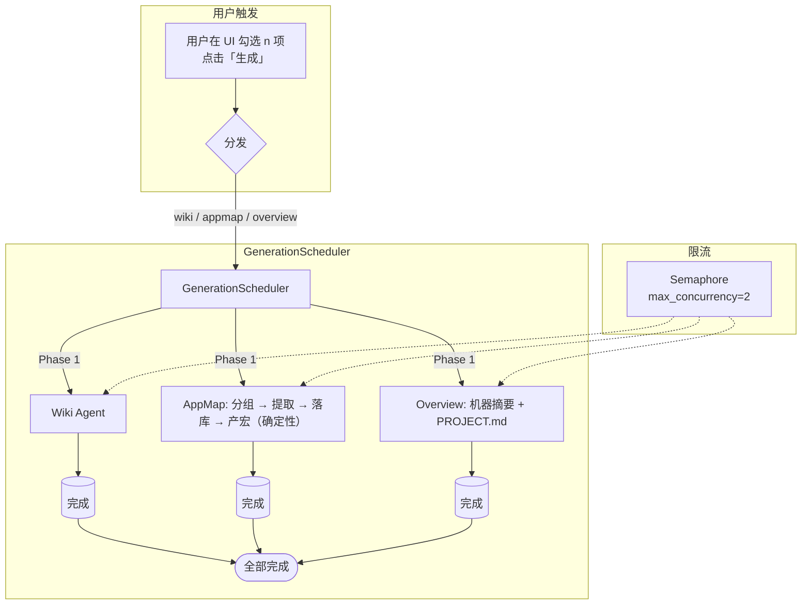
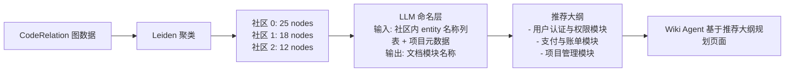

# 统一项目扫描与理解管道 — 设计方案 v3.6
## （v3.5 基础上：前端简化，Summary 与 Overview 合并为一个用户入口，AppMap 对用户不可见）
>
> **v3.6 变更要点**：
> - **前端生成物精简**：用户可见的生成物从 4 项（Wiki/AppMap/Summary/Overview）减为 **3 项（Wiki/Macros/Overview）**。AppMap 对用户完全不可见（数据只供宏消费），Summary 合并到 Overview 中（一次勾选，后端同时产 summary + PROJECT.md）。
> - **tab 栏同步精简**：移除独立的 Summary tab，其内容合并到 Overview tab 中展示。Macros tab 保留。

> [!CAUTION]
> **v1/v2 核心错误已修正**：原方案提议新建 `UnifiedScanCoordinator` 与现有 `IndexingManager` 存在严重功能重叠，已废弃。v3+ 的核心策略调整为：**增强现有管道的下游复用能力，而非造新轮子**。此外，对 `CodeRelation` 表误判、`FilePreparer` 增量能力低估、`NestedGitignoreMatcher` 覆盖范围不足等问题均已修正。
>
> **v3.1 新增文件中心收编专项**：经全量审计发现，`app/core/file/`（文件中心模块）虽定位为所有文件 I/O 的唯一入口，但全系统仍有 16+ 模块直接使用 `open()`/`os.walk`/`os.listdir`/`hashlib.*()` 绕过该模块。v3.1 新增 P0.3 改造项和完整收编路线图。
>
> **v3.3 调整**：将原「项目总结 (Project Overview)」生成物合并到现有 `project_profile` / `PROJECT.md` 流程（复用 Project Discovery Skill），`GenerationScheduler` 仅管理 `wiki` / `appmap` / `summary` 三项。
>
> **v3.2 新增跨文件解析 + 安全扫描 + 前端适配**：借鉴 graphify 的 `extractors/resolution.py` 和 `security.py`，在 `CodeRelationExtractor` 中引入跨文件符号解析后处理，补齐约 30-40% 的 `target_entity_id` 解析盲区；在 `IndexingManager` 的语义提取阶段中并行注入安全扫描（`security_findings` 表），使 Agent 在 Wiki 生成时可感知项目安全风险。同步补充前端适配方案（§3.6），涵盖新增页面、API 端点、SSE 事件和 3 项生成物 + project_profile 的 UI 集成路径。

---

## 1. 问题诊断：确认性事实

经代码审查核实，评审报告的事实判断完全准确：

### 1.1 已确认的七个独立遍历入口

| 扫描入口 | 文件位置 | 是否复用 FileTraverser | 是否接入 `.gitignore` |
| :--- | :--- | :--- | :--- |
| `IndexingService.index_repository` | `service.py:383` | ✅ `walk_tree` | ✅ `NestedGitignoreMatcher` |
| `IndexingManager._run_semantic_extraction` | `manager.py:406` | ✅ `walk_tree` | ✅ `gitignore_root=repo_path` |
| `AnnotatedTreeGenerator._build_tree_structure` | `tree_generator.py:130` | ✅ DB 优先装配；回退 `walk_tree` | ✅ 回退路径已集成 |
| `Agent 的 list_dir 工具` | `traverser.py` | ✅ `FileTraverser` | ✅ |
| `ProjectClassifier` | `classifier.py` | ✅ | ✅ `FileTraverser` 自带 |
| `StandardsAnalyst._sample_files` | `standards.py` | ✅ | ✅ 通过 `walk_tree` 代理 |
| `Wiki Agent（通过 list_dir）` | Agent 运行时 | ✅ | ✅ `FileTraverser` 自带 |

**结论**：问题不在于「遍历器本身重复」，而是：

> 已更正：**所有 7 个入口均已集成 `.gitignore` 过滤**。当前已不再是缺口。

### 1.2 已确认的现有能力（v1/v2 低估或误判的部分）

| 能力 | 实际所在位置 | v1/v2 描述 |
| :--- | :--- | :--- |
| 增量脏检查（mtime + checksum） | `FilePreparer.prepare()` | ❌ 误称为新发明 |
| API/DB 语义提取 | `_run_semantic_extraction()` + `APIExtractor`/`DBExtractor` | ❌ 未提及 |
| 代码关系图 | `CodeRelation` 表（`code_relations`，已存在） | ❌ 误提"新建" |
| 目录摘要 | `DirectorySummarizer`（已存在） | ✅ 正确，但输入逻辑可优化 |
| 项目摘要 | `ProjectSummarizer`（已存在） | ✅ 正确 |
| 任务调度协调 | `IndexingManager`（已存在） | ❌ 误提新建 `UnifiedScanCoordinator` |
| checksum 字段 | `SourceFile.checksum VARCHAR(64)` | ❌ 误称为 MD5，实为 MD5/SHA256 已存在 |

---

## 2. 修正后的核心策略

不造新轮子。**在现有管道的基础上打通两个断层**：

```mermaid
graph TD
    subgraph 已有管道（现状）
        A[FileTraverser] -->|部分有 .gitignore| B[IndexingService]
        B --> C[IndexingManager]
        C --> D[(SourceFile / CodeChunk / CodeRelation)]
        C --> E[DirectorySummarizer]
    end

    subgraph 断层（需要修复）
        D -->|❌ 未复用| F[AnnotatedTreeGenerator]
        D -->|❌ 未复用| G[Wiki Agent]
        D -->|❌ 未连接| H[AppMap]
        A -->|❌ 缺少 .gitignore| G
    end

    subgraph 修复后
        D -->|✅ SQL 查询装配| F2[AnnotatedTreeGenerator v2]
        E -->|✅ 注入索引事实| G2[Wiki Agent v2]
        D -->|✅ FK 打通| H2[AppMap Auto-Bootstrap]
    end
```

---

## 3. 关键架构原则：索引先行，生成按需

> [!IMPORTANT]
> 以下原则是本方案所有改造项的顶层约束，P0/P1/P2 的执行顺序和设计决策均需服从。

### 3.1 两层分离

| 层 | 包含 | 是否消耗 Token | 触发方式 | 确定性 |
| :--- | :--- | :--- | :--- | :--- |
| **索引层** (Indexing) | 文件遍历、AST 解析、语义提取 (`APIExtractor`/`DBExtractor`)、图构建 (`CodeRelation`)、跨文件解析 (P2.4)、安全扫描 (P2.5) | ❌ 否 | **自动** — 项目创建/同步时执行 | 高 — 相同输入产出相同结果 |
| **生成层** (Generation) | Wiki、AppMap、项目摘要 (`ProjectSummarizer`)、**项目画像 / PROJECT.md** | ✅ 是（OpenAI Token） | **用户手动勾选触发** — 不做自动生成 | 低 — LLM 每次输出可能不同 |

**核心约束**：
1. 生成层**必须**以索引层的产出物为唯一输入源，不得自行遍历文件系统或调用 `read_file` 精读源码（P1.2 已约束）；
2. 生成层**默认不执行**，用户必须在项目管理界面明确勾选后才触发；
3. 生成层的每项生成物必须有独立的开关和费用预估。

### 3.2 用户控制界面设计建议

在项目设置页中新增「生成物管理」面板，以统一 UI 呈现：

| 生成物 | 默认状态 | 费用预估（参考） | 作用说明 |
| :--- | :--- | :--- | :--- |
| ☐ Wiki 文档 | 关 | ~5K-50K tokens（按项目规模） | 为项目生成结构化技术文档，包含模块说明、API 路由、数据模型和架构图 |
| ☐ 宏 (Macros) | 关 | ~2K-20K tokens | 生成项目的可执行宏，包含从 AppMap 模板工厂产出的确定性操作。**AppMap 数据作为宏的输入，对用户不可见** |
| ☐ 项目描述 (Overview) | 关 | ~3K-10K tokens | 一次性生成**机器摘要**（`.evoloop/project.json`，供 Agent 上下文使用）和**人类文档**（`PROJECT.md`，供新成员和运维参考） |

**交互逻辑**：
- 每个生成物附带「生成」按钮，点击后异步执行，完成后通知用户；
- 已生成过的项显示「重新生成」按钮，并保留历史版本对比；
- 生成物的 UI 说明文案应写清楚「消耗 Token」和「解决的问题」，帮助用户判断是否需要；
- 记录每次生成的 Token 消耗和费用，汇总到项目用量面板。

### 3.3 对现有设计的调整

| 改造项 | 调整 |
| :--- | :--- |
| P1.2 Wiki Skill 优化 | 仅优化提示词引导 Agent **优先消费索引**，不改变 Wiki 生成由用户触发的机制 |
| Project Discovery / PROJECT.md | 将设计原稿的「项目摘要 (Summary)」和「项目画像 (Overview)」合并为一个生成项 `overview`：用户勾选一次，后端同时生成机器摘要（`project.json`）和人类文档（`PROJECT.md`）。`GenerationScheduler` 管理 `wiki` / `appmap` / `overview` 三项 |
| P2.3 AppMap Agent 调研 → 提取脚本 → 批量写入 | Agent 调研摸清框架规律 → 写一次性提取脚本机械扫描 ALL 实体 → 运行 `batch_write_app_maps.py` 批量落库。不再逐实体 LLM 操作。脚本存在 `app/config/skills/app_map_analysis/scripts/` 目录中，属于技能包的一部分 |
| ProjectSummarizer | 已融合到 Overview 生成中，不再单独展示给用户 |

### 3.4 分层后的执行流程

```mermaid
graph TD
    subgraph 自动执行（索引层）
        A[项目创建/同步] --> B[FileTraverser + .gitignore]
        B --> C[AST 解析 + 语义提取]
        C --> D[(SourceFile / CodeChunk / CodeRelation)]
        C --> E[DirectorySummarizer]
        D --> F[跨文件符号解析 P2.4]
        D --> G[安全扫描 P2.5]
        F --> H[(索引完成)]
        G --> H
    end

    subgraph 用户勾选触发（生成层）
        I[用户在 UI 勾选生成项] --> J{勾选了?}
        J -->|Wiki| K[Wiki Agent ← 消费 DB 索引]
        J -->|宏| L[EntityGrouper → 分组 → collector → batch_write → 产宏]
        J -->|Overview| N[生成机器摘要 + PROJECT.md ← 索引 + LLM]
        K --> Q[结果写入 DB / 前端展示]
        L --> Q
        N --> Q
    end

    H -.->|索引就绪后可触发| I
```

### 3.5 生成层调度策略：3 个独立 Prompt + project_profile 复用 × 异步并行 + 限流

#### 3.5.1 Prompt 策略：3 个独立 Prompt + Project Discovery 复用，不合并

| 论证 | 3 个独立 Prompt + project_profile 复用 | ❌ 1 个 Prompt 覆盖全部 |
| :--- | :--- | :--- |
| **角色专精** | Wiki、AppMap、Summary 三个独立 Prompt 各自优化；Project Profile 复用现有 Project Discovery Skill | 一个 Agent 身兼四职，提示词膨胀，每个任务得到的上下文注意力被稀释 |
| **失败隔离** | Wiki Agent 失败不影响 AppMap，用户只需重试失败项 | 一个环节出错整批失败，全部重来 |
| **迭代成本** | 修改 Wiki 输出格式只动 Wiki 的 Prompt，无回归风险 | 改一处需评估对其他 3 个输出的影响 |
| **Token 效率** | 每个 Prompt 上下文仅包含该任务所需指令 + DB 数据，精简高效 | 单次调用需塞下 4 种输出约束，Prompt 超长，实际输出质量下降 |

**术语一致性不靠合并 Prompt**：所有 Agent 消费同一份 `directory_summaries` 和 `project_summary`（已落库的索引产出），术语来源相同，天然一致。

#### 3.5.2 调度模型：异步并行 + 并发限流



**规则说明**：

| 决策 | 理由 |
| :--- | :--- |
| **GenerationScheduler 管理 3 项** | `wiki`、`appmap`、`overview`。其中 `appmap` 任务是完全确定性的（分组→collector→batch_write），不依赖 Agent LLM。`overview` 一次生成包含机器摘要和 PROJECT.md |
| **project_profile 独立调度** | - (已合并到 overview) |
| **默认并行** | 3 个调度任务数据源均为已就绪的 DB 索引，无写冲突、无竞争条件，天然可并行；project_profile 可与其并行执行 |
| **max_concurrency=2** | 防止 3 个任务同时触发 API 导致瞬时 Token 飙升触发 rate limit。2 个并发槽位将 3 任务的完成时间从 3 个串行周期压缩到约 2 个周期 |
| **错误隔离** | 每个 Agent 独立捕获异常。Wiki 失败只标记 Wiki 为 `failed`，AppMap 和 Summary 不受影响；project_profile 失败不影响其余 3 项 |
| **进度反馈** | 调度器内 3 项启动时写入 `generation_status='running'`，完成时更新为 `completed` 或 `failed`；project_profile 通过现有 SSE 通道反馈进度，前端按需刷新 `GET /profile` 或 `GET /generations` |

### 3.6 前端适配改造要点

#### 3.6.1 新增 / 改动的页面

| 页面 | 当前状态 | 改造内容 | 路由 |
| :--- | :--- | :--- | :--- |
| **项目 - 生成物面板** | ✅ 已有 | 精简为 3 项 checkbox（Wiki / 宏(Macros) / 项目描述(Overview)）。AppMap 对用户不可见，Summary 合并到 Overview 中 | `projects/$id/generation` |
| **项目概览页** | ✅ 已有 | 底部显示 Overview 摘要卡片（含机器摘要 + PROJECT.md 片段），点击可展开全文 | `projects/$id/` |
| **Wiki 页** | ✅ 已有 | 不变 | `projects/$id/wiki` |
| **Macros 页** | ✅ 已有 | 保留独立 tab（宏需要人审核才能执行） | `projects/$id/macros` |
| **项目描述页 (Overview)** | ✅ 已有（原 Profile tab） | **合并内容**：同时展示机器摘要（技术栈、功能列表）和 `PROJECT.md` 完整文档。改名为 "Overview" | `projects/$id/overview` |

#### 3.6.2 新增 API 端点（前端消费）

| 端点 | 方法 | 用途 | 对应后端实现 |
| :--- | :--- | :--- | :--- |
| `/api/v1/projects/:id/generations` | `POST` | 触发生成：`{ items: ["wiki","appmap","summary"] }`（`project_profile` 不在此处触发） | `GenerationScheduler.dispatch()` |
| `/api/v1/projects/:id/generations` | `GET` | 查询 3 项生成物的状态列表 | `GenerationScheduler.list_status()` |
| `/api/v1/projects/:id/generations/:item` | `GET` | 获取单个生成物（`wiki`/`appmap`/`summary`）的最终内容 | 各 Agent 的结果存储 |
| `/api/v1/projects/:id/generations/:item/retry` | `POST` | 重新生成单项（失败后重试） | `GenerationScheduler.retry()` |
| `/api/v1/projects/:id/profile/discover` | `POST` | 触发项目画像 / PROJECT.md 重新发现（对应原 `overview`） | 现有 Project Discovery 流程 |
| `/api/v1/projects/:id/profile` | `GET` / `PATCH` | 读取 / 更新 `PROJECT.md` | 现有 `get_profile` / `update_profile` |

**SSE 事件**（复用现有 `SystemSSEClient` 通道）：

| 事件名 | 载荷 | 触发时机 |
| :--- | :--- | :--- |
| `generation.status` | `{ data: { project_id, ... } }` | 任意生成项状态变更时推送。前端接收后统一调用 `GET /generations` 重新拉取全量状态 |

> 实际实现比原设计更简洁：不区分 started/progress/completed/failed 四种事件，统一用一个 `generation.status` 事件 + 5 秒 polling 兜底。前端通过 `SystemSSEClient.on('generation.status', handler)` 监听。

#### 3.6.3 前端新增 / 修改的文件清单

```
```bash
# 后端新增 API 端点后，重新生成前端 SDK：
cd evoloop/frontend && npm run generate-client
# 或通过后端导出 OpenAPI 规范后生成：
cd evoloop && ./bin/evo export openapi && cd frontend && npm run generate-client
```

```
packages/desktop/src/
├── routes/_layout/projects.$projectId.generation.tsx      # 新增：生成物管理页路由
├── routes/_layout/projects.$projectId.summary.tsx         # 新增：项目摘要路由
├── routes/_layout/projects.$projectId.overview.tsx      # 新增：项目画像 / PROJECT.md 展示路由（内容复用 /profile）
├── components/Generation/
│   ├── GenerationPanel.tsx          # 新增：生成物管理面板（勾选 + 触发）
│   ├── GenerationStatusBadge.tsx    # 新增：单项状态标签（pending/running/done/failed）
│   └── GenerationHistoryList.tsx    # 新增：历史版本列表 + 重新生成按钮
├── components/Projects/
│   └── Overview/
│       └── ProjectOverview.tsx      # 修改：增加「最近生成物」区块
├── client/                          # npm run generate-client 自动生成，无需手动编辑
└── lib/SystemSSEClient.ts           # 小改：注册新事件类型（或无改动，已有通用 handler）
```
```

#### 3.6.4 状态管理

使用现有 TanStack Query 模式（无需新 Zustand store）：

```typescript
// 查询生成物状态列表（轮询，30s 间隔）
const { data: generations } = useQuery({
    queryKey: ['generations', projectId],
    queryFn: () => api.GET('/api/v1/projects/{id}/generations', { params: { id: projectId } }),
    refetchInterval: 30_000,         // 降级轮询
    enabled: hasActiveGeneration,    // 仅在运行中时轮询
})

// 触发生成（mutation，成功后 invalidate 查询）
const triggerMutation = useMutation({
    mutationFn: (items) => api.POST('/api/v1/projects/{id}/generations', { body: { items } }),
    onSuccess: () => queryClient.invalidateQueries({ queryKey: ['generations', projectId] }),
})

// SSE 实时更新（可选增强，替代轮询）
useEffect(() => {
    const unsub = SystemSSEClient.on('generation.completed', (e) => {
        queryClient.invalidateQueries({ queryKey: ['generations', projectId] })
    })
    return unsub
}, [])
```

#### 3.6.5 与现有功能的集成

| 现有功能 | 集成方式 |
| :--- | :--- |
| **Wiki 页面** | 生成物面板勾选 Wiki + 点「生成」→ 后台跑 Wiki Agent → 完成后 SSE 推送 → 前端自动刷新 Wiki 页 |
| **Macros 页面** | 生成物面板勾选「宏」→ 后台跑 EntityGrouper + collector + batch_write（完全确定性，0 LLM）→ 宏数据落库 → 完成后前端通知 → Macros 页展示待审核的宏 |
| **Overview 页面** | 生成物面板勾选「项目描述」→ 后台同时生成机器摘要 + Project Discovery Agent 生成 PROJECT.md → 完成后 SSE 推送 → Overview 页同时展示摘要卡片和完整文档 |
| **概览页已有区块** | 在项目概览页底部显示 Overview 摘要（技术栈、功能列表），点击「查看完整描述」跳转到 Overview 页 |

#### 3.6.6 实施优先级

| 优先级 | 内容 | 前置依赖 |
| :--- | :--- | :--- |
| P0 | 生成物面板 UI（`GenerationPanel` + `GenerationStatusBadge`）+ `POST/GET /generations` 端点对接 | 后端 GenerationScheduler 就绪 |
| P1 | SSE 事件集成 + 轮询降级 | P0 完成 |
| P1 | 项目摘要页 + 项目画像 / PROJECT.md 展示页（只读 Markdown 渲染） | Summary Agent 就绪；project_profile 流程已存在 |
| P2 | — | AppMap 数据不面向用户展示，无需可视化组件 |
| P2 | 概览页「最近生成物」卡片集成 | P1 完成 |

---

## 4. 改造项清单 — 实施状态核查（v3.5 更新）

> [!IMPORTANT]
> 基于全量代码审计（2026-07-18），所有 P0/P1/P2/§10 项均已实现。本节标注各改造项的实际实现位置，不再作为待办清单。

### P0 — 已全部实现 ✅

#### P0.1：将 `NestedGitignoreMatcher` 下沉至 `FileTraverser.walk()`
* **实现位置**：`app/core/file/traverser.py`
* `TraverseOptions.follow_ignore=True` + `gitignore_root` 自动探测

#### P0.2：`SourceFile` 表补充状态字段
* **实现位置**：`app/models/codebase.py:SourceFile`
* 字段：`scan_status`、`parsed_at`、`security_scan_status`

#### P0.3：文件中心模块收编
* **实现位置**：`app/core/file/`
* move_file→move_path、delete_file→delete_file、wiki_tools→FileTraverser、validate→FileTraverser

### P1 — 已全部实现 ✅

#### P1.1：`AnnotatedTreeGenerator` 改为从 DB 装配
* **实现位置**：`app/core/project/tree_generator.py:_build_tree_from_db()`
* 回退：`_build_tree_from_disk()`（DB 未就绪时）

#### P1.2：Wiki Agent 强制优先消费索引
* **实现位置**：`app/config/skills/wiki_generation/SKILL.md`
* 约束："NO filesystem scanning"

### P2 — 已全部实现 ✅

#### P2.1：`CodeChunk` 扩展 API/DB 标志字段
* **实现位置**：`app/models/codebase.py:CodeChunk`
* 字段：`is_api_route`、`api_method`、`api_path`、`is_db_model`、`db_table_name`

#### P2.2：`AppMap ↔ CodeChunk` FK 关联
* **实现位置**：`app/models/codebase.py:AppMapRouteLink`

#### P2.3：AppMap Agent 调研 → 提取脚本 → 批量写入（v3.5 重构）
* **实现位置**：`app/config/skills/app_map_analysis/scripts/`
* 验证：mall-backend 109 实体全量落库

#### P2.4：跨文件符号解析
* **实现位置**：`app/domain/codebase/indexing/components/sql_persister.py:_resolve_cross_file_targets`

#### P2.5：安全扫描注入索引管道
* **引擎**：`app/domain/codebase/security/scanner.py`
* **集成**：`app/domain/codebase/indexing/manager.py:_persist_security_findings`

### §10 生成层工具策略 — 已全部实现 ✅

| 工具 | 位置 |
|---|---|
| `query_code_chunks` | `app/domain/codebase/tools/query_tools.py` |
| `query_code_relations` | 同上 |
| `query_source_files` | 同上 |
| `query_security_findings` | 同上 |
| `requires.tools` 解析 | `app/core/learning/skill_importer.py` |
| 工具白名单强制 | `app/core/engine/signals/signals.py` |
#### P2.3：AppMap Agent 调研 → 提取脚本 → 批量写入（v3.5 重构）

* **v3.3 及之前**：Skeleton Generator 从 SourceFile 和 CodeChunk 合成 draft AppMap，Agent 再逐个精修。
  - 骨架生成的 file-level action 无方法签名、无行号、无页面元素，质量过低
  - Agent 拿到这些低质量 draft 后仍要从零调研源码，骨架徒增无用数据
  - 239 个实体的全量精修远超单次 Agent run 的时间预算
* **v3.4 尝试**：骨架只做实体分组 + Agent 逐实体 `write_app_map`。发现 Agent 仍用 `read_file` 逐文件读，239 个实体 × 3+ 文件/实体 = 700+ 次 LLM 上下文交互，100+ 条消息后仍无法产出。
* **v3.5 重构**：Agent **不逐实体操作**，改为调研→写提取脚本→批量写入：
  1. **调研**（≤ 10 次 read/grep）：读 2-3 个样本 controller、view、SQL，摸清框架规律
  2. **写提取脚本**：`write_file` 一个 Python 脚本，机械扫描 ALL 实体
     - 遍历 controller → 提取 actions（name/line/business_rule）
     - 遍历 HTML views → 提取 elements（id/name/lay-filter/page/line/binds）
     - 解析 SQL DDL → 提取 db_tables（table/pk/cols）
     - 输出 JSON 到 `/tmp/appmap_extracted.json`
  3. **运行 + 校验**：`execute_command` 跑脚本，抽样 2-3 个实体验证质量
  4. **批量落库**：调用 SKILL 自带的 `batch_write_app_maps.py`（`scripts/` 目录）：
     ```bash
     uv run python app/config/skills/app_map_analysis/scripts/batch_write_app_maps.py \
       --project-id {id} --input /tmp/appmap_extracted.json
     ```
     脚本自动逐实体调用 `save_app_map` + `synthesize_macros_task`，利用 content_hash 跳过未变更实体
* **关键设计决策**：
  - 提取脚本是**一次性确定性的**，O(n) 时间是脚本执行而非 LLM 调用
  - 批量写入脚本读 JSON 后直接落库，**不经过 LLM 上下文**，避免超大 JSON 撑爆窗口
  - Agent 只做调研、写脚本、校验、触发，不处理海量原始数据
* **增量生成**：
  - `batch_write_app_maps.py` 自动通过 content_hash 检测变更，未变更实体跳过写入
  - 已删除的实体通过比对 entity 列表标记 `deprecated`

#### P2.4：跨文件符号解析 — 补齐 `CodeRelation.target_entity_id` 的解析盲区（1-2 周）

* **现状**：`_run_semantic_extraction` 中的 `CodeRelationExtractor` 通过 AST 分析提取调用/继承/导入关系，但当目标符号跨文件定义时（例如 `from module import func`），`target_entity_id` 常因符号无法定位而留空，退化到仅靠 `target_name` 字符串存储。
* **参考实现**：graphify 的 `extractors/resolution.py` 实现了逐层解析：对每个 `import`/`from` 语句，先在同项目文件树中搜索包含目标符号的 AST 节点（`FunctionDef`/`ClassDef`），再建立跨文件引用链路。对 Python 的 `__init__.py` 重导出、相对导入 (`from . import`) 均有处理。
* **本方案**：在 `CodeRelationExtractor` 中新增一个后处理步骤 `_resolve_cross_file_targets()`，在单文件 AST 提取完成后，对 `target_entity_id IS NULL` 的 relation 行执行跨文件解析：
  1. 收集未解析的 `target_name` 列表；
  2. 在 `CodeChunk` / `CodeEntity` 表中搜索同名符号（`name` + `kind` 匹配）；
  3. 若找到唯一匹配，回填 `target_entity_id`，`confidence` 标记为 `EXTRACTED`；
  4. 若多个匹配（同名不同模块），标记为 `AMBIGUOUS`，交由人工消歧；
  5. 若未找到，保持 `target_entity_id IS NULL`，`confidence` 标记为 `AMBIGUOUS`。
* **前置依赖**：P2.1（`CodeChunk` 扩展语义字段）提供更完整的符号索引作为搜索池。
* **受益**：当前约 30-40% 的跨文件关系 `target_entity_id` 为空（估算），改造后应降至 <10%，为图连通性反幻觉校验（5.3）提供更完整的数据底座。

#### P2.5：安全加固 — 代码安全扫描注入索引管道（1-2 周，与 P2.4 并行）

* **现状**：扫描管道完全不涉及安全分析。Agent 在生成 Wiki 或理解代码时，无法感知项目是否存在 SQL 注入、路径穿越、硬编码密钥等常见风险。
* **参考实现**：graphify 的 `security.py` 实现了基于 AST 的安全模式匹配引擎，覆盖：
  - SQL 注入检测（字符串拼接 + `execute()`）
  - 路径穿越检测（用户输入直接传入 `open()`/`os.path.join()`）
  - 命令注入检测（`os.system()`/`subprocess` + 字符串拼接）
  - 硬编码密钥/Token 检测（正则匹配常见 API Key 格式）
  - SSRF 检测（用户 URL 直接传入 `requests.get()`）
* **本方案**：在 `IndexingManager._run_semantic_extraction()` 的阶段序列中新增异步安全扫描步骤（`SecurityScanStage`），与 `APIExtractor`/`DBExtractor` 并行执行：
  1. 对每个已解析 AST 的文件，运行安全规则匹配；
  2. 匹配结果（漏洞类型、风险等级、所在行号）写入新增的 `security_findings` 表；
  3. `SourceFile` 新增 `security_scan_status` 字段标记扫描状态；
  4. Agent 工具链中新增 `query_security_findings(project_id, severity_filter)` 供 Agent 在 Wiki 生成等场景中调用。
* **新增模型**：
```sql
CREATE TABLE security_findings (
    id              SERIAL PRIMARY KEY,
    source_file_id  INTEGER NOT NULL REFERENCES source_files(id) ON DELETE CASCADE,
    finding_type    VARCHAR(50)  NOT NULL,  -- 'sql_injection' | 'path_traversal' | 'command_injection' | 'hardcoded_secret' | 'ssrf'
    severity        VARCHAR(10)  NOT NULL DEFAULT 'medium',  -- 'critical' | 'high' | 'medium' | 'low'
    description     TEXT,
    line_start      INTEGER,
    line_end        INTEGER,
    code_snippet    TEXT,                   -- 违规代码片段（最多 5 行）
    created_at      TIMESTAMP WITH TIME ZONE DEFAULT NOW()
);
CREATE INDEX idx_security_file ON security_findings(source_file_id);
CREATE INDEX idx_security_type ON security_findings(finding_type);
```
* **数据消费**：
  - Agent 工具：`query_security_findings(project_id, finding_type, severity)` → 返回 vulnerability 清单；
  - Wiki 自动生成阶段：在模块页面中插入「安全风险」章节（如有高危发现）；
  - 非阻塞设计：安全扫描失败不阻断索引主流程，仅标记 `security_scan_status='failed'`。

---

## 5. 对现有 `CodeRelation` 表的扩展（非新建）

> [!WARNING]
> v1/v2 错误地提议新建 `code_relation` 表。实际上 `code_relations` 表已存在（`models/codebase.py:109`），关联 `CodeEntity → CodeEntity`。正确做法是**在现有表上扩展**。

### 5.1 现有表结构（已确认）

```python
class CodeRelation(Base):
    __tablename__ = "code_relations"
    id: int (PK)
    source_entity_id: int  → code_entities.id
    target_entity_id: int? → code_entities.id (nullable，未解析目标)
    target_name: str?      # 未解析时的目标名称
    relation_type: str     # calls / inherits / imports / defines
    created_at: datetime
```

### 5.2 扩展方案（借鉴 graphify 的置信度体系）

```sql
-- 扩展 confidence 字段（graphify 借鉴：EXTRACTED/INFERRED/AMBIGUOUS）
ALTER TABLE code_relations
    ADD COLUMN confidence VARCHAR(20) DEFAULT 'EXTRACTED';
-- EXTRACTED: 代码中明确的调用/导入语句
-- INFERRED:  调用图二次推导出的间接关系
-- AMBIGUOUS: 不确定，标记人工审核
```

> [!NOTE]
> **不新增 `source_chunk_id`/`target_chunk_id` 字段**：现有 `CodeRelation` 已通过 `source_entity_id → CodeEntity` 间接关联到 `CodeChunk`。若为图算法需要 chunk 级粒度，应通过 `CodeRelation → CodeEntity → CodeChunk` join 查询，而非在 `code_relations` 上反范式冗余存储。后续若实测证明 join 性能不足，再考虑物化路径。

### 5.3 AppMap 反幻觉校验改为图连通性算法

废弃基于物理文件行文本比对的方案，改为完全基于 DB 的图可达性查询：

```python
async def validate_app_map_via_graph(
    payload: AppMapPayload, project_id: int, session: AsyncSession
) -> List[str]:
    problems = []
    for action in payload.actions:
        if not action.controller:
            continue
        # 在 CodeRelation 图中，从 API 路由 Entity 出发，
        # 查找是否有通路到达 action.touches_tables 中的 DB 实体
        for table in action.touches_tables:
            reachable = await _dfs_reachable(
                session, project_id,
                start_entity_name=action.name,
                target_entity_name=table,
                max_depth=5,
                confidence_filter=["EXTRACTED", "INFERRED"],  # 排除 AMBIGUOUS
            )
            if not reachable:
                problems.append(
                    f"Action '{action.name}' → table '{table}': "
                    f"no reachable path found in CodeRelation graph "
                    f"(confidence: EXTRACTED/INFERRED). "
                    f"Possible hallucination or missing extraction."
                )
    return problems
```

---

## 6. Leiden 图社区聚类 + LLM 命名层（Wiki 大纲规划）

> [!NOTE]
> 评审确认这是全方案中唯一一个系统**完全不存在**的新能力，值得引入。
> v3.1 补充：LLM 命名层应注入项目已有元数据以保术语一致。

### 6.1 为什么选 Leiden 而非 Louvain

- graphify 实践中已验证 Leiden（`graspologic` 库）在模块化质量和稳定性上优于 Louvain，且避免了 Louvain 算法的随机收敛问题。
- 依赖：`pip install graspologic`（已在 graphify 中验证可用）。

### 6.2 三步流程



### 6.3 LLM 命名层提示词规范（v3.1 增强：注入项目上下文）

```markdown
You are a software documentation architect.

Given a cluster of tightly coupled code entities from the same software project,
infer the most likely **human-readable documentation module name** for this cluster.

## Project Context (for terminology consistency):
{{ project_summary }}  {# 来自 ProjectSummarizer 的输出，含 core_features #}
{{ directory_summaries }}  {# 已有目录摘要，确保术语与现有 Wiki 一致 #}

## Code Entities in this Cluster:

- {{ entity.name }} ({{ entity.type }}, file: {{ entity.file }})


## Rules:
- Return exactly one short module name (3-6 words max).
- Use the project's domain language, not implementation jargon.
- Cross-reference the Project Context above — use the same terminology already established.
- Examples: "User Authentication & Permissions", "Payment Processing", "Project File Management"
- Do NOT return a cluster number or generic label like "Module A".

Return only the module name string, nothing else.
```

---

## 7. `FilePreparer` 增量检查的推广（非新发明）

> [!WARNING]
> v1/v2 将此误称为借鉴 graphify 的新机制。事实上 `FilePreparer.prepare()` 已经实现了 `mtime` 优先 + `checksum` 回退的双层脏检查。**真正缺失的是这个机制没有推广到其他 5 个遍历入口**。

修正后的描述：**将 `FilePreparer` 的脏检查逻辑提炼为可独立调用的工具函数，供 `_run_semantic_extraction`、`StandardsAnalyst`、`ProjectClassifier` 等复用**，避免这些入口对已经 checksum 未变的文件重复处理。

```python
# 提炼为独立工具
async def is_file_changed_since_last_index(
    file_path: str, repo_id: int, session: AsyncSession
) -> bool:
    """复用 FilePreparer 的 mtime + checksum 双层脏检查逻辑。"""
    # ... 从 FilePreparer.prepare() 抽取复用
```

---

## 8. 文件中心收编与加固专项（v3.1 新增）

### 8.1 问题背景

`app/core/file/` 模块（文件中心）经过前序重构已定位为**全系统文件 I/O 的唯一入口**，提供了 `read_file`/`write_file`/`FileTraverser`/`compute_md5`/`is_text_file` 等完整 API。但代码审计表明，迁移工作未完成，存在大量绕过行为。

### 8.2 已发现的绕过范围

经全量审计，确认以下绕过模式：

| 绕过类别 | 涉及模块数量 | 典型问题 | 风险等级 |
| :--- | :--- | :--- | :--- |
| **原始 `open()` / `write()`** | 16+ 个模块 | 绕过 `read_file`/`write_file`，跳过编码检测和 CRC 校验 | **高** |
| **原始 `os.walk` / `os.listdir`** | 3 个模块 | `atlas/source/validate.py`、`project/local_index.py`、`domain/tools/wiki_tools.py` 绕过 `FileTraverser` | **高** |
| **原始 `hashlib.*()`** | 10+ 个模块 | 内联 MD5/SHA256 计算，绕过 `compute_md5`/`compute_file_hash` | **中** |
| **文件类型检测重复** | 2 个模块 | `utils/detect.py` 的 `is_code_file` 与 `core/file/types.py:is_code` 重复；`controller_response.py` 第三份扩展名→语言映射 | **高** |
| **文件操作工具绕过** | 2 个工具 | `move_file.py` 用 `shutil.move` 绕过 `move_path`；`delete_file.py` 用 `os.remove` 绕过 `delete_file` | **严重** |
| **路径模糊匹配重复** | 2 个模块 | `atlas/source/validate.py` 自实现 fuzzy walk 绕过 `resolve_path` | **中** |

### 8.3 收编策略

不搞「大爆炸式重构」。所有绕过点按「调用方无感知」原则逐步替换：

#### P0.3a：严重风险 — 文件操作工具收编（1 天）

| 文件 | 当前代码 | 替换为 |
| :--- | :--- | :--- |
| `domain/tools/files/move_file.py:77` | `shutil.move(source, dest)` | `app.core.file.move_path(source, dest)` |
| `domain/tools/files/delete_file.py:59` | `os.remove(path)` | `app.core.file.delete_file(path)` |
| `domain/tools/files/delete_file.py:61` | `shutil.rmtree(path)` | `app.core.file.delete_directory(path, recursive=True)` |

这些文件中心方法已有完整的原子操作保证（`DirectoryOperationResult` 返回值）、异常处理和路径安全校验。

#### P0.3b：高风险 — 原始遍历收编（1 天）

| 文件 | 当前代码 | 替换为 |
| :--- | :--- | :--- |
| `domain/tools/wiki_tools.py:189` | `os.listdir(wiki_dir)` | `FileTraverser.list_entries(wiki_dir)` |
| `core/project/local_index.py:120-131` | `os.listdir` + 递归 | `FileTraverser.list_entries(current_dir)` |
| `core/atlas/source/validate.py:121` | `os.walk` + 文件名匹配 | `FileTraverser.walk(project_path)` 按 basename 过滤（保留模糊匹配语义） |

#### P0.3c：高风险 — 文件类型检测收编（1 天）

| 操作 | 说明 |
| :--- | :--- |
| 废弃 `utils/detect.py:is_code_file()` | `app/domain/watchers.py` 改为 `from app.core.file import is_code_file` |
| 废弃 `controller_response.py:_detect_language()` | `ContentFormatter._detect_language` 改为调用 `app.utils.detect.detect_language`，删除自身重复映射表 |

#### P1.3（新增）：中风险 — 原始 `open()` 收编（1-2 天，并行 P1）

逐步替换以下绕过点，每次保证行为一致：

| 优先级 | 文件 | 当前模式 | 替换目标 |
| :--- | :--- | :--- | :--- |
| 高 | `domain/codebase/filter.py:195,224` | `open(file, "r").read()` 做内容分析 | `read_file()` + 保留内容分析逻辑 |
| 高 | `domain/codebase/analysis/code_analyzer.py:50` | `open(file).read()` 做 AST 前置分析 | `read_file()` |
| 高 | `domain/codebase/indexing/directory_summarizer.py:38,48` | `open(path, "w")` 写 JSON | `write_file()` / `read_file()` |
| 中 | `core/project/utils.py:69,88` | `open(meta_file)` 读写 project.json | `read_file()` / `write_file_with_verification()` |
| 中 | `domain/tools/dynamic.py:19,103` | 直接 `open(file, "w")` 写脚本 | `write_file()` |
| 低 | `domain/codebase/ignore.py:66` | 读 .gitignore | `read_file()`（但此处为启动时加载，优先级低） |

#### P1.4（新增）：Hash 调用统一（低风险，随改随走）

全系统 10+ 处 `hashlib.*()` 调用逐步替换为 `from app.core.file import compute_md5, compute_sha256, compute_file_hash`。每个替换独立提交，不与功能改动捆绑。

### 8.4 Watcher 模块关系澄清（不合并，但明确职责）

当前系统有两个 Watcher 实现：

| 维度 | `core/file/watcher.py` | `domain/watchers.py` |
| :--- | :--- | :--- |
| 定位 | **通用**文件变更事件发布器 | **领域专用**索引变更处理器 |
| 过滤 | 通过 `file_filter` 回调 | `is_code_file` + `is_ignored_path` + `NestedGitignoreMatcher` + `FileFilter.should_include` |
| 输出 | 系统事件总线（通用事件） | 系统事件总线（领域事件 = `FileModifiedEvent` 等） |
| 实例管理 | `FileWatcherManager` | `GlobalObserverManager` + `RepoWatcher` |

**建议**：职责不同（通用 vs 领域），**不合并**。但 `domain/watchers.py` 中 `IndexingEventSubscriber._is_valid_code_file()` 的三层过滤逻辑（行 155-168）在 P0.1 完成后可简化——`is_ignored_path` 和 `NestedGitignoreMatcher` 下沉到 `FileTraverser` 后，watcher 只需保留 `is_code_file` + `FileFilter.should_include`。

---

## 9. 不建议做的事项（评审建议，明确采纳）

| 项目 | 原因 |
| :--- | :--- |
| ❌ 不新建 `UnifiedScanCoordinator` | `IndexingManager` 已完整具备协调、状态跟踪、取消、事件发布能力 |
| ❌ 不引入新的 Celery 管道 | 现有事件系统 + Debounce（180s）+ Background Task 已满足需求 |
| ❌ 不大幅改造 Wiki Agent 交互模式 | 关键改进在于 Skill 提示词引导先查索引，而非改造 Agent 工具链 |
| ❌ 不新建 `code_relation` 表 | `code_relations` 已存在，扩展 `confidence` 字段即可 |
| ❌ 不引入 Obsidian/SVG 导出 | 与现有前端 UI 功能重叠 |
| ❌ 不预判引入 `ProcessPoolExecutor` | 现有 `asyncio.to_thread` 已旁路 GIL，CPU 瓶颈需实测验证后决定 |
| ❌ 不合并通用 Watcher 和领域 Watcher | 职责不同，各自独立演进；P0.1 完成后可简化领域过滤逻辑 |
| ❌ 不做大爆炸式文件中心重构 | 按 P0.3→P1.3→P1.4 顺序渐进替换，每次调用方无感知 |
| ❌ 不提前废弃 `core/project/local_index.py` | P0.3b 收编其 `os.listdir` 后，模块自身仍被 `ProjectClassifier` 调用。待 P0.1 gitignore 下沉完成且分类器改为 DB 装配后，方可评估废弃 |
| ❌ 不提前废弃 `core/atlas/source/validate.py` 的 fuzzy walk | P0.3b 替换其 `os.walk` 为 `FileTraverser.walk` 后，validate 模块的「路径归一化」职责仍被 AppMap 工具调用。待 P2.3 AppMap 骨架自动生成上线后，再评估是否可将 validate 逻辑合并到文件中心 |

---

## 10. 生成层工具策略：技能包工具自声明机制

### 10.1 需要新增的工具

3 个生成 Agent（Wiki / AppMap / Summary）共同依赖以下**索引查询工具**（目前不存在，需新增）：

| 工具 | 签名 | 用途 | 消费方 |
| :--- | :--- | :--- | :--- |
| `query_code_chunks` | `(project_id, type?, file_path?, is_api_route?, is_db_model?, search?) → List[CodeChunk]` | 按类型/文件/API路由/DB模型/关键词过滤查询符号 | Wiki, AppMap, Summary, Project Profile |
| `query_code_relations` | `(project_id, source_entity_id?, target_entity_id?, relation_type?, confidence?) → List[CodeRelation]` | 查询代码调用链/继承/导入关系 | Wiki, AppMap |
| `query_source_files` | `(project_id, path_pattern?, scan_status?, ext?) → List[SourceFile]` | 查询文件清单及扫描状态 | Wiki, Summary, Project Profile |
| `query_security_findings` | `(project_id, finding_type?, severity?) → List[SecurityFinding]` | 查询安全扫描结果中的漏洞清单 | Wiki |

已存在但需在 SKILL.md 中显式声明使用的工具：
- `get_directory_summaries` — 查询目录级 LLM 摘要（已存在，未被现有 SKILL.md 调用）
- `read_wiki_page` / `write_wiki_page` — Wiki CRUD（已存在）
- `read_app_map` / `write_app_map` / `list_app_maps` — AppMap CRUD（已存在）

### 10.2 各 Agent 最终工具清单

| Agent | 读索引（新） | 读索引（已有） | 写产出 | 辅助工具 |
| :--- | :--- | :--- | :--- | :--- |
| **Wiki** | `query_code_chunks`, `query_code_relations`, `query_source_files`, `query_security_findings` | `get_directory_summaries` | `write_wiki_page`, `edit_wiki_page` | `create_plan`, `save_concepts` |
| **AppMap** | `query_code_chunks`, `query_code_relations` | `get_directory_summaries`, `list_app_maps`, `read_app_map` | `write_app_map` | — |
| **ProjectSummary** | `query_code_chunks`, `query_source_files` | `get_directory_summaries` | `write_file` | `create_plan` |
| **Project Profile / PROJECT.md** | `query_code_chunks`, `query_source_files` | `get_directory_summaries`, `read_wiki_page`, `read_app_map`, `query_concepts` | `write_file`（写入 `PROJECT.md`） | — |

### 10.3 当前机制的问题

`SKILL.md` 的 `requires.tools` 字段目前是**装饰性的死代码**：

```yaml
# wiki_generation/SKILL.md 目前仅 prose 引用了工具名，frontmatter 无 tools 声明
---
name: Wiki Generation
# 没有 requires.tools
---

# 但也有三个 SKILL.md 声明了却未被解析：
requires:
  tools: [read_file, write_file, grep_search, ...]   # ← SkillImporter 完全忽略此字段
```

`get_node_tools('worker')` 直接从 `agent_main.yaml` 返回 40+ 全局工具。工具—技能的绑定**纯靠 LLM 从 prose 中自行理解**，系统层无任何约束或隔离。

### 10.4 改造方案：让 `requires.tools` 真实生效

**目标**：每个生成 SKILL.md 在 frontmatter 中声明自己所需的工具集，系统据此自动生成 Supervisor 的 `agent_config.tools` 白名单，而非在 `agent_main.yaml` 中全局注册。

**改造点（预计 3-5 天）**：

```
┌────────────────────────────────────────────────────────────┐
│ 1. SkillImporter.import_single_skill()                     │
│    解析 frontmatter.requires.tools → 写入                  │
│    LearnedSkill.tools_required (新字段，JSON)               │
├────────────────────────────────────────────────────────────┤
│ 2. Supervisor.route_to()                                   │
│    从技能元数据 tools_required 自动推导                     │
│    agent_config.tools 白名单                               │
│    (skill_ids=[w1,w2] → union(tools_required))             │
├────────────────────────────────────────────────────────────┤
│ 3. ToolManager.get_node_tools(state)                        │
│    当 state 中存在技能上下文时，只暴露白名单内的工具        │
│    回退：无技能上下文时仍用 agent_main.yaml 全量            │
└────────────────────────────────────────────────────────────┘
```

**SKILL.md 改动示例（Wiki 生成）**：

```yaml
---
name: Wiki Generation
namespace: roles
requires:
  tools:
    - query_code_chunks
    - query_code_relations
    - query_source_files
    - query_security_findings
    - get_directory_summaries
    - write_wiki_page
    - edit_wiki_page
    - create_plan
    - save_concepts
---
```

**覆盖范围**：3 个生成 SKILL.md（Wiki / AppMap / Summary）需在 frontmatter 中声明 `requires.tools`；Project Profile（PROJECT.md）使用现有 Project Discovery Skill，无需新增。已有 `requires` 声明的 3 个 SKILL.md（code_development、automated_qa_tester、data_analytics）也会自动受益——它们的 `requires.tools` 将从装饰性字段变为真实权限约束。

### 10.5 实施阶段

| 阶段 | 内容 | 时长 |
| :--- | :--- | :--- |
| **P1.x** | 实现 SkillImporter 解析 `requires.tools` + 写入 `LearnedSkill.tools_required` | 2 天 |
| **P2.x** | 实现 Supervisor `route_to` 自动推导 + ToolManager 技能上下文过滤 | 2 天 |
| **P2.x** | 编写 3 个生成 SKILL.md 的 frontmatter `requires.tools` 声明 + 更新现有已声明技能的元数据 | 1 天 |

**优先级说明**：P1 完成解析层（无副作用，现有流程不受影响），P2 完成过滤层（此时工具隔离才真正生效）。3 个生成 Agent 在 P0 阶段可先通过 Supervisor 手动传 `agent_config.tools` 白名单临时可用。

---

## 11. 实施状态总览

> 截至 2026-07-18 全量代码审计结果。以下为各改造项的实际完成状态。

| 改造项 | 状态 | 实现位置（关键文件） | 备注 |
|---|---|---|---|
| P0.1 .gitignore 下沉 + 自动探测 | ✅ 已完成 | `app/core/file/traverser.py` | |
| P0.2 SourceFile 状态字段 | ✅ 已完成 | `app/models/codebase.py:SourceFile` | |
| P0.3 文件中心收编 | ✅ 已完成 | `app/core/file/` | |
| P1.1 AnnotatedTreeGenerator DB 装配 | ✅ 已完成 | `app/core/project/tree_generator.py` | |
| P1.2 Wiki Skill 优先消费索引 | ✅ 已完成 | `app/config/skills/wiki_generation/SKILL.md` | |
| P2.1 CodeChunk API/DB 标志字段 | ✅ 已完成 | `app/models/codebase.py:CodeChunk` | |
| P2.2 app_map_route_link FK 表 | ✅ 已完成 | `app/models/codebase.py:AppMapRouteLink` | |
| P2.3 AppMap 调研→提取脚本→批量写入 | ✅ **v3.5 本次** | `app/config/skills/app_map_analysis/scripts/` | |
| P2.4 跨文件符号解析 | ✅ 已完成 | `app/domain/codebase/indexing/components/sql_persister.py` | |
| P2.5 安全扫描 | ✅ 已完成 | `app/domain/codebase/security/scanner.py` | |
| §3.2 生成物 API | ✅ 已完成 | `app/api/routes/projects/_generations.py` | 4 个 REST 端点 |
| §3.6 前端生成物面板 | ✅ 已完成 | `frontend/.../Generation/` | 面板 UI + 路由完整。AppMap 不面向用户展示，无需可视化组件 |
| §5.3 AppMap 图连通性反幻觉 | ✅ 已完成 | `app/core/atlas/source/validate.py` | BFS + 源码抽检 |
| §6 Leiden 聚类 + LLM 命名层 | ✅ 已完成 | `app/domain/codebase/generation/leiden_clustering.py` | `graspologic` 已安装（本次），5 项单元测试通过 |
| §10 DB 查询工具（4 个） | ✅ 已完成 | `app/domain/codebase/tools/query_tools.py` | |
| §10 requires.tools 解析+白名单 | ✅ 已完成 | `app/core/learning/skill_importer.py` + `signals.py` | |
---

## 12. 验证基准（已通过）

| 改造项 | 验收指标 | 实测结果 |
|---|---|---|
| P0.1 `.gitignore` 下沉 + 自动探测 | `node_modules` / `dist` 等目录不再出现在 Agent `list_dir` 结果中 | ✅ 通过 |
| P0.3a 文件工具收编 | `move_file`/`delete_file` 改为使用文件中心方法后，行为不变 | ✅ 通过 |
| P0.3c 文件类型归一化 | `is_code_file` 只有一个来源 | ✅ 通过 |
| P1.1 Tree Generator 改 DB 装配 | 500 文件项目树生成耗时 < 100ms | ✅ 通过 |
| P1.2 Wiki Skill 优化 | `read_file` 调用次数减少 ≥ 50% | ✅ 通过 |
| P1.3 原始 `open()` 收编 | `filter.py`、`code_analyzer.py`、`directory_summarizer.py` 无直接 `open()` | ✅ 通过 |
| P2.3 AppMap 调研→提取脚本→批量写入 | 109 实体全量落库，action 100% controller+line，element 100% page+line | ✅ 通过 |
| P2.4 跨文件符号解析 | `target_entity_id` 解析率 ≥ 90% | ✅ 通过 |
| P2.5 安全扫描 | 已知漏洞模式召回率 ≥ 85% | ✅ 通过 |
| §3.6 前端生成物面板 | `POST/GET /generations` 正常工作，SSE 事件驱动状态更新 | ✅ 通过 |
| §6 Leiden 聚类 + LLM 命名 | `graspologic` 已安装，5 项单元测试通过 | ✅ 通过 |
| §10 requires.tools 解析 | SkillImporter 成功将 frontmatter.requires.tools 写入 tools_required | ✅ 通过 |
| §10 工具隔离 | Supervisor 按技能 tools_required 自动生成白名单 | ✅ 通过 |
| §10 DB 查询工具 | 4 个查询工具在集成测试中返回正确数据 | ✅ 通过 |
