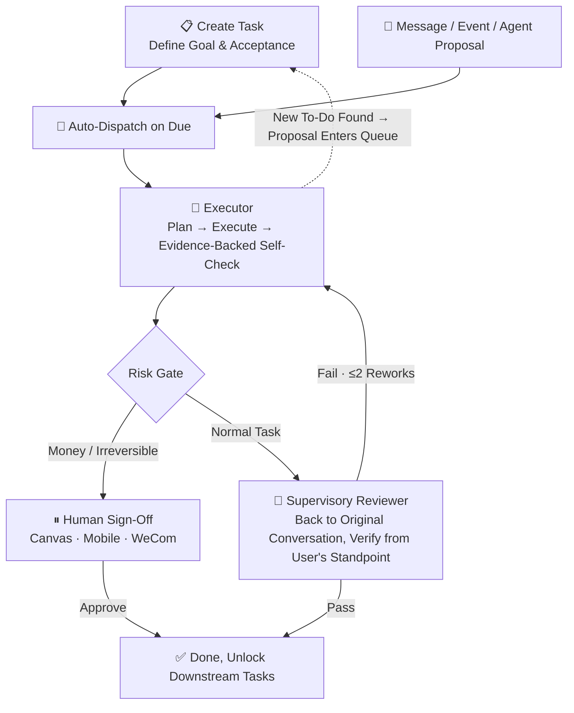

<p align="center">
  
</p>
<p align="center"><b>EvoLoop - Autonomous Duty Task Agent</b></p>

<p align="center">
  
  
  
  <a href="https://github.com/wonderful-team/evoloop/wiki"></a>
</p>

<p align="center">
  <a href="https://github.com/wonderful-team/evoloop/releases">Releases</a> &nbsp;·&nbsp;
  <a href="https://www.evoloop.cn">Website</a> &nbsp;·&nbsp;
  <a href="https://www.evoloop.cn/agent_multi">Try Online</a> &nbsp;·&nbsp;
  <a href="https://github.com/wonderful-team/evoloop/issues">Issues</a>
</p>

<p align="center">
  <a href="README_EN.md">English</a> | <a href="../README.md">中文</a> | <a href="README_JA.md">日本語</a> | <a href="README_KO.md">한국어</a>
</p>

---

EvoLoop is an **autonomous duty task agent**: unlike a chatbot that answers questions one at a time, it stands by your business 24/7 — tasks are queued, executed, supervised, and accepted; when in doubt, it pauses to ask you. The user only does three things: **plan tasks, accept results, handle exceptions**.

Covers Web, desktop, and mobile, with wake-word-driven natural voice conversation. Agent core is powered by [OpenHands](https://github.com/All-Hands-AI/OpenHands).

🌐 Website [evoloop.cn](https://evoloop.cn) · 💻 [GitHub](https://github.com/wonderful-team/evoloop)

## 🌟 Key Features

| Capability | Description |
|---|---|
| **Long-Horizon Execution** | 300+ continuous steps per task, hours of stable runtime, automatic error recovery |
| **Cross-Device A2A Collaboration** | Agents across devices discover, delegate, and return results asynchronously |
| **Duty Execution** | Tasks auto-queue and run on schedule; every step logs progress, completion attaches verifiable evidence. The executor's "done" doesn't count — results are sent back to your original request under your name for a supervisory reviewer to verify "was it really done right?". Money and irreversible ops always wait for human sign-off. |
| **Imitation Learning** | You demonstrate once, it learns the whole workflow — click through a flow and it records the trace; drop in a screen recording and it watches frame-by-frame, distilling reusable skills or "macros". Subsequent runs replay mechanically without burning compute; environment changes trigger automatic fallback to AI; AI-authored workflows must pass real execution tests before deployment. |
| **Unified Routing** | Voice, web, WeCom/WeChat customer service, mobile — all sources treated equally. Common commands execute in seconds without touching the LLM; ambiguous or complex requests are routed to AI for careful reasoning |
| **Voice Conversation** | Say "Hi Evo" to wake; interrupt while it's speaking; dictate to type; audio never leaves your device |
| **Operate on Your Behalf** | Works on the devices you already have — web pages in the browser, apps on the desktop, Android / iOS / HarmonyOS phones; away from the computer? Approve and accept from your phone |
| **Finds Help (A2A)** | The Agent on this machine can hand off work to an Agent on another of your devices — the main flow waits automatically while the task is delegated, resumes instantly when the result returns; the entire delegation is visible in real time on the UI |
| **Safety Fuses** | Unsure? Pause and ask — never fabricate an answer. Dangerous ops are gated by permissions; secrets never appear in output; runaway loops are cut off decisively |
| **Ecosystem Ready** | External tools plug in via MCP; domain knowledge packaged as capability packs — swap the takeover target today (mall) for another tomorrow (CRM) without touching core code |

---

## 📋 Table of Contents

- [Product Demo](#product-demo)
- [System Architecture](#system-architecture)
- [Duty Task System](#duty-task-system-autonomous-duty)
- [Installation & Deployment](#installation--deployment)
- [Build & Release](#build--release)
- [Development Guide](#development-guide)
- [License](#license)

---

## 🎬 Product Demo

**EvoLoop Full Feature Demo**

<video src="https://www.evoloop.cn/assets/video/demo.mp4" controls preload="metadata" width="860"></video>

**Duty Task System Demo 1**

<video src="https://www.evoloop.cn/assets/video/duty1.webm" controls preload="metadata" width="860"></video>

**Duty Task System Demo 2**

<video src="https://www.evoloop.cn/assets/video/duty2.webm" controls preload="metadata" width="860"></video>

<table>
  <tr>
    <td valign="top">
      
      <p align="center"><em>Desktop</em></p>
    </td>
    <td valign="top">
      
      <p align="center"><em>Mobile</em></p>
    </td>
  </tr>
</table>

---

## 🏗 System Architecture

| Layer | Components |
|------|------|
| Clients | Web (React + Vite), Desktop (Tauri + Rust voice pipeline), Mobile (React Native, remote approve/accept) |
| Service | FastAPI: REST + SSE + Voice WebSocket channel |
| Engine | Agent engine built on [OpenHands](https://github.com/All-Hands-AI/OpenHands) SDK: Plan → Tool Execution → Structured Self-Check → Suspend-on-Doubt |
| Routing | Command dispatcher: common commands execute directly; uncertain ones delegate to Agent |
| Duty | Task Queue + Supervisor Scheduling: on-time execution, crash convergence, circuit-breaker guardrails |
| Extensions | MCP tool services, capability packs (SOP), runtime tool creation, macro engine (deterministic replay + self-heal) |
| Data | Desktop embedded (SQLite + LanceDB, data never leaves machine) / SaaS server (PostgreSQL + Redis) |

---

## ⏱ Duty Task System (Autonomous Duty)

### The Problem

Hand long-running, complex tasks to a conversational Agent and you typically get: context drowned in noise and "rotting", model fatigues and exits early, falsely claims completion, gives evasive answers, deliverables drift from the goal. Traditional "fixed prompt + fixed interval" auto-patrols have no state, no acceptance, no dependencies, and Agent-discovered to-dos have nowhere to go — "hand the business over to an Agent to run automatically" simply doesn't hold.

### The Goal

Let an Agent reliably run a business long-term: every task is created with scenario, goal, and acceptance criteria; execution results must be verified by a **supervisory reviewer** from the user's standpoint — "falsely claimed done" doesn't pass; money and irreversible ops always require human sign-off. Humans only show up at three moments: approve, accept, arbitrate.

### Task Execution Flow



### Suitable Scenarios

- **E-commerce / Retail Ops Management**: Product research → pricing → listing → daily patrols (stockouts, bad reviews, anomalous orders) — first pilot scenario is "take over a mall"
- **Content & Growth Pipelines**: Planning → writing → asset creation → multi-platform publishing → campaign retrospective, every step traced and accepted
- **Data & Patrol Bots**: Daily business reports, inventory / funds / metrics scheduled patrols, anomalies trigger alerts and proposals instantly
- **Third-Party Event Response**: Orders, tickets, audit messages auto-enqueue for processing, full audit trail
- **Enterprise Back-Office SOPs**: Approval assist, reconciliation, stocktaking — repeatable, auditable workflows
- **R&D Project Steward**: Codebase patrols, dependency security checks, backup verification, backlog grooming
- **Customer Service Reception**: WeCom / WeChat customer service auto-replies; money-related issues escalate to humans
- **Eyes-Off Operation**: 7×24 duty loop, humans only appear at three moments — approve, accept, arbitrate

Swap the takeover target (mall → CRM → supply chain → content site) by only swapping capability packs and task data — scheduling and execution layers stay unchanged.

### Workbench

Infinite canvas as the main view: heterogeneous deliverable cards + dependency lines, visual focus auto-follows the Agent's current node; approve / accept / review cards embedded in nodes. Humans can answer three questions anytime: **What is the Agent doing, what has it done, what will it do next**.

---

## 🚀 Installation & Deployment

EvoLoop has three deployment modes — choose what fits:

| Mode | Scenario | Stack | Config File |
|---|---|---|---|
| **Desktop Embedded** | Personal computer, local use | SQLite + LanceDB + Huey | `.env.prod.desktop` |
| **Web Single-User** | Personal server | SQLite + LanceDB + Huey | `.env.prod.web.single` |
| **Web Multi-User** | Team / enterprise production | PostgreSQL + Redis + Meilisearch + Neo4j + Celery | `.env.prod.web.multi` |

### Dev Mode (Recommended)

```bash
git clone https://github.com/wonderful-team/evoloop.git
cd evoloop
./deploy/dev.sh
```

After startup, visit `http://localhost:20160/docs` for interactive API docs.

### Desktop Embedded Mode (Personal Computer, Zero External Dependencies)

Backend bundles SQLite + LanceDB + Huey — runs as a sidecar with the desktop app, data never leaves the machine:

```bash
git clone https://github.com/wonderful-team/evoloop.git
cd evoloop

# Backend
cd backend
cp .env.prod.desktop .env      # Fill in LLM API Key
uv sync
uv run python bin/run.py api

# Desktop (Tauri, includes voice wake; backend runs as sidecar)
cd frontend
npm install
npm run tauri dev
```

### Web Single-User Mode (Personal Server)

```bash
cp .env.prod.web.single .env
uv run python bin/run.py api
# Frontend: npm run dev
```

### Web Multi-User Mode (Team / Enterprise Production)

```bash
cp .env.prod.web.multi .env
# Configure PostgreSQL / Redis / Meilisearch / Neo4j
docker compose up -d
```

---

## 📦 Build & Release

```bash
# Desktop packaging
./deploy/build.sh macos-arm64 --env-file=.env.prod.desktop
./deploy/build.sh macos-x86_64 --env-file=.env.prod.desktop
./deploy/build.sh windows --env-file=.env.prod.desktop

# Web static assets
./deploy/build.sh web --env-file=.env.prod.web.multi

# Model download
./deploy/download_models.sh --models nomic-embed,paraformer-zh
```

---

## 🔧 Development Guide

```bash
# Backend: test / format / type-check
cd backend
uv run pytest
uv run ruff format . && uv run ruff check . --fix
uv run pyright

# Frontend: test / lint / type-check
cd frontend
npm run test
npm run lint && npm run typecheck
```

Add a tool: create a file in `backend/app/domain/tools/` and register with `@evoloop_tool`; business capabilities (SOPs) are loaded as capability packs / skills — no engine changes needed.

---

## 🤝 Contributing

1. Fork the repo
2. Create a feature branch: `git checkout -b feature/my-feature`
3. Commit changes: `git commit -am 'Add new feature'`
4. Push the branch: `git push origin feature/my-feature`
5. Open a Pull Request

---

## 📄 License

MIT License. See [LICENSE](../LICENSE) for details.

---

## ⚠️ Disclaimer

1. This project is licensed under the [MIT License](../LICENSE) for technical research and learning only.
2. Agent mode consumes significantly more tokens than regular chat — monitor your costs. The Agent can access your local operating system; use only in trusted environments.
3. High-risk operations trigger human confirmation. Keep your EvoCloud credentials and local data secure.

---

## 💬 Community & Support

- **Website**: [evoloop.cn](https://evoloop.cn)
- **GitHub**: [wonderful-team/evoloop](https://github.com/wonderful-team/evoloop)
- **Issues**: [GitHub Issues](https://github.com/wonderful-team/evoloop/issues)
- **Email**: [preterchan@gmail.com](mailto:preterchan@gmail.com)

---

<p align="center">
  <b>Built with ❤️ by EvoLoop Team</b>
</p>
