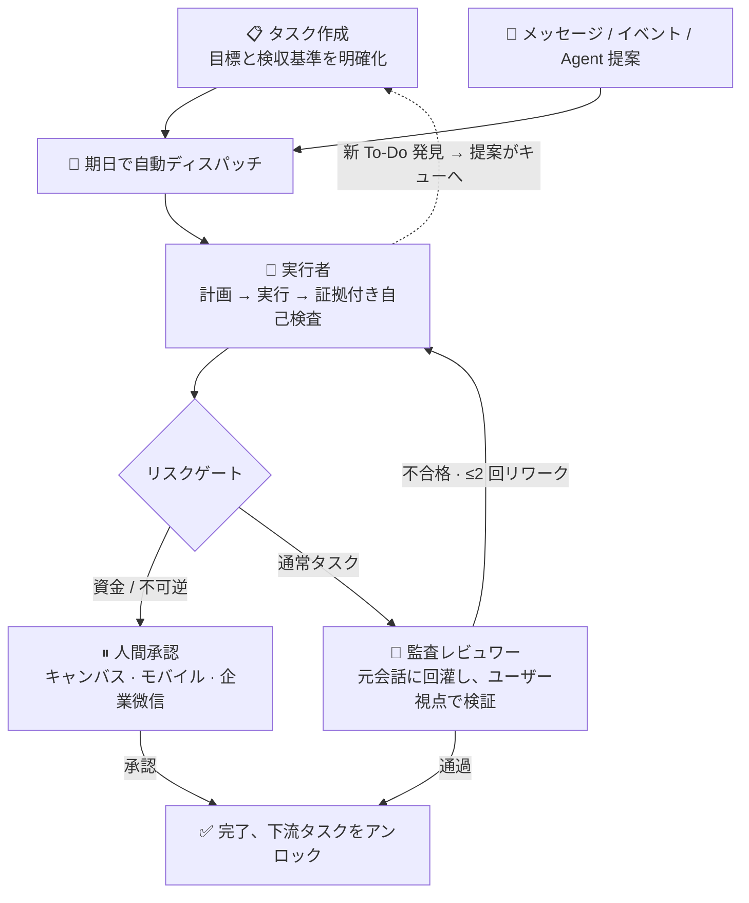

<p align="center">
  
</p>
<p align="center"><b>EvoLoop - 自主値守型タスクエージェント</b></p>

<p align="center">
  
  
  
  <a href="https://github.com/wonderful-team/evoloop/wiki"></a>
</p>

<p align="center">
  <a href="https://github.com/wonderful-team/evoloop/releases">Releases</a> &nbsp;·&nbsp;
  <a href="https://www.evoloop.cn">Website</a> &nbsp;·&nbsp;
  <a href="https://www.evoloop.cn/agent_multi">Try Online</a> &nbsp;·&nbsp;
  <a href="https://github.com/wonderful-team/evoloop/issues">Issues</a>
</p>

<p align="center">
  <a href="README_EN.md">English</a> | <a href="../README.md">中文</a> | <a href="README_JA.md">日本語</a> | <a href="README_KO.md">한국어</a>
</p>

---

EvoLoop は **自主値守型タスクエージェント** です。チャットボットのように一問一答するのではなく、24/7 あなたのビジネスのそばに立ち続けます — タスクをキューイングし、実行し、監査検収し、迷ったら人に尋ねます。ユーザーがやることは 3 つだけ：**タスクを計画し、結果を検収し、例外を処理する**。

Web・デスクトップ・モバイルの 3 端末をカバーし、ウェイクワード駆動の自然な音声会話に対応。エージェント基盤は [OpenHands](https://github.com/All-Hands-AI/OpenHands) を採用。

🌐 公式サイト [evoloop.cn](https://evoloop.cn) · 💻 [GitHub](https://github.com/wonderful-team/evoloop)

## 🌟 主な機能

| 機能 | 説明 |
|---|---|
| **長時間実行** | 単一タスクで 300 ステップ以上の連続実行、数時間の安定稼働、自動エラー復旧 |
| **クロスデバイス A2A 協調** | デバイス間でエージェントが発見・委任・結果返却を非同期に実行 |
| **値守実行** | タスクが期限になると自動でキューに入り実行。各ステップの進捗をリアルタイムに記録し、完了時には検証可能な証跡を添付。「実行完了」だけでは不十分 — 結果をあなたの名前で元の会話に戻し、監査レビュワーが「本当に正しくやったか」を代行確認。資金・不可逆操作は必ず人間が承認 |
| **模倣学習** | あなたが 1 回デモするだけで 1 セット習得 — マウス操作で軌跡を記録し、画面録画を投げればフレームごとに理解して再利用可能なスキルや「マクロ」に蒸留。以降は機械的に再実行（モデル推論コストゼロ）、環境変化時は自動的に AI にフォールバック；AI が書いたワークフローは実測テスト通過後にのみ配備可能 |
| **統合ルーティング** | 音声・Web・企業微信/微信カスタマーサービス・モバイル — どの入力経路も同一扱い。頻出コマンドは LLM を経由せず秒で実行；曖昧・複雑なものだけ AI が慎重に推論 |
| **音声対話** | 「你好Evo」で起動、話しかければ割り込み可能、音声入力で書き起こし代行、音声はデバイス外に出ない |
| **あなたの代わりに操作** | あなたが持っているデバイス上で実行 — ブラウザ内の Web ページ、デスクトップアプリ、Android / iOS / HarmonyOS 端末。PC の前にいなくてもスマホで承認・検収 |
| **助けを呼べる (A2A)** | このマシンの Agent が、あなたの別のデバイス上の Agent に仕事を投げられる — 派遣時はメインフローが自動待機、結果が戻れば即座に再開。委任プロセス全体が UI 上でリアルタイム可視化 |
| **安全装置** | 自信がなければ停止して人に尋ね、決してでっち上げない；危険操作は権限ゲートでガード、機密情報は出力に出さない、暴走ループは即座に強制停止 |
| **エコシステム対応** | 外部ツールは MCP プロトコルで即時接続/切断；業務ノウハウは能力パックとしてパッケージ化 — 今日 EC サイトを管轄し、明日は CRM に切り替え、コアコードは無変更 |

---

## 📋 目次

- [製品デモ](#製品デモ)
- [システムアーキテクチャ](#システムアーキテクチャ)
- [値守タスクシステム](#値守タスクシステム-autonomous-duty)
- [インストールとデプロイ](#インストールとデプロイ)
- [ビルドとリリース](#ビルドとリリース)
- [開発ガイド](#開発ガイド)
- [ライセンス](#ライセンス)

---

## 🎬 製品デモ

**EvoLoop 完全機能デモ**

<video src="https://www.evoloop.cn/assets/video/demo.mp4" controls preload="metadata" width="860"></video>

**値守タスクシステムデモ 1**

<video src="https://www.evoloop.cn/assets/video/duty1.webm" controls preload="metadata" width="860"></video>

**値守タスクシステムデモ 2**

<video src="https://www.evoloop.cn/assets/video/duty2.webm" controls preload="metadata" width="860"></video>

<table>
  <tr>
    <td valign="top">
      
      <p align="center"><em>Desktop</em></p>
    </td>
    <td valign="top">
      
      <p align="center"><em>Mobile</em></p>
    </td>
  </tr>
</table>

---

## 🏗 システムアーキテクチャ

| 層 | 構成 |
|------|------|
| クライアント | Web (React + Vite)、デスクトップ (Tauri + Rust 音声パイプライン)、モバイル (React Native、リモート承認/検収対応) |
| サービス | FastAPI: REST + SSE + 音声 WebSocket チャネル |
| エンジン | [OpenHands](https://github.com/All-Hands-AI/OpenHands) SDK ベースの Agent エンジン: 計画 → ツール実行 → 構造化自己検査 → 迷いがあれば挂起 |
| ルーティング | 指令振り分け: 定型コマンドは即実行、不確実なものは Agent に委任 |
| 値守 | タスクキュー + Supervisor スケジューリング: 期日実行、クラッシュ収束、サーキットブレーカー |
| 拡張 | MCP ツールサービス、能力パック (SOP)、ランタイムツール作成、マクロエンジン (確定的再生 + 自動修復) |
| データ | デスクトップ組込 (SQLite + LanceDB、データはマシン外に出ない) / SaaS サーバ (PostgreSQL + Redis) |

---

## ⏱ 値守タスクシステム (Autonomous Duty)

### 解決する課題

長期・複雑なタスクを対話型 Agent に任せると、典型的には：コンテキストがノイズで溢れ「腐敗」、モデルが疲弊して早期終了、完了を虚偽報告、曖昧な返答、成果物が目標から逸脱。従来の「固定プロンプト + 固定間隔」の自動巡回では、状態・検収・依存関係がなく、Agent が作業中に見つけた新しい To-Do が戻れない — 「ビジネスを Agent に自動運転させる」ことは成立しない。

### 目標

Agent がビジネスを長期的に確実に回せるようにする：タスク作成時にシナリオ・目標・検収基準をセット；実行結果は **監査レビュワー** がユーザー視点で検証 — 「やったふり」は通らない；資金・不可逆操作は必ず人間が承認。人間が登場するのは「承認・検収・仲裁」の 3 瞬間のみ。

### タスク実行フロー



### 適したシナリオ

- **EC / 小売運用托管**: 選品調査 → 価格決定 → 上架 → 日次巡回 (欠品・悪評・異常注文) — 最初の試験シナリオは「1 つの商城を接管」
- **コンテンツ & グロースパイプライン**: 企画 → 執筆 → 素材制作 → 多プラットフォーム投稿 → 投放復盘、各ステップは痕跡化・検収
- **データ & 巡回ボット**: 経営日報、在庫/資金/指標の定期巡回、異常即アラート・即提案
- **サードパーティイベント継続応答**: 注文・チケット・審査メッセージを自動キューイング、全プロセス監査可能
- **企業バックオフィス SOP**: 承認補助、照合、棚卸し等の繰り返し可能かつ検収可能なフロー
- **R&D プロジェクト管家**: コードベース巡回、依存脆弱性チェック、バックアップ検証、バックログ整理
- **カスタマーサービス受付**: 企業微信/微信カスタマーサービス巡回自動応答、資金類は人工へエスカレーション
- **ノンアテンション運用**: 7×24 値守ループ、人間は「承認・検収・仲裁」の 3 瞬間のみ登場

接管対象を変更 (商城 → CRM → サプライチェーン → コンテンツサイト) する場合、能力パックとタスクデータを入れ替えるだけで、スケジューリング・実行層はゼロ変更。

### ワークベンチ

無限キャンバスをメインビューに: 異種デリバラブルカード + 依存線、視覚フォーカスが Agent の現在ノードを自動追従；承認/検収/レビューカードはノード内に埋め込み。人間はいつでも 3 つの問いに答えられる — **Agent は今何をしているか、これまで何をしたか、次に何をするか**。

---

## 🚀 インストールとデプロイ

EvoLoop には 3 つのデプロイ形態があります。用途に合わせて選択してください。

| モード | シナリオ | スタック | 設定ファイル |
|---|---|---|---|
| **デスクトップ組込** | 個人 PC・ローカル利用 | SQLite + LanceDB + Huey | `.env.prod.desktop` |
| **Web 単一ユーザー** | 個人サーバー | SQLite + LanceDB + Huey | `.env.prod.web.single` |
| **Web マルチユーザー** | チーム / 企業本番 | PostgreSQL + Redis + Meilisearch + Neo4j + Celery | `.env.prod.web.multi` |

### 開発モード (推奨)

```bash
git clone https://github.com/wonderful-team/evoloop.git
cd evoloop
./deploy/dev.sh
```

起動後 `http://localhost:20160/docs` でインタラクティブ API ドキュメントを確認できます。

### デスクトップ組込モード (個人 PC、外部依存ゼロ)

バックエンドに SQLite + LanceDB + Huey を内蔵、デスクトップアプリと同時に起動、データはマシン外に出ない:

```bash
git clone https://github.com/wonderful-team/evoloop.git
cd evoloop

# バックエンド
cd backend
cp .env.prod.desktop .env      # LLM API Key を記入
uv sync
uv run python bin/run.py api

# デスクトップ (Tauri、音声ウェイク含む; バックエンドは sidecar として同期起動)
cd frontend
npm install
npm run tauri dev
```

### Web 単一ユーザーモード (個人サーバー)

```bash
cp .env.prod.web.single .env
uv run python bin/run.py api
# フロントエンド: npm run dev
```

### Web マルチユーザーモード (チーム / 企業本番)

```bash
cp .env.prod.web.multi .env
# PostgreSQL / Redis / Meilisearch / Neo4j を構成
docker compose up -d
```

---

## 📦 ビルドとリリース

```bash
# デスクトップ パッケージング
./deploy/build.sh macos-arm64 --env-file=.env.prod.desktop
./deploy/build.sh macos-x86_64 --env-file=.env.prod.desktop
./deploy/build.sh windows --env-file=.env.prod.desktop

# Web 静的アセットビルド
./deploy/build.sh web --env-file=.env.prod.web.multi

# モデルダウンロード
./deploy/download_models.sh --models nomic-embed,paraformer-zh
```

---

## 🔧 開発ガイド

```bash
# バックエンド: テスト / フォーマット / 型チェック
cd backend
uv run pytest
uv run ruff format . && uv run ruff check . --fix
uv run pyright

# フロントエンド: テスト / lint / 型チェック
cd frontend
npm run test
npm run lint && npm run typecheck
```

ツール追加: `backend/app/domain/tools/` にファイルを作成し `@evoloop_tool` デコレータで登録；業務能力 (SOP) は能力パック / スキルとしてマウント、エンジン変更不要。

---

## 🤝 コントリビュート

1. リポジトリを Fork
2. 機能ブランチ作成: `git checkout -b feature/my-feature`
3. 変更をコミット: `git commit -am 'Add new feature'`
4. ブランチを Push: `git push origin feature/my-feature`
5. Pull Request 作成

---

## 📄 ライセンス

MIT ライセンス。詳細は [LICENSE](../LICENSE) を参照。

---

## ⚠️ 免責事項

1. 本プロジェクトは [MIT ライセンス](../LICENSE) の下、技術研究および学習目的でのみ提供されます。
2. Agent モードは通常チャットより大幅に多くのトークンを消費します。コストを監視してください。Agent はローカル OS にアクセス可能です。信頼できる環境でのみ使用してください。
3. 高リスク操作は人工確認をトリガーします。EvoCloud 認証情報とローカルデータを安全に管理してください。

---

## 💬 コミュニティとサポート

- **公式サイト**: [evoloop.cn](https://evoloop.cn)
- **GitHub**: [wonderful-team/evoloop](https://github.com/wonderful-team/evoloop)
- **Issues**: [GitHub Issues](https://github.com/wonderful-team/evoloop/issues)
- **メール**: [preterchan@gmail.com](mailto:preterchan@gmail.com)

---

<p align="center">
  <b>Built with ❤️ by EvoLoop Team</b>
</p>
