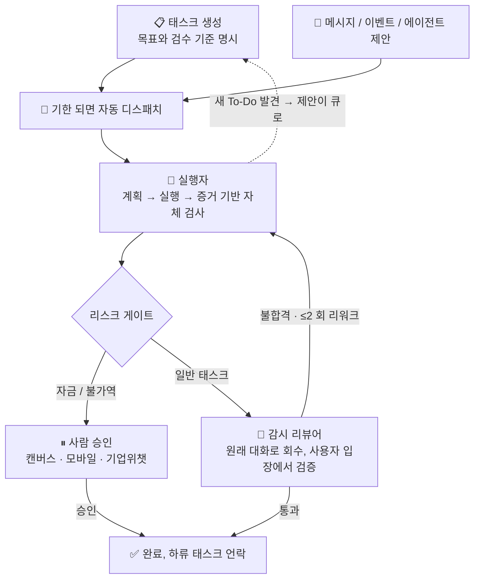

<p align="center">
  
</p>
<p align="center"><b>EvoLoop - 자율 당직형 태스크 에이전트</b></p>

<p align="center">
  
  
  
  <a href="https://github.com/wonderful-team/evoloop/wiki"></a>
</p>

<p align="center">
  <a href="https://github.com/wonderful-team/evoloop/releases">Releases</a> &nbsp;·&nbsp;
  <a href="https://www.evoloop.cn">Website</a> &nbsp;·&nbsp;
  <a href="https://www.evoloop.cn/agent_multi">Try Online</a> &nbsp;·&nbsp;
  <a href="https://github.com/wonderful-team/evoloop/issues">Issues</a>
</p>

<p align="center">
  <a href="README_EN.md">English</a> | <a href="../README.md">中文</a> | <a href="README_JA.md">日本語</a> | <a href="README_KO.md">한국어</a>
</p>

---

EvoLoop은 **자율 당직형 태스크 에이전트**입니다. 챗봇처럼 일문일답하는 것이 아니라, 24/7 당신의 비즈니스 곁을 지키며 — 태스크를 큐에 넣고, 실행하고, 감시·검수하며, 애매하면 사람에게 묻습니다. 사용자가 할 일은 단 세 가지뿐입니다: **태스크 계획, 결과 검수, 예외 처리**.

웹, 데스크톱, 모바일 3단말 커버, 웨이크워드 기반 자연어 음성 대화 지원. 에이전트 코어는 [OpenHands](https://github.com/All-Hands-AI/OpenHands) 기반.

🌐 공식 사이트 [evoloop.cn](https://evoloop.cn) · 💻 [GitHub](https://github.com/wonderful-team/evoloop)

## 🌟 주요 기능

| 기능 | 설명 |
|---|---|
| **장시간 실행** | 단일 태스크 300+ 연속 스텝, 수시간 안정적 실행, 자동 오류 복구 |
| **크로스 디바이스 A2A 협업** | 디바이스 간 에이전트가 비동기적으로 발견·위임·결과 반환 |
| **당직 실행** | 태스크가 기한 되면 자동 큐잉·실행; 모든 단계 진행률 실시간 기록, 완료 시 검증 가능한 증거 첨부. 실행자의 "완료"만으로는 부족 — 결과를 당신의 이름으로 원 요청 대화에 되돌려 **감시 리뷰어**가 "제대로 했는가"를 대리 검증. 자금·불가역 작업은 반드시 사람 승인 |
| **모방 학습** | 당신이 한 번 시연하면 한 세트 습득 — 마우스 클릭으로 궤적 기록, 화면 녹화 던지면 프레임 단위 이해 후 재사용 가능한 스킬·'매크로'로 증류. 이후 같은 일은 기계적 재실행(모델 연산 비용 제로); 환경 변화 시 자동 AI 폴백; AI가 작성한 워크플로는 실측 테스트 통과 후만 배포 |
| **통합 라우팅** | 음성·웹·기업위챗/위챗 고객센터·모바일 — 모든 입력을 동일 처리. 빈번 명령은 LLM 거치지 않고 초 단위 실행; 애매하거나 복잡한 것만 AI가 신중히 추론 |
| **음성 대화** | "你好Evo"로 깨우기, 말하는 중 끼어들기 가능, 음성 받아쓰기 대행, 음성은 디바이스 밖으로 나가지 않음 |
| **대신 조작** | 당신이 가진 기기 위에서 실행 — 브라우저 웹페이지, 데스크톱 앱, Android / iOS / HarmonyOS 폰. PC 앞을 비워도 폰으로 승인·검수 |
| **도움 요청 (A2A)** | 이 머신의 에이전트가 당신의 다른 기기 에이전트에게 일을 넘길 수 있음 — 태스크 내보낼 때 메인 플로 자동 대기, 결과 돌아오면 즉시 재개. 전체 위임 과정이 UI에서 실시간 가시화 |
| **안전 장치** | 확신 없으면 멈추고 사람에게 묻고, 절대 답을 꾸며내지 않음; 위험 조작은 권한 게이트로 차단, 비밀정보 출력에 노출 안 함, 폭주 루프 즉각 차단 |
| **생태계 연동** | 외부 도구 MCP 프로토콜로 즉시 접속/해제; 도메인 지식은 능력 패키지로 패키징 — 오늘은 쇼핑몰, 내일은 CRM으로 교체, 코어 코드 수정 불필요 |

---

## 📋 목차

- [제품 데모](#제품-데모)
- [시스템 아키텍처](#시스템-아키텍처)
- [당직 태스크 시스템](#당직-태스크-시스템-autonomous-duty)
- [설치 및 배포](#설치-및-배포)
- [빌드 및 릴리스](#빌드-및-릴리스)
- [개발 가이드](#개발-가이드)

---

## 🎬 제품 데모

**EvoLoop 전체 기능 데모**

<video src="https://www.evoloop.cn/assets/video/demo.mp4" controls preload="metadata" width="860"></video>

**당직 태스크 시스템 데모 1**

<video src="https://www.evoloop.cn/assets/video/duty1.webm" controls preload="metadata" width="860"></video>

**당직 태스크 시스템 데모 2**

<video src="https://www.evoloop.cn/assets/video/duty2.webm" controls preload="metadata" width="860"></video>

<table>
  <tr>
    <td valign="top">
      
      <p align="center"><em>Desktop</em></p>
    </td>
    <td valign="top">
      
      <p align="center"><em>Mobile</em></p>
    </td>
  </tr>
</table>

---

## 🏗 시스템 아키텍처

| 계층 | 구성 |
|------|------|
| 클라이언트 | Web (React + Vite), 데스크톱 (Tauri + Rust 음성 파이프라인), 모바일 (React Native, 원격 승인/검수 지원) |
| 서비스 | FastAPI: REST + SSE + 음성 WebSocket 채널 |
| 엔진 | [OpenHands](https://github.com/All-Hands-AI/OpenHands) SDK 기반 Agent 엔진: 계획 → 도구 실행 → 구조화된 자체 검사 → 의심 시 중단 |
| 라우팅 | 명령 디스패처: 빈번 명령 즉시 실행, 불확실한 것만 에이전트 위임 |
| 당직 | 태스크 큐 + Supervisor 스케줄링: 기한 실행, 크래시 수렴, 서킷 브레이커 가드레일 |
| 확장 | MCP 도구 서비스, 능력 팩 (SOP), 런타임 도구 생성, 매크로 엔진 (결정적 재생 + 자가 치유) |
| 데이터 | 데스크톱 내장 (SQLite + LanceDB, 데이터는 머신 밖으로 나가지 않음) / SaaS 서버 (PostgreSQL + Redis) |

---

## ⏱ 당직 태스크 시스템 (Autonomous Duty)

### 해결하는 문제

긴 호흡·복잡한 태스크를 대화형 에이전트에게 맡기면 흔히 겪는 결말: 컨텍스트가 소음으로 뒤덮여 "썩음", 모델이 지쳐 조기 종료, 완료 허위 보고, 회피적 답변, 산출물이 목표에서 이탈. 기존 "고정 프롬프트 + 고정 간격" 자동 순찰은 상태·검수·의존성 없고, 에이전트가 작업 중 발견한 새 To-Do가 돌아갈 곳 없음 — "비즈니스를 에이전트에게 자동 운영 맡기기"는 성립되지 않음.

### 목표

에이전트가 비즈니스를 장기적으로 확실하게 돌게 만들기: 모든 태스크는 생성 시 시나리오·목표·검수 기준을 가짐; 실행 결과는 **감시 리뷰어**가 사용자 입장에서 검증 — "다 했다"는 허위 보고는 통하지 않음; 자금·불가역 조작은 반드시 사람 승인. 사람은 "승인·검수·중재" 세 순간에만 개입.

### 태스크 실행 플로우



### 적합한 시나리오

- **이커머스/리테일 운영 위탁**: 선발조사 → 가격결정 → 상장 → 일일 순찰(품절·악평·이상 주문) — 첫 파일럿 시나리오는 "쇼핑몰 한 곳 접수"
- **콘텐츠·그로스 파이프라인**: 기획 → 집필 → 소재 제작 → 멀티 플랫폼 발행 → 투자 회고, 단계마다 흔적·검수
- **데이터·순찰 봇**: 일일 경영 보고, 재고/자금/지표 정기 순찰, 이상 즉시 알람·즉시 제안
- **서드파티 이벤트 지속 응답**: 주문·티켓·심사 메시지 자동 큐잉 처리, 전 과정 감사 가능
- **기업 백오피스 SOP**: 승인 보조, 대사, 재고조사 등 반복 가능·검수 가능 프로세스
- **R&D 프로젝트 집사**: 코드베이스 순찰, 의존성 취약점 점검, 백업 검증, 백로그 정리
- **고객 서비스 응대**: 기업위챗/위챗 고객센터 순찰 자동 응답, 자금류 이슈는 사람으로 에스컬레이션
- **무인 운영**: 7×24 당직 루프, 사람은 "승인·검수·중재" 세 순간에만 등장

접수 대상을 교체(쇼핑몰 → CRM → 공급망 → 콘텐츠 사이트)할 때, 능력 팩과 태스크 데이터만 교체하면 스케줄링·실행 계층은 제로 변경.

### 워크벤치

무한 캔버스를 메인 뷰로: 이종 딜리버러블 카드 + 의존성 선, 시각적 포커스가 에이전트 현재 노드를 자동 추적; 승인/검수/리뷰 카드가 노드 내에 임베디드. 사람은 언제든 세 가지 질문에 답할 수 있음 — **에이전트가 지금 뭘 하는가, 지금까지 뭘 했는가, 다음에 뭘 할 것인가**.

---

## 🚀 설치 및 배포

EvoLoop는 세 가지 배포 형태를 제공합니다. 용도에 맞게 선택하세요.

| 모드 | 시나리오 | 스택 | 설정 파일 |
|---|---|---|---|
| **데스크톱 내장** | 개인 PC·로컬 사용 | SQLite + LanceDB + Huey | `.env.prod.desktop` |
| **웹 단일 사용자** | 개인 서버 | SQLite + LanceDB + Huey | `.env.prod.web.single` |
| **웹 다중 사용자** | 팀/엔터프라이즈 프로덕션 | PostgreSQL + Redis + Meilisearch + Neo4j + Celery | `.env.prod.web.multi` |

### 개발 모드 (권장)

```bash
git clone https://github.com/wonderful-team/evoloop.git
cd evoloop
./deploy/dev.sh
```

시작 후 `http://localhost:20160/docs`에서 인터랙티브 API 문서 확인.

### 데스크톱 내장 모드 (개인 PC, 외부 의존성 제로)

백엔드에 SQLite + LanceDB + Huey 내장, 데스크톱 앱과 함께 기동, 데이터는 머신 밖으로 나가지 않음:

```bash
git clone https://github.com/wonderful-team/evoloop.git
cd evoloop

# 백엔드
cd backend
cp .env.prod.desktop .env      # LLM API Key 입력
uv sync
uv run python bin/run.py api

# 데스크톱 (Tauri, 음성 웨이크 포함; 백엔드는 사이드카로 동시 기동)
cd frontend
npm install
npm run tauri dev
```

### 웹 단일 사용자 모드 (개인 서버)

```bash
cp .env.prod.web.single .env
uv run python bin/run.py api
# 프론트엔드: npm run dev
```

### 웹 다중 사용자 모드 (팀/엔터프라이즈 프로덕션)

```bash
cp .env.prod.web.multi .env
# PostgreSQL / Redis / Meilisearch / Neo4j 구성
docker compose up -d
```

---

## 📦 빌드 및 릴리스

```bash
# 데스크톱 패키징
./deploy/build.sh macos-arm64 --env-file=.env.prod.desktop
./deploy/build.sh macos-x86_64 --env-file=.env.prod.desktop
./deploy/build.sh windows --env-file=.env.prod.desktop

# 웹 정적 애셋 빌드
./deploy/build.sh web --env-file=.env.prod.web.multi

# 모델 다운로드
./deploy/download_models.sh --models nomic-embed,paraformer-zh
```

---

## 🔧 개발 가이드

```bash
# 백엔드: 테스트 / 포맷 / 타입 체크
cd backend
uv run pytest
uv run ruff format . && uv run ruff check . --fix
uv run pyright

# 프론트엔드: 테스트 / 린트 / 타입 체크
cd frontend
npm run test
npm run lint && npm run typecheck
```

도구 추가: `backend/app/domain/tools/`에 파일 생성 후 `@evoloop_tool` 데코레이터로 등록; 비즈니스 역량(SOP)은 능력 팩/스킬로 마운트, 엔진 수정 불필요.

---

## 🤝 기여

1. 저장소 포크
2. 기능 브랜치 생성: `git checkout -b feature/my-feature`
3. 변경 사항 커밋: `git commit -am 'Add new feature'`
4. 브랜치 푸시: `git push origin feature/my-feature`
5. 풀 리퀘스트 생성

---

## 💬 커뮤니티 및 지원

- **공식 사이트**: [evoloop.cn](https://evoloop.cn)
- **GitHub**: [wonderful-team/evoloop](https://github.com/wonderful-team/evoloop)
- **Issues**: [GitHub Issues](https://github.com/wonderful-team/evoloop/issues)
- **이메일**: [preterchan@gmail.com](mailto:preterchan@gmail.com)
- **微信**: QR 코드를 스캔하여 커뮤니티 그룹에 가입

<p align="center">
  
</p>

---

<p align="center">
  <b>Built with ❤️ by EvoLoop Team</b>
</p>
