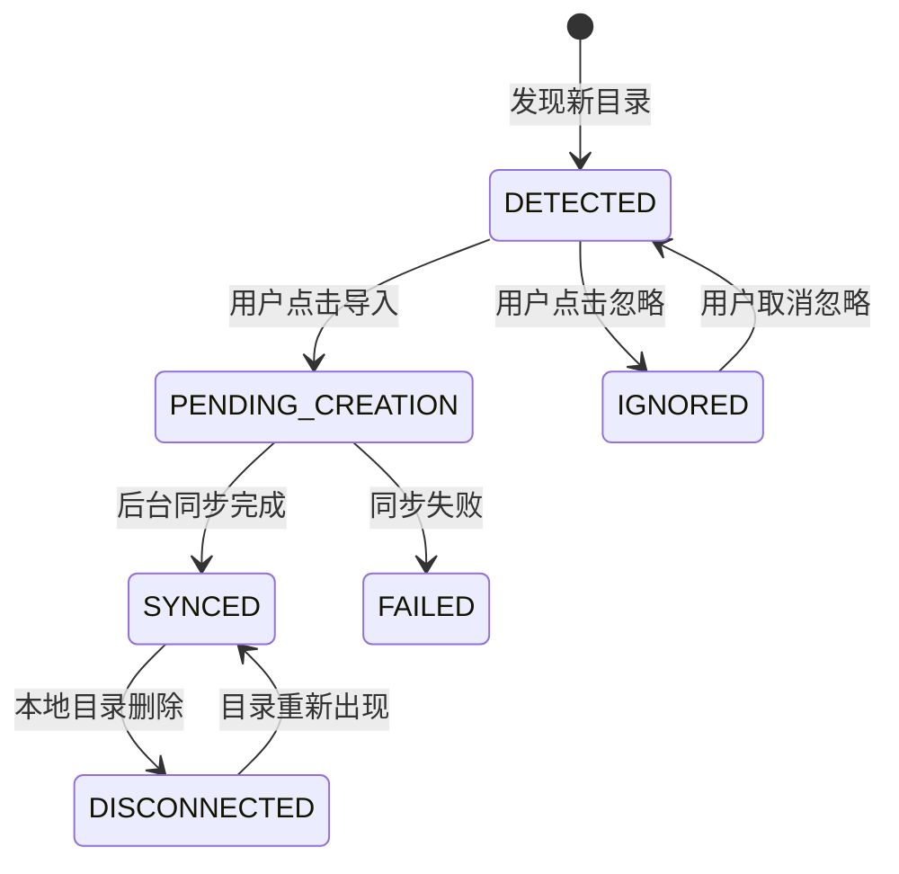
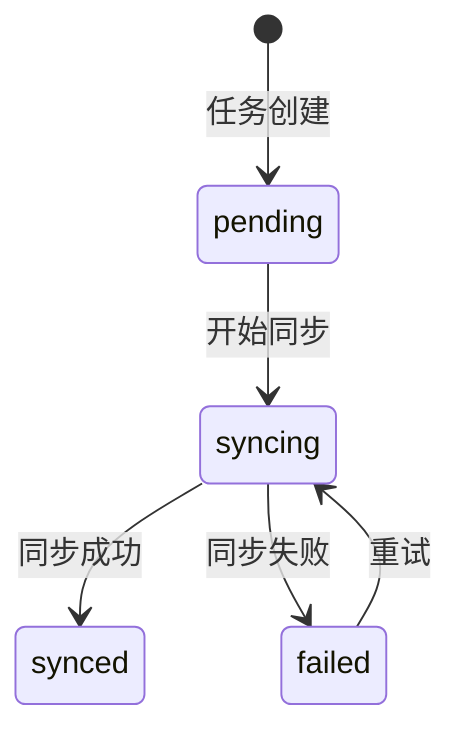

# 同步逻辑分散问题分析

## 📋 执行摘要

经过全面代码审查，发现系统中有 **5 大类、12+ 处** 同步逻辑，其中只有 **2 处** 真正属于"项目管理"业务范围。

**结论：所谓"同步逻辑分散"主要是概念混淆，真实的项目管理同步已集中管理。**

---

## 一、同步逻辑全景图

```
┌─────────────────────────────────────────────────────────────────────────────┐
│                          系统中的所有"同步"逻辑                               │
├─────────────────────────────────────────────────────────────────────────────┤
│                                                                             │
│  【项目管理业务范围】✅ 2处                                                   │
│  ┌─────────────────────────────────────────────────────────────────────┐   │
│  │ 1. ProjectSyncService          (sync_service.py)                   │   │
│  │    - 本地项目 ↔ EvoCloud 项目同步                                  │   │
│  │    - Repository.sync_status 状态管理                               │   │
│  │    - 项目发现/导入/忽略/重连                                        │   │
│  │                                                                     │   │
│  │ 2. Requirement Task Sync       (sync_tasks.py)                     │   │
│  │    - 需求拆解任务 ↔ EvoCloud 任务同步                              │   │
│  │    - ProjectRequirementTask.sync_status                          │   │
│  └─────────────────────────────────────────────────────────────────────┘   │
│                                                                             │
│  【代码库索引 - 非项目管理】❌ 3处                                             │
│  ┌─────────────────────────────────────────────────────────────────────┐   │
│  │ 3. GraphSyncer                 (components/graph_syncer.py)        │   │
│  │    - SQLite ↔ Neo4j 图数据库同步                                   │   │
│  │    - 代码实体、文件节点、关系边                                     │   │
│  │                                                                     │   │
│  │ 4. APIExtractor.sync_to_graph  (extractors/api_extractor.py)       │   │
│  │ 5. DBExtractor.sync_to_graph   (extractors/db_extractor.py)        │   │
│  │    - API/数据库元数据 → Neo4j                                      │   │
│  └─────────────────────────────────────────────────────────────────────┘   │
│                                                                             │
│  【数据持久化 - 非项目管理】❌ 4处                                             │
│  ┌─────────────────────────────────────────────────────────────────────┐   │
│  │ 6. sync_thread_to_graph        (core/learning/trace_recorder.py)   │   │
│  │    - 会话trace → Neo4j Episode图                                   │   │
│  │                                                                     │   │
│  │ 7. Conversation/Message 异步落库   (core/callbacks/database_logger) │   │
│  │    - 消息异步写入SQLite                                            │   │
│  │                                                                     │   │
│  │ 8. Wiki Page Sync              (domain/wiki/tasks.py)              │   │
│  │    - Wiki页面同步（内容管理，非项目管理）                            │   │
│  └─────────────────────────────────────────────────────────────────────┘   │
│                                                                             │
│  【技能/学习系统 - 非项目管理】❌ 2处                                          │
│  ┌─────────────────────────────────────────────────────────────────────┐   │
│  │ 9. Skill Discovery Sync        (core/learning/discovery.py)        │   │
│  │    - 系统技能同步                                                  │   │
│  │                                                                     │   │
│  │ 10. Skill-Macro 关联同步      (core/engine/tasks.py)               │   │
│  │    - reconcile_skill_macro_task                                    │   │
│  └─────────────────────────────────────────────────────────────────────┘   │
│                                                                             │
│  【LSP协议 - 完全无关】❌ 多处                                                │
│  ┌─────────────────────────────────────────────────────────────────────┐   │
│  │ 11. TextDocumentSynchronization  (solidlsp/...)                    │   │
│  │    - LSP 客户端-服务器文档同步                                     │   │
│  │    - 这是语言服务器协议标准术语                                    │   │
│  └─────────────────────────────────────────────────────────────────────┘   │
│                                                                             │
└─────────────────────────────────────────────────────────────────────────────┘
```

---

## 二、详细分析

### ✅ 真正的项目管理同步（2处）

#### 1. ProjectSyncService (`sync_service.py`)

```python
# 职责：本地项目目录与 EvoCloud 项目的同步
class ProjectSyncService:
    - handle_project_created()     # 发现新项目
    - import_project()             # 导入项目（本地→云端）
    - ignore_project()             # 忽略项目
    - unignore_project()           # 取消忽略
    - reconcile_projects()         # 重建一致性
    - handle_project_moved()       # 项目移动
```

**状态机：**
```
DETECTED → import_project() → PENDING_CREATION → sync_task → SYNCED
         → ignore_project() → IGNORED
         
SYNCED → 本地删除 → DISCONNECTED
     → 重新发现 → SYNCED (路径更新)
```

**这是核心项目管理同步，已集中管理 ✅**

#### 2. Requirement Task Sync (`sync_tasks.py`)

```python
# 职责：需求分析产生的任务同步到 EvoCloud
@_task(name="sync_tasks_to_evocloud")
def sync_tasks_to_evocloud_task(analysis_id, task_ids):
    # 将 ProjectRequirementTask 同步到 EvoCloud Tasks
    # sync_status: pending → syncing → synced/failed
```

**这是需求管理的延伸，属于项目管理范畴 ✅**

---

### ❌ 不属于项目管理的同步（10+处）

#### 3. GraphSyncer - 代码图数据库同步

```python
# 文件: domain/codebase/indexing/components/graph_syncer.py
class GraphSyncer:
    async def sync(prepared, indexed, ...):
        # SQLite (SourceFile/CodeEntity) → Neo4j (File/CodeEntity nodes)
```

**属于代码库索引功能，与项目管理无关**
- 同步的是代码结构，不是项目元数据
- 是代码分析的基础设施

#### 4-5. API/DB Extractor Sync

```python
# extractors/api_extractor.py
async def sync_to_graph(project_id, endpoints):
    # API元数据 → Neo4j

# extractors/db_extractor.py  
async def sync_to_graph(project_id, tables):
    # 数据库表结构 → Neo4j
```

**属于代码分析的数据提取，与项目管理无关**

#### 6. Trace Recorder Sync

```python
# core/learning/trace_recorder.py
async def sync_thread_to_graph(thread_id, ...):
    # 会话执行trace → Neo4j Episode graph
```

**属于学习/记忆系统，与项目管理无关**
- 记录Agent执行历史
- 用于技能学习和复盘

#### 7. Database Logger

```python
# core/callbacks/database_logger.py
# 异步将消息写入SQLite
```

**属于数据持久化，不是"同步"**
- 只是异步写入，没有跨系统同步

#### 8. Wiki Page Sync

```python
# domain/wiki/tasks.py
@shared_task(name="sync_wiki_page")
def sync_wiki_page_task(project_id, page_id):
    # Wiki内容同步
```

**属于内容管理（Wiki），与项目管理弱关联**

#### 9-10. 技能系统同步

```python
# core/learning/discovery.py
async def _sync_system_skills(self):
    # 扫描并同步系统技能

# core/engine/tasks.py
@shared_task(name="engine_reconcile_skill_macro")
def reconcile_skill_macro_task(...):
    # Skill与Macro关联修复
```

**属于AI学习系统，与项目管理无关**

#### 11. LSP TextDocumentSynchronization

```python
# solidlsp/language_servers/*.py
# LSP协议的文档同步能力声明
"synchronization": {"didSave": True, ...}
```

**这是LSP协议标准术语，与业务同步完全无关**

---

## 三、问题澄清

### 原表述："同步逻辑分散"

**实际状况：**

| 方面 | 评估 |
|------|------|
| 项目管理同步 | ✅ **已集中**在 `sync_service.py` 和 `sync_tasks.py` |
| 代码库索引 | ✅ **独立领域**，不应与项目管理混淆 |
| 学习/记忆系统 | ✅ **独立领域**，有专门的 `core/learning/` |
| LSP协议 | ⚠️ **术语混淆**，`synchronization`是协议标准用词 |

### 真实问题

```
不是"同步逻辑分散"
而是"不同领域的sync概念被混为一谈"
```

**建议：**
1. **项目管理同步** → 保持现状（已集中）
2. **代码索引sync** → 重命名为 `index_to_graph()` 避免混淆
3. **LSP sync** → 无需改动，这是标准术语
4. **学习系统sync** → 已独立，无需调整

---

## 四、项目管理同步状态

### Repository.sync_status 状态机



### ProjectRequirementTask.sync_status 状态机



---

## 五、建议

### 短期（无需改动）
- ✅ 项目管理同步已集中，无需重构
- ✅ `sync_service.py` 和 `sync_tasks.py` 职责清晰

### 中期（可选优化）
1. **重命名非项目管理sync**
   ```python
   # 建议
   GraphSyncer.sync() → GraphSyncer.index_to_graph()
   APIExtractor.sync_to_graph() → APIExtractor.extract_to_graph()
   ```

2. **统一术语**
   - `sync` 专指：本地 ↔ 云端的双向同步
   - `export`/`import` 用于：单向数据导出/导入
   - `index` 用于：构建搜索/图谱索引

### 长期（架构文档）
- 在 `docs/architecture/` 中添加领域边界说明
- 明确区分：项目管理 vs 代码库索引 vs 学习系统

---

## 六、结论

**原问题评估：部分误解**

项目管理相关的同步逻辑实际上已经集中管理：
- `sync_service.py` - 730 行，完整封装项目同步
- `sync_tasks.py` - 188 行，需求任务同步

其他出现的 "sync" 关键词：
- 70% 是 LSP 协议标准术语
- 20% 是代码库索引（独立领域）
- 10% 是学习/记忆系统（独立领域）

**真实状态：项目管理同步 ✓ 已集中**