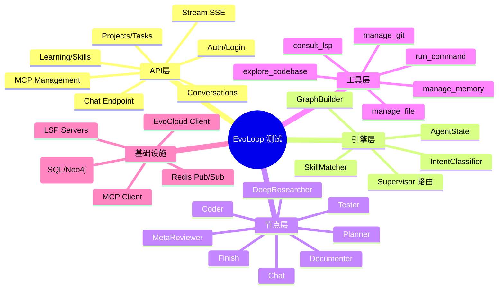

# EvoLoop 综合测试计划 (Comprehensive Test Plan)

> **版本**: 2026-01-14  
> **范围**: 全系统端到端测试覆盖

---

## 1. 测试范围概述 (Test Scope Overview)



---

## 2. API 层测试 (API Layer Tests)

### 2.1 核心聊天接口 (`/api/v1/chat`)

| 场景ID | 场景名称 | 前置条件 | 测试步骤 | 预期结果 |
| :--- | :--- | :--- | :--- | :--- |
| **CHAT-001** | 基础消息发送 | 用户已登录，存在有效 project_id | POST `/chat` with `{"message": "Hello", "thread_id": "xxx", "project_id": 1}` | 返回 `{"status": "queued"}`, SSE 开始推送 |
| **CHAT-002** | 多模态消息 (图片) | 同上 | POST `/chat` with `attachments: [{type: "image", url: "..."}]` | 消息被正确构建为 `HumanMessage` with image content |
| **CHAT-003** | 空消息拒绝 | 同上 | POST `/chat` with `{"message": "", "thread_id": "xxx"}` | 返回 400 或消息被忽略 |
| **CHAT-004** | 无效 thread_id | 同上 | POST `/chat` with `{"message": "Hi", "thread_id": "invalid-uuid"}` | 自动创建新会话或返回错误 |
| **CHAT-005** | 取消正在运行的任务 | 存在进行中任务 | POST `/stop` with `thread_id` | `activity_monitor.cancel_run()` 被调用，SSE 推送 `status: cancelled` |
| **CHAT-006** | 恢复中断任务 | 存在 HITL 中断 | POST `/resume` with `user_input` | Agent 从中断点恢复执行 |

### 2.2 SSE 流式推送 (`/api/v1/stream/chat/{thread_id}`)

| 场景ID | 场景名称 | 测试步骤 | 预期结果 |
| :--- | :--- | :--- | :--- |
| **SSE-001** | 连接建立 | GET `/stream/chat/{thread_id}` | 返回 `Content-Type: text/event-stream`, 首条为 `event: activity` |
| **SSE-002** | Token 推送 | 发送消息并监听 | 收到多个 `event: token` 事件，包含 LLM 生成的文本片段 |
| **SSE-003** | 任务状态更新 | 发送复杂任务 | 收到 `event: activity` 包含 `tasks` 数组，状态从 `pending` 变为 `running` 再到 `done` |
| **SSE-004** | Human-in-the-Loop | 触发危险操作 | 收到 `event: human_request` 包含 `approval_card` 数据 |
| **SSE-005** | 错误推送 | 触发 Agent 异常 | 收到 `event: error` 和 `event: status` (status=failed) |
| **SSE-006** | 断线重连 | 断开后重新连接 | 收到初始快照，不丢失状态 |

### 2.3 会话管理 (`/api/v1/conversations`)

| 场景ID | 场景名称 | 测试步骤 | 预期结果 |
| :--- | :--- | :--- | :--- |
| **CONV-001** | 列表查询 | GET `/conversations?project_id=1` | 返回该项目下所有会话 |
| **CONV-002** | 历史消息 | GET `/conversations/{thread_id}/messages` | 返回按 `sequence_number` 排序的消息列表 |
| **CONV-003** | 删除会话 | DELETE `/conversations/{thread_id}` | 会话及其消息被软删除 |
| **CONV-004** | 分页查询 | GET `/conversations?page=2&page_size=10` | 正确返回分页数据 |

### 2.4 技能学习 (`/api/v1/learning`)

| 场景ID | 场景名称 | 测试步骤 | 预期结果 |
| :--- | :--- | :--- | :--- |
| **LEARN-001** | 开始录制 | POST `/traces/start` with `thread_id` | 返回 `session_id` |
| **LEARN-002** | 记录事件 | POST `/traces/events` with `events[]` | 事件存入 `TraceEvent` 表 |
| **LEARN-003** | 合成技能 | POST `/skills/synthesize` with `thread_id` | 返回新创建的 `LearnedSkill` |
| **LEARN-004** | 技能列表 | GET `/skills` | 返回所有活跃技能 |
| **LEARN-005** | 执行技能 | POST `/skills/{id}/execute` with `params` | 触发 Agent 执行技能步骤 |
| **LEARN-006** | 更新技能 | PUT `/skills/{id}` with `trigger_patterns` | 技能配置被更新 |
| **LEARN-007** | 停用技能 | DELETE `/skills/{id}` | `is_active` 设为 False |

### 2.5 MCP 管理 (`/api/v1/mcp`)

| 场景ID | 场景名称 | 测试步骤 | 预期结果 |
| :--- | :--- | :--- | :--- |
| **MCP-001** | 列表服务 | GET `/mcp/servers` | 返回已注册 MCP 服务及状态 |
| **MCP-002** | 工具列表 | GET `/mcp/tools` | 返回所有 MCP 暴露的工具 |

---

## 3. 引擎层测试 (Engine Layer Tests)

### 3.1 Supervisor 路由决策

| 场景ID | 场景名称 | 输入消息 | 预期路由 |
| :--- | :--- | :--- | :--- |
| **SUP-001** | 代码任务路由 | "帮我写一个 Python 函数计算阶乘" | `next_node = coder` |
| **SUP-002** | 研究任务路由 | "深入研究 LangGraph 的设计理念" | `next_node = deep_researcher` |
| **SUP-003** | 文档任务路由 | "为这个项目生成 Wiki" | `next_node = documenter` |
| **SUP-004** | 规划任务路由 | "规划一个重构方案" | `next_node = planner` |
| **SUP-005** | 闲聊路由 | "你好，今天天气怎么样？" | `next_node = chat` |
| **SUP-006** | 完成路由 | "谢谢，就这样" | `next_node = finish` |
| **SUP-007** | Fast Path (技能匹配) | "帮我提交代码 'fix bug'" (假设有学习过的技能) | `SkillMatcher` 命中 → 直接执行 → `finish` |
| **SUP-008** | Fast Path (意图分类) | 高置信度意图 | `IntentClassifier.classify()` → 直接路由，绕过 LLM |

### 3.2 IntentClassifier

| 场景ID | 场景名称 | 输入 | 预期输出 |
| :--- | :--- | :--- | :--- |
| **IC-001** | 中文代码意图 | "写一个排序算法" | `label="coder", confidence > 0.35` |
| **IC-002** | 英文研究意图 | "Research about GraphQL" | `label="deep_researcher", confidence > 0.35` |
| **IC-003** | 模糊意图 | "这个怎么弄？" | `confidence < 0.35` → 回退 LLM |
| **IC-004** | 空消息 | "" | `label="chat", confidence低` 或抛出默认 |

### 3.3 SkillMatcher

| 场景ID | 场景名称 | 输入 | 预期输出 |
| :--- | :--- | :--- | :--- |
| **SM-001** | 正则匹配 | "帮我提交 'bugfix'" (技能 pattern: `帮我提交 {message}`) | `match.skill_name="git_commit", confidence=0.95` |
| **SM-002** | 语义匹配 | "commit the code with message 'update'" | `match via LLM, confidence=0.7-0.9` |
| **SM-003** | 无匹配 | "编译项目" (无相关技能) | `match = None` |
| **SM-004** | 阈值过滤 | 低置信度匹配 | `confidence < threshold(0.7)` → 返回 None |

### 3.4 GraphBuilder

| 场景ID | 场景名称 | 测试步骤 | 预期结果 |
| :--- | :--- | :--- | :--- |
| **GB-001** | YAML 加载 | `build("agent_main.yaml")` | 成功返回 `CompiledStateGraph` |
| **GB-002** | 节点动态导入 | 配置中引用 `app.core.engine.nodes.coder.coder_node` | 函数被正确导入并注册 |
| **GB-003** | 边配置 | `edges: [{from: coder, to: tester}]` | 图中存在 `coder → tester` 边 |
| **GB-004** | 条件路由 | `router: route_tester` | 正确绑定条件边 |
| **GB-005** | 无效配置 | 引用不存在的节点路径 | 抛出 `ImportError` 或配置错误 |

---

## 4. 工作流节点测试 (Workflow Node Tests)

### 4.1 Coder 节点

| 场景ID | 场景名称 | 输入 | 预期行为 |
| :--- | :--- | :--- | :--- |
| **COD-001** | 新建文件 | "创建 `utils.py` 包含 `add(a,b)` 函数" | 调用 `manage_file(action='create')`, 文件创建成功 |
| **COD-002** | 修改文件 | "在 `utils.py` 添加 `subtract` 函数" | 调用 `manage_file(action='update_block')`, 代码正确插入 |
| **COD-003** | 模糊匹配修复 | LLM 生成的代码缩进有误 | `EditEngine` 使用 `IndentationFlexibleReplacer` 自动修正 |
| **COD-004** | LSP 错误检测 | 生成的代码有语法错误 | 调用 `consult_lsp(action='check_errors')` 返回诊断信息 |
| **COD-005** | Fix Mode | Tester 返回失败后重新进入 | `state.scratchpad["fix_mode"] = True`, Coder 分析失败原因并修复 |
| **COD-006** | RBAC 工具约束 | Coder 尝试调用 `search_web` | 工具不在 Coder 可用列表中，被拒绝 |

### 4.2 Tester 节点

| 场景ID | 场景名称 | 输入 | 预期行为 |
| :--- | :--- | :--- | :--- |
| **TST-001** | 执行测试命令 | `run_command("pytest tests/")` | 返回 stdout/stderr, exit_code |
| **TST-002** | JUnit XML 解析 | 测试生成 `report.xml` | 解析为 `TestAnalysis` 结构 |
| **TST-003** | 测试通过 | exit_code=0 | `next_node = supervisor`, `state.retry_count` 重置 |
| **TST-004** | 测试失败 (重试) | exit_code≠0, retry_count < 3 | `next_node = coder`, `state.retry_count += 1` |
| **TST-005** | 测试失败 (放弃) | retry_count >= 3 | `next_node = meta_reviewer` |
| **TST-006** | RCA 建议 | 失败时 | 生成根因分析 (Root Cause Analysis) 和修复建议 |

### 4.3 Planner 节点

| 场景ID | 场景名称 | 输入 | 预期行为 |
| :--- | :--- | :--- | :--- |
| **PLN-001** | 生成计划 | "重构 `core` 模块" | 返回 JSON 格式计划，写入 `state.current_plan` |
| **PLN-002** | 步骤更新 | 完成某步骤后 | `PlanManager.update_step_status(step_id, "done")` |
| **PLN-003** | 上下文注入 | 存在 `past_experience` | Prompt 包含历史情节 |
| **PLN-004** | 语言适配 | 用户语言为中文 | 生成的计划为中文 |

### 4.4 Deep Researcher 节点

| 场景ID | 场景名称 | 输入 | 预期行为 |
| :--- | :--- | :--- | :--- |
| **DR-001** | 研究循环 | "研究 RAG 架构" | 执行多轮工具调用 (search_web, crawl_url) |
| **DR-002** | 迭代次数限制 | `max_iterations=3` | 最多执行 3 轮后总结 |
| **DR-003** | 结论生成 | 完成研究后 | 调用 `ReportGenerator.generate_report()` |
| **DR-004** | 并行研究 | `map_research` 触发 | 多个研究任务并行执行 |

### 4.5 Documenter 节点

| 场景ID | 场景名称 | 输入 | 预期行为 |
| :--- | :--- | :--- | :--- |
| **DOC-001** | Wiki 生成 | "生成项目 Wiki" | 扫描目录结构 → 生成章节 → 写入 MD 文件 |
| **DOC-002** | 增量更新 | 部分文档已存在 | 仅更新变化部分 |
| **DOC-003** | 代码引用 | 文档中需要引用代码 | 使用 `explore_codebase` 获取定义 |

### 4.6 Meta Reviewer 节点

| 场景ID | 场景名称 | 输入 | 预期行为 |
| :--- | :--- | :--- | :--- |
| **MR-001** | 死循环检测 | Coder-Tester 循环 3+ 次 | 分析问题根因，提供破局建议 |
| **MR-002** | 架构建议 | 检测到架构问题 | 建议调整设计或请求人工干预 |

### 4.7 Chat 节点

| 场景ID | 场景名称 | 输入 | 预期行为 |
| :--- | :--- | :--- | :--- |
| **CHT-001** | 简单问答 | "你是谁？" | 直接回复，不调用工具 |
| **CHT-002** | 上下文保持 | 多轮对话 | 记住之前的对话内容 |
| **CHT-003** | 意图溢出 | "顺便帮我写个函数" | 返回 Supervisor re-route 或提示用户明确需求 |

### 4.8 Finish 节点

| 场景ID | 场景名称 | 输入 | 预期行为 |
| :--- | :--- | :--- | :--- |
| **FIN-001** | 正常完成 | 任务成功 | 生成总结消息，SSE 推送 `status: done` |
| **FIN-002** | 技能执行后完成 | `SkillExecutor` 返回 | 更新 `LearnedSkill.success_count` |
| **FIN-003** | 学习触发 | `should_learn=True` | 调用 `learn_skill_from_trace` |

---

## 5. 工具层测试 (Tool Layer Tests)

### 5.1 文件管理 (`manage_file`)

| 场景ID | 场景名称 | 输入 | 预期结果 |
| :--- | :--- | :--- | :--- |
| **MF-001** | 读取文件 | `action='read', path='README.md'` | 返回文件内容 |
| **MF-002** | 读取行范围 | `start_line=10, end_line=20` | 返回指定行 |
| **MF-003** | 创建文件 | `action='create', path='new.py', content='...'` | 文件创建成功 |
| **MF-004** | 覆盖文件 | `action='overwrite', path='existing.py'` | 文件内容被替换 |
| **MF-005** | 块更新 | `action='update_block', target='old', content='new'` | 精确替换目标代码块 |
| **MF-006** | 模糊块更新 | 目标有缩进差异 | `EditEngine` 模糊匹配成功 |
| **MF-007** | 多次替换 | `allow_multiple=True` | 所有匹配项被替换 |
| **MF-008** | 路径验证 | 路径在工作目录外 | 返回安全错误 |
| **MF-009** | 目录列表 | `action='list_tree', max_depth=2` | 返回目录树结构 |
| **MF-010** | 符号列表 | `with_symbols=True` | 返回文件中的函数/类定义 |

### 5.2 命令执行 (`run_command`)

| 场景ID | 场景名称 | 输入 | 预期结果 |
| :--- | :--- | :--- | :--- |
| **RC-001** | 简单命令 | `command='pwd'` | 返回当前工作目录 |
| **RC-002** | 带参数命令 | `command='ls -la'` | 返回目录详情 |
| **RC-003** | 状态保持 (cd) | `command='cd src && pwd'` | 输出 `src` 路径 |
| **RC-004** | 环境变量 | `command='export FOO=bar && echo $FOO'` | 输出 `bar` |
| **RC-005** | 超时 | 长时间运行命令 | 超过 timeout 返回错误 |
| **RC-006** | 错误命令 | `command='invalid_cmd'` | 返回 stderr 和非零 exit_code |

### 5.3 LSP 咨询 (`consult_lsp`)

| 场景ID | 场景名称 | 输入 | 预期结果 |
| :--- | :--- | :--- | :--- |
| **LSP-001** | Python 错误检查 | `action='check_errors', file_path='test.py'` | 返回 Pyright 诊断 |
| **LSP-002** | 跳转定义 | `action='find_definition', line=10, character=5` | 返回定义位置 |
| **LSP-003** | Hover 信息 | `action='hover', line=10, character=5` | 返回类型/文档信息 |
| **LSP-004** | TypeScript 支持 | 分析 `.ts` 文件 | 使用 `typescript-language-server` |
| **LSP-005** | 服务器重用 | 同项目多次调用 | 复用已启动的 LSP 服务器 |

### 5.4 代码探索 (`explore_codebase`)

| 场景ID | 场景名称 | 输入 | 预期结果 |
| :--- | :--- | :--- | :--- |
| **EC-001** | 符号搜索 | `action='search_symbol', query='ChatEndpoint'` | 返回定义位置 |
| **EC-002** | 文本搜索 | `action='search_text', query='TODO'` | 返回匹配行 |
| **EC-003** | 语义搜索 | `action='semantic_code_search', query='处理用户消息'` | 返回相关代码片段 |
| **EC-004** | 影响分析 | `action='analyze_impact', query='UserModel'` | 返回依赖该符号的文件 |

### 5.5 Git 管理 (`manage_git`)

| 场景ID | 场景名称 | 输入 | 预期结果 |
| :--- | :--- | :--- | :--- |
| **GIT-001** | 状态查询 | `action='status'` | 返回 `git status` 输出 |
| **GIT-002** | 差异查看 | `action='diff'` | 返回未提交变更 |
| **GIT-003** | 提交 | `action='commit', argument='feat: add feature'` | 提交成功 |
| **GIT-004** | 查看历史 | `action='log'` | 返回最近提交记录 |
| **GIT-005** | 创建分支 | `action='create_branch', argument='feature/new'` | 分支创建并切换 |

### 5.6 记忆管理 (`manage_memory`)

| 场景ID | 场景名称 | 输入 | 预期结果 |
| :--- | :--- | :--- | :--- |
| **MEM-001** | 保存偏好 | `action='save_preference', key='lang', value='zh'` | 偏好存入数据库 |
| **MEM-002** | 获取偏好 | `action='retrieve_preferences'` | 返回用户偏好列表 |
| **MEM-003** | 添加概念 | `action='add_concept', key='UserModel', value='核心用户实体'` | 概念存入 Neo4j |
| **MEM-004** | 搜索概念 | `action='search_concepts', key='用户'` | 返回相关概念 |

---

## 6. 基础设施测试 (Infrastructure Tests)

### 6.1 数据库持久化

| 场景ID | 场景名称 | 测试步骤 | 预期结果 |
| :--- | :--- | :--- | :--- |
| **DB-001** | 消息存储 | Agent 生成回复后 | `Message` 表有新记录，`run_id` 关联正确 |
| **DB-002** | 会话创建 | 新 `thread_id` | `Conversation` 表有新记录 |
| **DB-003** | 序号递增 | 同一会话多条消息 | `sequence_number` 正确递增 |
| **DB-004** | 任务快照 | 任务完成时 | `steps_snapshot` 字段包含 JSON 数组 |
| **DB-005** | 去重逻辑 | 重复 `run_id` + 相同内容 | 不重复写入 |

### 6.2 Redis Pub/Sub

| 场景ID | 场景名称 | 测试步骤 | 预期结果 |
| :--- | :--- | :--- | :--- |
| **RD-001** | 事件发布 | `activity_monitor.publish_event()` | Redis channel 收到消息 |
| **RD-002** | 事件订阅 | SSE 端点订阅 | 能收到 Agent 产生的事件 |
| **RD-003** | 取消信号 | `set_cancelled()` | Agent 下一循环检测到并退出 |

### 6.3 Neo4j 图数据库

| 场景ID | 场景名称 | 测试步骤 | 预期结果 |
| :--- | :--- | :--- | :--- |
| **NEO-001** | 代码索引 | 索引 Python 文件 | 创建 `File`, `Class`, `Function` 节点 |
| **NEO-002** | 依赖关系 | 分析 `import` 语句 | 创建 `IMPORTS`, `DEPENDS_ON` 边 |
| **NEO-003** | 情节记忆 | 任务完成后 | 创建 `Episode` 节点，关联 `goal`, `plan`, `outcome` |
| **NEO-004** | 相似情节查询 | 新任务规划时 | 返回相似历史情节 |

### 6.4 EvoCloud 集成

| 场景ID | 场景名称 | 测试步骤 | 预期结果 |
| :--- | :--- | :--- | :--- |
| **EC-001** | 设备注册 | 后端启动 | `DeviceLinkManager.register_device()` 成功 |
| **EC-002** | WebSocket 连接 | 注册后 | 建立长连接，收到 `init` 事件 |
| **EC-003** | 远程指令 | 云端发送 `new_command` | 本地 Agent 接收并执行 |
| **EC-004** | 状态同步 | Agent 执行完成 | 日志和结果上传到云端 |
| **EC-005** | 项目切换 | 收到 `project_switch` | 本地切换关联项目 |

### 6.5 MCP 客户端

| 场景ID | 场景名称 | 测试步骤 | 预期结果 |
| :--- | :--- | :--- | :--- |
| **MCP-001** | 服务发现 | 启动时 | 扫描并注册可用 MCP 服务 |
| **MCP-002** | 工具调用 | Agent 调用 MCP 工具 | 请求转发到 Sidecar，结果返回 |
| **MCP-003** | 服务故障 | Sidecar 崩溃 | 优雅降级，不影响核心服务 |
| **MCP-004** | 热重载 | 新服务启动 | 自动发现并注册 |

---

## 7. 端到端场景测试 (End-to-End Scenarios)

### 7.1 完整编码任务

```
用户: "创建一个 Python 包 `calculator`，包含 add, subtract, multiply, divide 函数，并编写单元测试"
```

| 步骤 | 预期节点 | 预期行为 |
| :--- | :--- | :--- |
| 1 | Supervisor | 路由到 Planner |
| 2 | Planner | 生成 4 步计划 (创建包, 实现函数, 写测试, 运行测试) |
| 3 | Supervisor | 路由到 Coder |
| 4 | Coder | 创建 `calculator/__init__.py`, `calculator/operations.py` |
| 5 | Supervisor | 继续 Coder |
| 6 | Coder | 创建 `tests/test_calculator.py` |
| 7 | Supervisor | 路由到 Tester |
| 8 | Tester | 执行 `pytest tests/`, 验证结果 |
| 9 | Supervisor | 路由到 Finish |
| 10 | Finish | 生成总结，SSE `status: done` |

### 7.2 错误自愈流程

```
用户: "修复 `utils.py` 中的语法错误"
```

| 步骤 | 预期节点 | 预期行为 |
| :--- | :--- | :--- |
| 1 | Supervisor | 快速路由到 Coder |
| 2 | Coder | 调用 `consult_lsp(action='check_errors')` |
| 3 | Coder | 获取错误: "Line 4: Expected ':'" |
| 4 | Coder | 调用 `manage_file(action='update_block')` 修复 |
| 5 | Coder | 再次调用 `consult_lsp` 验证 "No errors" |
| 6 | Supervisor | 路由到 Finish |

### 7.3 深度研究流程

```
用户: "深入研究 LangGraph 的 StateGraph 实现原理，生成研究报告"
```

| 步骤 | 预期节点 | 预期行为 |
| :--- | :--- | :--- |
| 1 | Supervisor | IntentClassifier 识别 "research" |
| 2 | DeepResearcher | 执行 `search_web`, `crawl_url` |
| 3 | DeepResearcher | 多轮迭代，积累发现 |
| 4 | DeepResearcher | 生成研究报告 Markdown |
| 5 | Supervisor | 路由到 Finish |

### 7.4 Human-in-the-Loop 流程

```
用户: "删除 `src/` 目录下所有 `.pyc` 文件"
```

| 步骤 | 预期节点 | 预期行为 |
| :--- | :--- | :--- |
| 1 | Supervisor | 路由到 Coder |
| 2 | Coder | 检测到危险操作 (批量删除) |
| 3 | Coder | 调用 `request_approval` |
| 4 | ActivityMonitor | 推送 `human_request` 事件 |
| 5 | 前端 | 显示 Approval Card |
| 6 | 用户 | 点击 Approve |
| 7 | Coder | 继续执行删除 |
| 8 | Finish | 完成 |

---

## 8. 性能与稳定性测试 (Performance & Stability)

| 场景ID | 场景名称 | 测试方法 | 指标 |
| :--- | :--- | :--- | :--- |
| **PERF-001** | 并发请求 | 10 并发用户同时发送消息 | 无请求丢失，响应时间 < 2s |
| **PERF-002** | 长会话 | 100+ 消息的会话 | 内存稳定，无 OOM |
| **PERF-003** | 大文件处理 | 读取/写入 10MB 文件 | 操作成功，耗时合理 |
| **PERF-004** | LSP 大项目 | 1000+ 文件项目 | LSP 启动 < 5s，诊断 < 1s |
| **STAB-001** | Agent 崩溃恢复 | 模拟节点异常 | 图状态持久化，可从断点恢复 |
| **STAB-002** | Redis 断连 | 模拟 Redis 故障 | 优雅降级，不影响核心功能 |
| **STAB-003** | 长时间运行 | 24 小时持续运行 | 无内存泄漏，性能稳定 |

---

## 9. 安全测试 (Security Tests)

| 场景ID | 场景名称 | 测试方法 | 预期结果 |
| :--- | :--- | :--- | :--- |
| **SEC-001** | 路径穿越 | `path='../../../etc/passwd'` | 拒绝，返回安全错误 |
| **SEC-002** | 命令注入 | `command='ls; rm -rf /'` | 危险命令被拦截或需审批 |
| **SEC-003** | Prompt 注入 | 用户消息包含 "忽略之前指令" | Agent 不受影响 |
| **SEC-004** | RBAC 绕过 | Coder 尝试调用 Supervisor 专属工具 | 被拒绝 |
| **SEC-005** | API 认证 | 无 Token 访问 | 返回 401 |

---

## 10. 测试执行优先级

| 优先级 | 类别 | 场景范围 |
| :---: | :--- | :--- |
| **P0** (阻塞发布) | 核心链路 | CHAT-001/002, SSE-001/002/003, COD-001/002, SUP-001~006 |
| **P1** (高优先级) | 关键功能 | TST-*, PLN-001, DR-001, MF-*, LSP-001 |
| **P2** (中优先级) | 增强功能 | LEARN-*, MCP-*, EC-*, SM-*, MR-* |
| **P3** (低优先级) | 边缘场景 | PERF-*, STAB-*, SEC-* |

---

## 附录: 测试工具与环境

### 测试框架
- **pytest** + **pytest-asyncio** (后端单元/集成测试)
- **httpx** (API 测试)
- **Playwright** (E2E 浏览器测试)

### 测试环境
```bash
# 启动测试环境
docker compose -f docker-compose.test.yml up -d
cd backend && uv run pytest tests/ -v
```

### Mock 策略
- **LLM**: 使用 `unittest.mock` 模拟 `ChatOpenAI` 返回
- **Redis**: 使用 `fakeredis`
- **Database**: 使用 SQLite 内存数据库
- **MCP**: 使用本地 Mock Server
