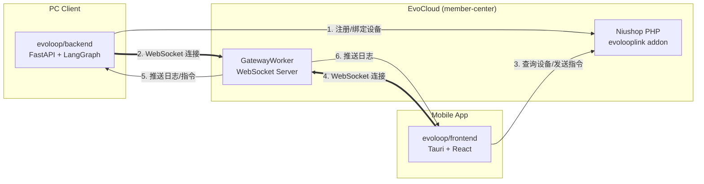
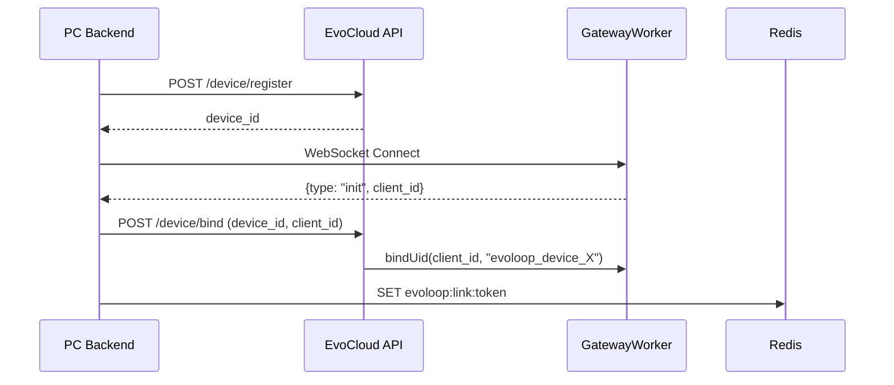
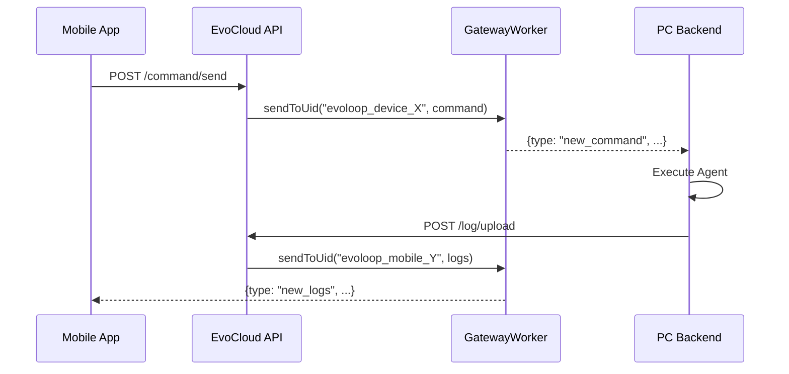
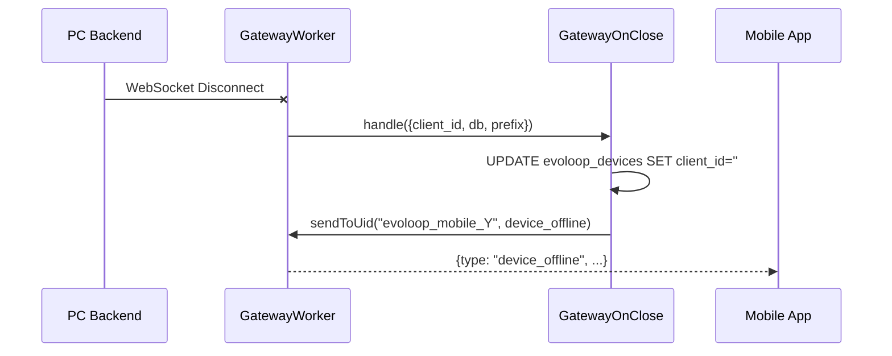

# EvoLoop 系统架构报告

本报告梳理 `evoloop/backend` (PC Client Backend) → `member-center` (EvoCloud) → Mobile App 完整链路。

---

## 系统概览



---

## 核心组件

### 1. PC Client Backend (`evoloop/backend`)

| 文件 | 说明 |
|------|------|
| [main.py](file:///Users/huangjinhuan/项目/develop-assistant.cn/evoloop/backend/app/main.py) | FastAPI 入口，Lifespan 内尝试从 Redis 恢复 Token 自动连接 |
| `infrastructure/external/` | ImagicBox 客户端，负责登录认证 |
| `core/callbacks/evoloop_logger.py` | LangGraph 回调，将 Agent 执行日志上传云端 |

**连接流程**:
1. 用户登录时调用 `/login/access-token`
2. 成功后初始化 WebSocket 连接至 EvoCloud
3. Token 保存到 Redis (`evoloop:link:token`)，支持重启恢复
4. Logout 时断开连接并清除 Redis Token

---

### 2. EvoCloud (`member-center/backend`)

#### 2.1 evolooplink 插件结构

```
addon/evolooplink/
├── api/controller/
│   ├── Device.php    # 设备注册、绑定、心跳
│   ├── Command.php   # 指令发送、状态更新
│   └── Log.php       # 日志上传、查询、推送
├── event/
│   └── GatewayOnClose.php  # 设备离线处理
└── model/
    ├── Device.php
    ├── Command.php
    └── Log.php
```

#### 2.2 API 端点汇总

| 端点 | 方法 | 调用方 | 说明 |
|------|------|--------|------|
| `/evolooplink/api/device/register` | POST | PC | 注册设备到云端 |
| `/evolooplink/api/device/bind` | POST | PC | 绑定 client_id 到 device_id |
| `/evolooplink/api/device/bindMobile` | POST | Mobile | 绑定手机 client_id 到用户 |
| `/evolooplink/api/device/list` | GET | Mobile | 获取用户设备列表 |
| `/evolooplink/api/device/heartbeat` | POST | PC | 心跳保活 |
| `/evolooplink/api/command/send` | POST | Mobile | 向设备发送指令 |
| `/evolooplink/api/command/pending` | GET | PC | 轮询待执行指令(备用) |
| `/evolooplink/api/command/updateStatus` | POST | PC | 更新指令执行状态 |
| `/evolooplink/api/log/upload` | POST | PC | 上传执行日志 |
| `/evolooplink/api/log/list` | GET | Mobile | 查询 thread 日志 |
| `/evolooplink/api/log/recent` | GET | Mobile | 获取最近日志 |

#### 2.3 GatewayWorker 事件

[Events.php](file:///Users/huangjinhuan/项目/develop-assistant.cn/member-center/backend/app/gateway/service/Events.php) 扩展了插件 Hook:

```php
// onClose 方法中扫描 addon/*/event/GatewayOnClose.php
$instance->handle([
    'client_id' => $client_id,
    'db' => self::$db,
    'prefix' => self::$prefix
]);
```

[GatewayOnClose.php](file:///Users/huangjinhuan/项目/develop-assistant.cn/member-center/backend/addon/evolooplink/event/GatewayOnClose.php) 处理设备离线:
- 清空设备的 `client_id`
- 通过 `Gateway::sendToUid()` 通知手机端

---

### 3. Mobile App (`evoloop/frontend`)

#### 3.1 WebSocket Hook

[useEvoLoopWebSocket.ts](file:///Users/huangjinhuan/项目/develop-assistant.cn/evoloop/frontend/src/hooks/useEvoLoopWebSocket.ts):

```typescript
// 接收 init 消息后绑定
if (data.type === "init") {
    await DevicesService.bindClient({ deviceId, requestBody: { client_id: clientId } })
}

// 处理 new_logs 批量推送
if (data.type === "new_logs") {
    setMessages(prev => [...prev, ...newMsgs])
}
```

---

## 关键数据流

### Flow 1: PC 设备上线



### Flow 2: 手机发送指令



### Flow 3: 设备离线



---

## 当前状态与问题

### ✅ 已实现

| 功能 | 状态 |
|------|------|
| PC 设备注册与绑定 | ✅ |
| WebSocket 实时通信 | ✅ |
| 指令下发与执行 | ✅ |
| 日志上传与推送 | ✅ |
| 设备离线检测 | ✅ |
| Token Redis 持久化 | ✅ |
| 重启自动恢复连接 | ✅ |
| Logout 断开并清理 | ✅ |

### ⚠️ 潜在问题

| 问题 | 说明 | 建议 |
|------|------|------|
| WebSocket 频繁断开 | Nginx `proxy_read_timeout` 默认 60s | 增大超时或添加 WS Ping/Pong |
| 日志 site_id 过滤 | searchLogs 全局搜索可能跨租户 | 在 Model 中强制 site_id 条件 |
| Token 过期未处理 | Redis Token 无 TTL | 设置 Token 过期时间 |

---

## 目录结构对照

| 层级 | 路径 | 说明 |
|------|------|------|
| PC Backend | `evoloop/backend/app/` | FastAPI + LangGraph Agent |
| EvoCloud | `member-center/backend/addon/evolooplink/` | PHP 插件 |
| Gateway | `member-center/backend/app/gateway/` | Workerman WebSocket |
| Mobile | `evoloop/frontend/src/` | Tauri + React |

---

## 总结

EvoLoop 系统采用三层架构:
1. **PC Backend**: 运行 AI Agent，通过 WebSocket 接收指令并上报日志
2. **EvoCloud**: 中转层，管理设备、指令、日志，提供 WebSocket Gateway
3. **Mobile App**: 用户界面，发送指令并实时查看执行日志

当前链路基本完整，主要需关注 WebSocket 稳定性和 Token 过期处理。
