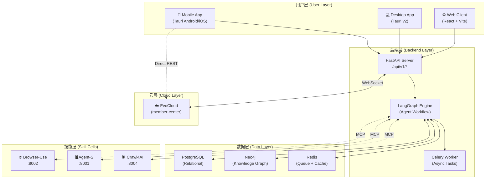
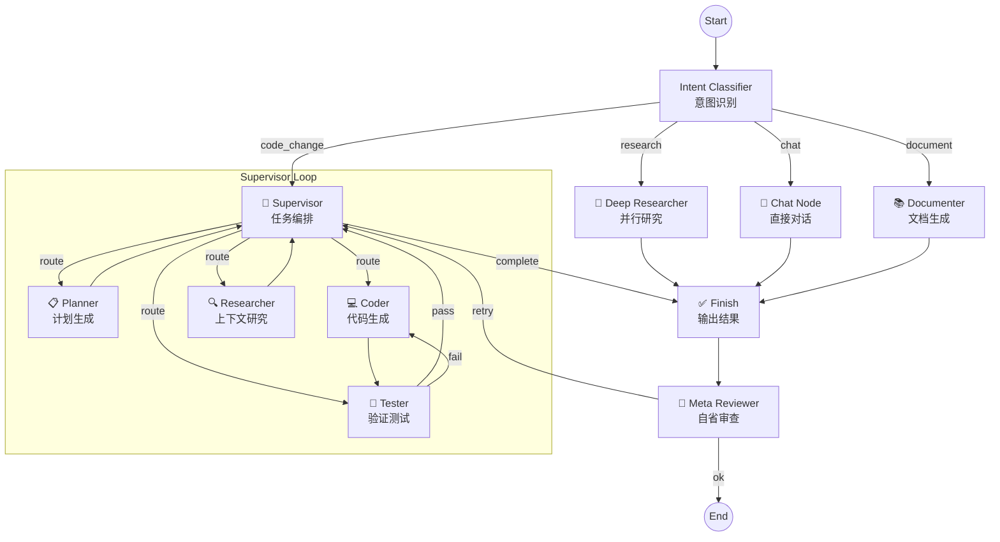
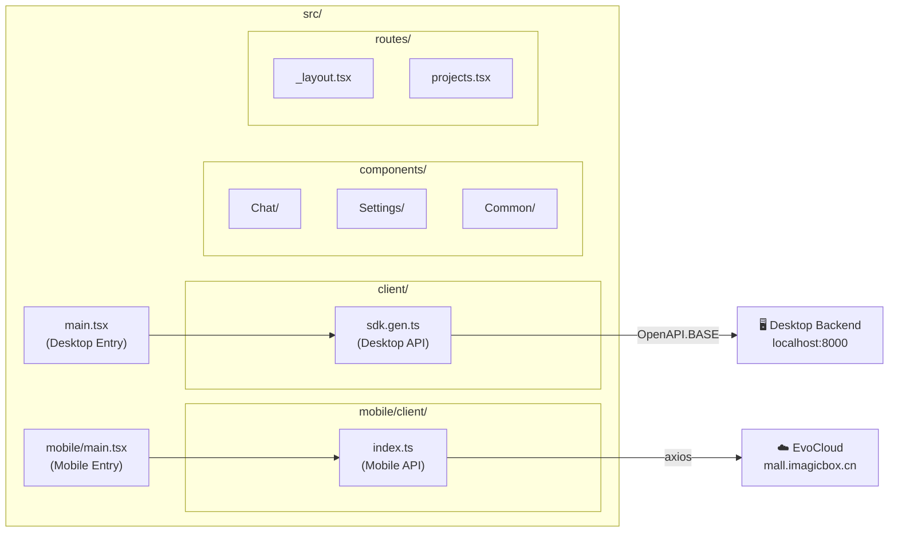
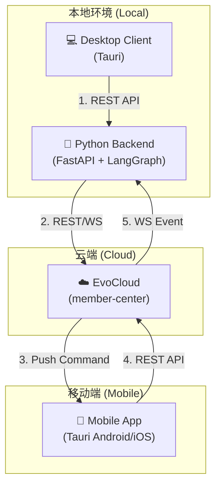
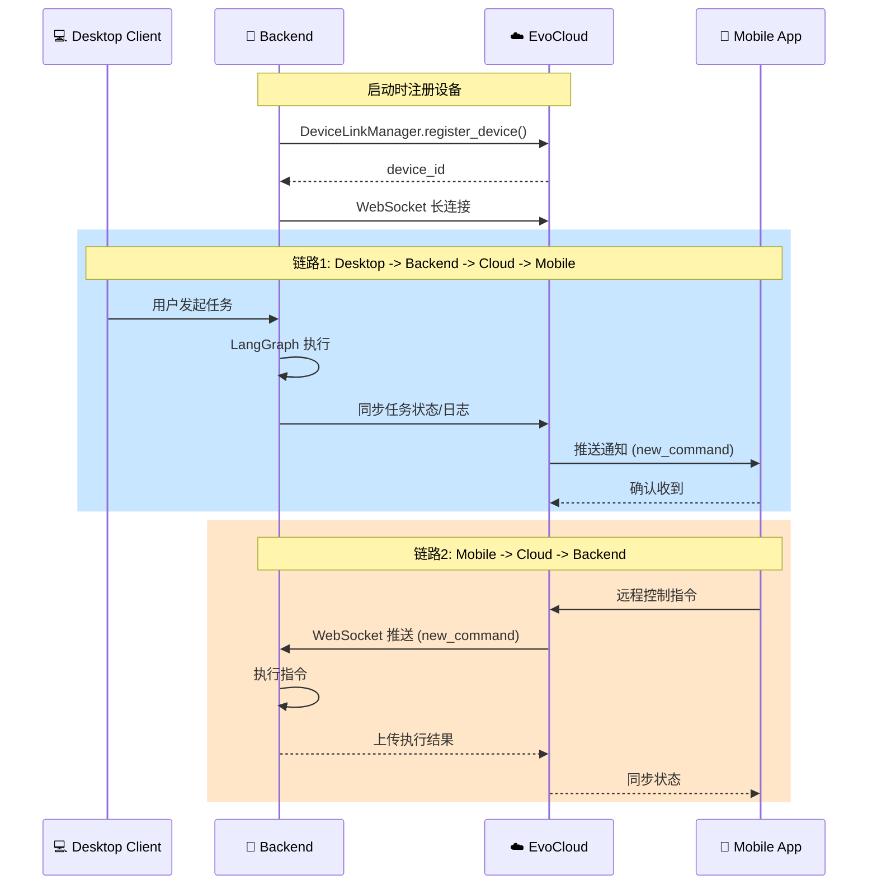
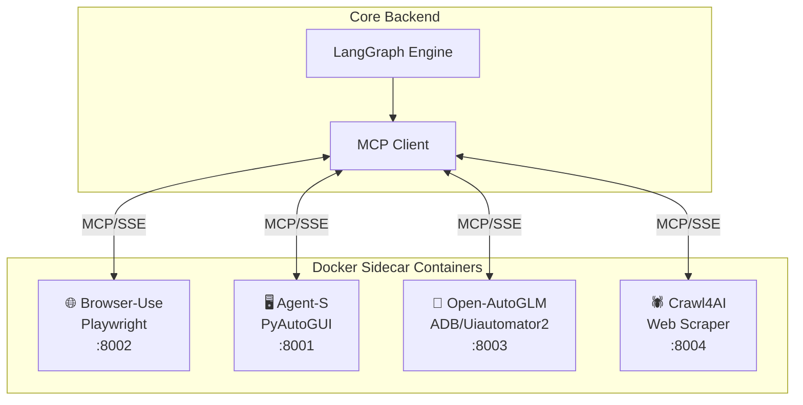
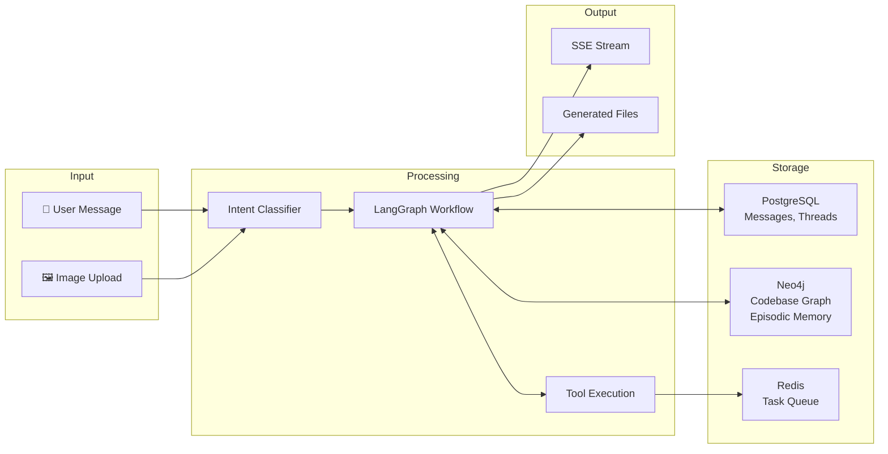
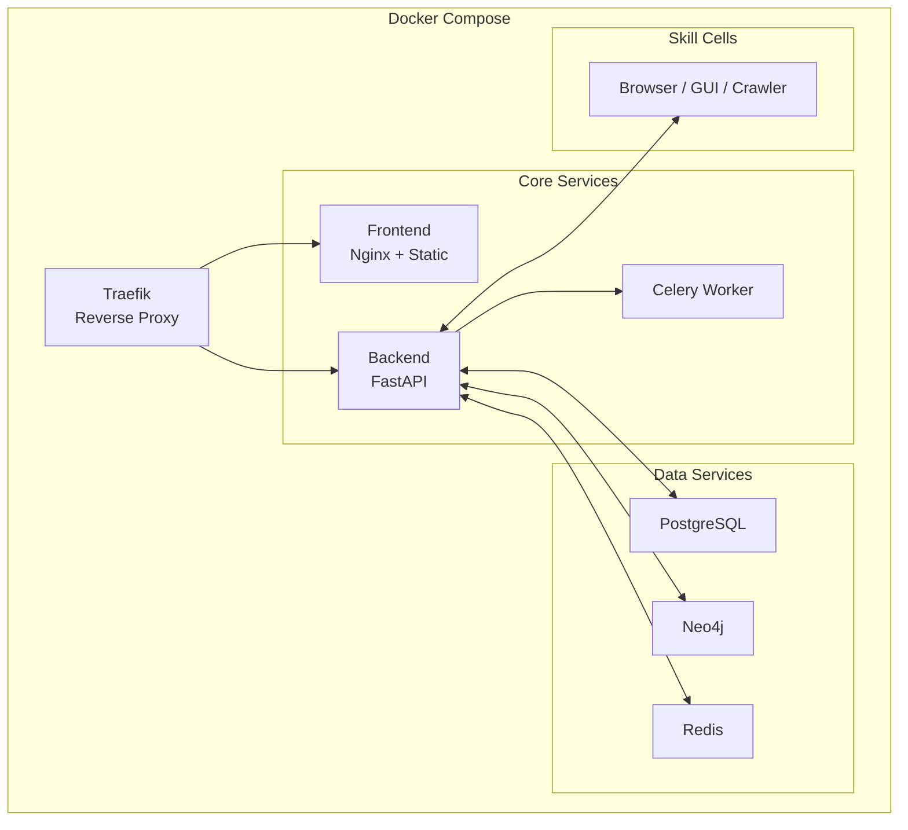

# EvoLoop 系统架构分析报告

> **文档版本**: 2026.01.13  
> **分析范围**: `/evoloop` 完整代码库

---

## 1. 系统总览 (System Overview)

EvoLoop 是一个**通用智能体系统 (Universal Agent System)**，采用 **LangGraph** 构建，实现跨平台（Web、桌面、移动端）的自主任务编排与执行。

---

## 2. 后端架构 (Backend Architecture)

### 2.1 目录结构

| 目录 | 职责 |
| :--- | :--- |
| `app/api/` | REST API 路由 (FastAPI) |
| `app/core/` | 核心引擎 (LangGraph, LLM, Memory, Tools) |
| `app/domain/` | 业务领域 (Codebase, Planning, Research, Tools) |
| `app/infrastructure/` | 基础设施 (Database, EvoCloud, MCP, LSP) |
| `app/models/` | SQLAlchemy ORM 模型 |

### 2.2 Agent 工作流 (LangGraph Workflow)

### 2.3 核心节点 (Workflow Nodes)

| 节点 | 文件 | 职责 |
| :--- | :--- | :--- |
| `Supervisor` | [supervisor.py](file:///Users/huangjinhuan/项目/develop-assistant.cn/evoloop/backend/app/core/engine/nodes/supervisor.py) | 任务路由与编排 |
| `Coder` | [coder.py](file:///Users/huangjinhuan/项目/develop-assistant.cn/evoloop/backend/app/core/engine/nodes/coder.py) | 代码生成与修改 |
| `Tester` | [tester.py](file:///Users/huangjinhuan/项目/develop-assistant.cn/evoloop/backend/app/core/engine/nodes/tester.py) | 测试执行与验证 |
| `Planner` | [planner.py](file:///Users/huangjinhuan/项目/develop-assistant.cn/evoloop/backend/app/core/engine/nodes/planner.py) | 任务规划与分解 |
| `Deep Researcher` | [deep_researcher.py](file:///Users/huangjinhuan/项目/develop-assistant.cn/evoloop/backend/app/core/engine/nodes/deep_researcher.py) | 并行深度研究 |
| `Documenter` | [documenter.py](file:///Users/huangjinhuan/项目/develop-assistant.cn/evoloop/backend/app/core/engine/nodes/documenter.py) | Wiki/文档生成 |
| `Meta Reviewer` | [meta_reviewer.py](file:///Users/huangjinhuan/项目/develop-assistant.cn/evoloop/backend/app/core/engine/nodes/meta_reviewer.py) | 自省与破局建议 |
| `System Scanner` | [system_scanner.py](file:///Users/huangjinhuan/项目/develop-assistant.cn/evoloop/backend/app/core/engine/nodes/system_scanner.py) | 系统健康监控与自我进化 |

---

## 3. 前端架构 (Frontend Architecture)

### 3.1 技术栈

| 技术 | 版本 | 用途 |
| :--- | :--- | :--- |
| React | 19 | UI 框架 |
| Vite | 7 | 构建工具 |
| TanStack Router | - | 路由管理 |
| TanStack Query | - | 数据获取 |
| Shadcn/UI | - | 组件库 |
| TailwindCSS | 4 | 样式系统 |
| Tauri | 2 | 原生封装 |

### 3.2 目录结构

### 3.3 双入口架构

| 入口 | 文件 | API 目标 |
| :--- | :--- | :--- |
| Desktop | [main.tsx](file:///Users/huangjinhuan/项目/develop-assistant.cn/evoloop/frontend/src/main.tsx) | Local Python Backend |
| Mobile | [mobile/main.tsx](file:///Users/huangjinhuan/项目/develop-assistant.cn/evoloop/frontend/src/mobile/main.tsx) | EvoCloud (ThinkPHP) |

---

## 4. 云端集成 (Cloud Integration)

### 4.1 通讯链路总览

EvoCloud 作为**中央枢纽**，连接桌面端 Agent 和移动端 App：

### 4.2 详细通讯时序

### 4.3 关键组件

| 组件 | 路径 | 职责 |
| :--- | :--- | :--- |
| `EvoCloudAPI` | [evocloud/api.py](file:///Users/huangjinhuan/项目/develop-assistant.cn/evoloop/backend/app/infrastructure/external/evocloud/api.py) | REST 请求封装 (项目/任务/设备) |
| `DeviceLinkManager` | [evocloud/device_link.py](file:///Users/huangjinhuan/项目/develop-assistant.cn/evoloop/backend/app/infrastructure/external/evocloud/device_link.py) | WebSocket 长连接管理 |
| `MobileAuthService` | [mobile/client/index.ts](file:///Users/huangjinhuan/项目/develop-assistant.cn/evoloop/frontend/src/mobile/client/index.ts) | 移动端直连 EvoCloud API |

### 4.4 WebSocket 事件类型

| 事件 | 方向 | 描述 |
| :--- | :--- | :--- |
| `init` | Cloud → Backend | 连接初始化，返回 client_id |
| `new_command` | Cloud → Backend | 移动端下发的远程指令 |
| `project_switch` | Cloud → Backend | 移动端切换关联项目 |

---

## 5. 微技能架构 (Micro-Skills / Skill Cells)

### 优势

- **隔离性**: 技能崩溃不影响核心服务
- **可扩展**: 新技能只需实现 MCP 接口
- **热插拔**: 运行时动态加载/卸载

---

## 6. 数据流 (Data Flow)

---

## 7. 部署架构 (Deployment)

---

## 8. 技术总结

| 层级 | 技术选型 | 说明 |
| :--- | :--- | :--- |
| **Agent 引擎** | LangGraph + LangChain | 状态图驱动的多节点工作流 |
| **后端框架** | FastAPI | 高性能异步 REST API |
| **前端框架** | React 19 + Vite 7 | 现代 SPA 架构 |
| **原生封装** | Tauri v2 | Rust + WebView 跨平台 |
| **关系数据库** | PostgreSQL | 用户、消息、配置持久化 |
| **图数据库** | Neo4j | 代码语义索引、情节记忆 |
| **消息队列** | Redis + Celery | 异步任务处理 |
| **云集成** | EvoCloud (ThinkPHP) | 项目管理、远程控制 |
| **技能隔离** | Docker + MCP | 微服务化能力扩展 |
