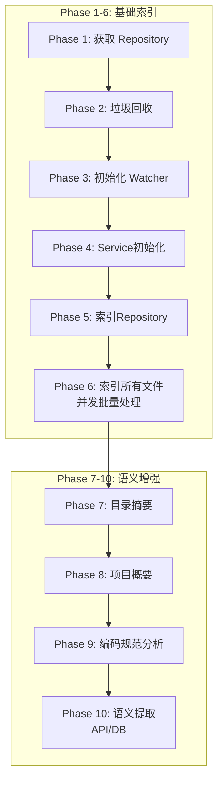
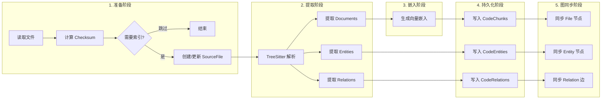

# 索引系统架构文档

## 概述

索引系统是 EvoLoop 的核心模块，负责代码库的解析、向量化、存储和图谱构建。位于 `app/domain/codebase/indexing`。

---

## 目录结构

```
indexing/
├── manager.py              # 入口：编排器，管理 Watcher + 触发索引
├── service.py              # 核心：单文件索引逻辑（并发优化）
├── tasks.py                # Celery 异步任务定义
├── base.py                 # 基础类定义
├── parsers.py              # Tree-sitter 语言解析器注册
├── queries.py              # Tree-sitter 查询语句（Legacy）
├── classifier.py           # 项目类型分类器
├── standards.py            # 项目编码规范分析
├── directory_summarizer.py # 目录摘要生成
├── garbage_collector.py    # 过期数据清理
├── tools.py                # 工具函数
│
├── components/             # 组件化拆分
│   ├── file_preparer.py    # 文件过滤、读取、校验
│   ├── content_indexer.py  # 代码提取、向量嵌入
│   ├── sql_persister.py    # SQL 持久化
│   └── graph_syncer.py     # Neo4j 图同步
│
├── extractors/             # 代码提取器
│   ├── treesitter_extractor.py  # 通用 Tree-sitter 提取
│   ├── api_extractor.py         # API 端点提取
│   ├── db_extractor.py          # 数据库模型提取
│   ├── provider_registry.py     # Provider 单例注册
│   ├── sem_provider.py          # 语义 Provider 基类
│   ├── python_provider.py       # Python 语言 Provider
│   ├── ts_js_provider.py        # TypeScript/JS Provider
│   ├── java_provider.py         # Java Provider
│   ├── go_provider.py           # Go Provider
│   └── csharp_provider.py       # C# Provider
│
└── vectors/                # 向量嵌入
    ├── factory.py          # Embedder 工厂
    ├── openai_embedder.py  # OpenAI 兼容嵌入
    └── ollama_embedder.py  # Ollama 本地嵌入
```

---

## 核心组件

### 1. IndexingManager（编排层）

**文件**: `manager.py`

**职责**:
- 管理文件系统 Watcher
- 编排完整索引流程（10 个 Phase）
- 分发 Celery 任务

**关键方法**:
| 方法 | 职责 |
|------|------|
| `trigger_full_index()` | 触发完整索引流程 |
| `dispatch_full_index()` | 分发到 Celery |
| `start_watching()` | 启动文件监控 |
| `_run_semantic_extraction()` | 运行语义提取（API/DB） |

---

### 2. IndexingService（执行层）

**文件**: `service.py`

**职责**:
- 单文件索引执行
- 并发批量索引（`asyncio.gather`）
- Repository 管理

**关键方法**:
| 方法 | 职责 |
|------|------|
| `index_file()` | 索引单个文件（320 行） |
| `index_repository()` | 并发索引整个仓库 |
| `remove_file()` | 删除文件索引 |
| `move_file()` | 处理文件移动 |

---

### 3. Components（组件层）

| 组件 | 文件 | 职责 |
|------|------|------|
| **FilePreparer** | `file_preparer.py` | 文件过滤、读取、checksum 校验 |
| **ContentIndexer** | `content_indexer.py` | Tree-sitter 提取、向量嵌入 |
| **SQLPersister** | `sql_persister.py` | CodeChunk/Entity/Relation 持久化 |
| **GraphSyncer** | `graph_syncer.py` | Neo4j 节点/边同步 |

---

### 4. Extractors（提取层）

#### TreeSitterExtractor

**核心提取器**，解析代码结构：
- 函数、类、方法
- Imports
- 变量、常量

#### SemanticProviders

**语言特定 Provider**，提供 Tree-sitter 查询：

| Provider | 语言 | 查询类型 |
|----------|------|----------|
| PythonProvider | .py | API、DB、结构、导入 |
| TSJSProvider | .ts/.js | API、结构、导入 |
| JavaProvider | .java | API、结构、导入 |
| GoProvider | .go | API、结构、导入 |
| CSharpProvider | .cs | API、结构、导入 |
| **PHPProvider** | .php | Laravel/Symfony API、结构、导入 |
| **RubyProvider** | .rb | Rails API、结构、导入 |
| **RustProvider** | .rs | Actix/Rocket API、结构、导入 |
| **KotlinProvider** | .kt | Spring/Ktor API、结构、导入 |
| **SwiftProvider** | .swift | Vapor API、结构、导入 |
| **SQLProvider** | .sql | DDL 结构、DB 提取 |
| **VueProvider** | .vue | SFC 组件结构 |

#### 专用提取器

| 提取器 | 职责 |
|--------|------|
| **APIExtractor** | 提取 REST/GraphQL 端点 |
| **DBExtractor** | 提取 ORM 模型/数据库表 |

---

### 5. Vectors（嵌入层）

| 组件 | 职责 |
|------|------|
| **EmbedderFactory** | 根据配置创建嵌入器 |
| **GenericOpenAIEmbedder** | OpenAI 兼容 API 嵌入 |
| **OllamaEmbedder** | 本地 Ollama 嵌入 |

---

## 索引流程（10 Phase）



### Phase 详解

| Phase | 组件 | 职责 |
|-------|------|------|
| **1** | Manager | 查询 Repository 记录 |
| **2** | GarbageCollector | 清理已删除文件的索引 |
| **3** | RepoWatcher | 启动文件系统监控 |
| **4** | IndexingService | 初始化服务实例 |
| **5-6** | IndexingService | 遍历并索引所有文件（并发） |
| **7** | DirectorySummarizer | 生成目录结构摘要 |
| **8** | ProjectSummarizer | 生成项目概要 |
| **9** | StandardsAnalyst | 分析编码规范 |
| **10** | APIExtractor/DBExtractor | 提取 API 和 DB 模型 |

---

## 单文件索引流程



---

## 数据存储

### PostgreSQL

| 表 | 职责 |
|----|------|
| `repositories` | 仓库元信息 |
| `source_files` | 文件记录（path, checksum） |
| `code_chunks` | 代码块（含向量嵌入） |
| `code_entities` | 代码实体（类、函数） |
| `code_relations` | 实体关系（调用、继承） |

### Neo4j

| 节点 | 职责 |
|------|------|
| `File` | 文件节点 |
| `Directory` | 目录节点 |
| `CodeEntity` | 代码实体节点 |
| `Concept` | 语义概念节点 |
| `API` | API 端点节点 |
| `DBTable` | 数据库表节点 |

| 关系 | 职责 |
|------|------|
| `CONTAINS` | File → Entity |
| `RELATION` | Entity → Entity |
| `HAS_API` | File → API |
| `USES_TABLE` | Entity → DBTable |

---

## 并发优化

### 配置

```python
# service.py:546
CONCURRENT_FILES = 30  # 每批并发数

# database.py
pool_size = 50
max_overflow = 100
```

### 实现

```python
for i in range(0, total_files, CONCURRENT_FILES):
    batch = filtered_files[i:i+CONCURRENT_FILES]
    tasks = [self.index_file(f, repo_id) for f in batch]
    await asyncio.gather(*tasks, return_exceptions=True)
```

---

## 相关脚本

| 脚本 | 位置 | 职责 |
|------|------|------|
| `reset_kb.py` | scripts/ | 清除知识库 |
| `reindex_all.py` | scripts/ | 重建所有索引 |
| `reset_and_rebuild.py` | scripts/ | 清除并重建（统一） |

---

## 调用入口

1. **API 触发**: `POST /api/v1/projects/{id}/index`
2. **Celery 任务**: `run_full_indexing.delay(project_id)`
3. **脚本**: `python scripts/reset_and_rebuild.py`
4. **Watcher**: 文件变更自动触发

---

## 配置项

| 配置 | 位置 | 说明 |
|------|------|------|
| `CONCURRENT_FILES` | service.py | 并发文件数 |
| `pool_size` | database.py | 数据库连接池 |
| Embedding 模型 | config.py | 向量嵌入服务 |
