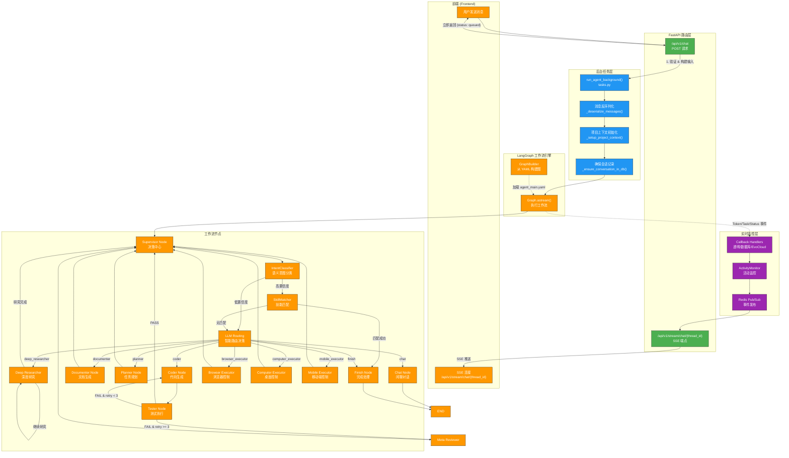
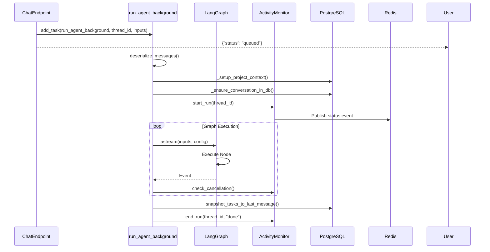
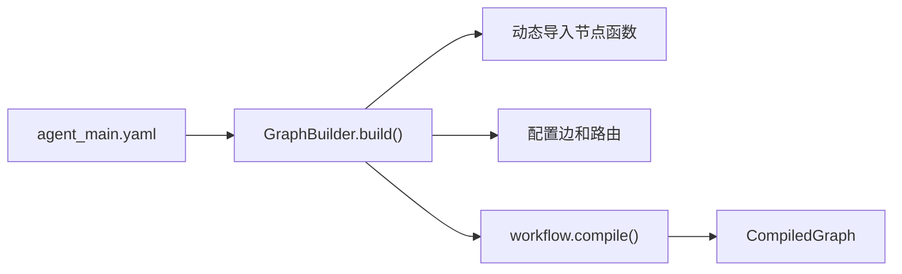
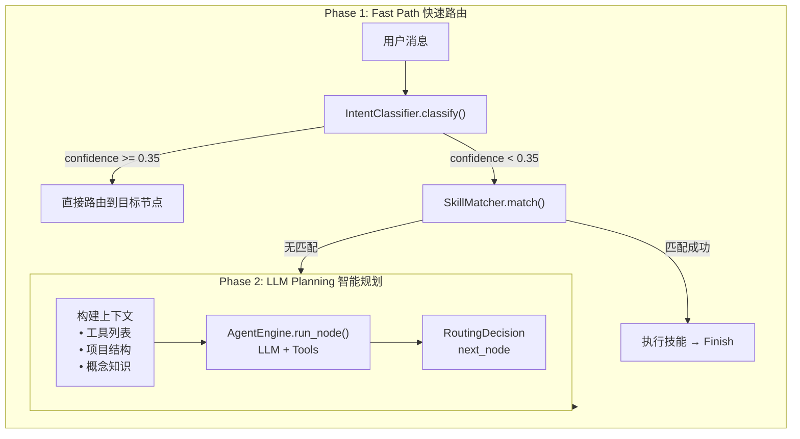
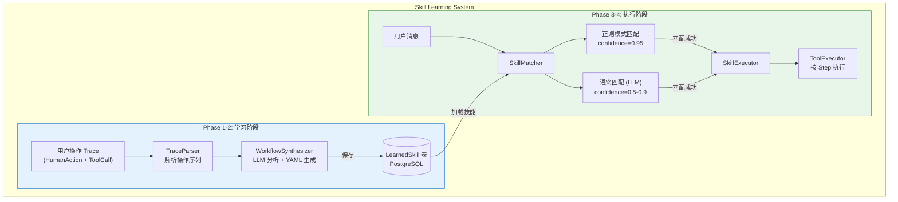
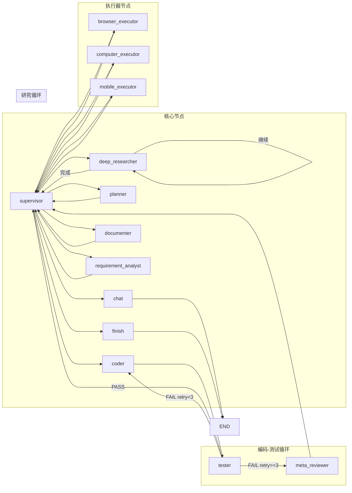
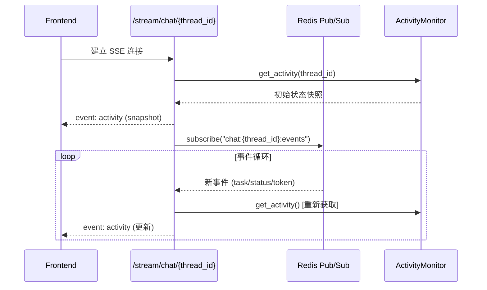
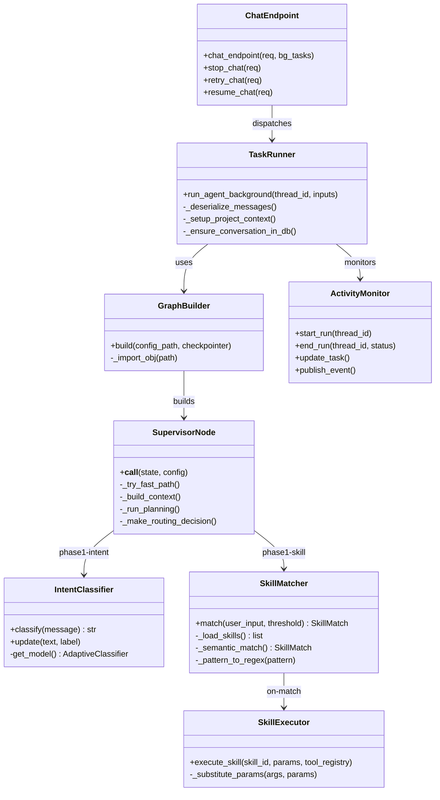

# EvoLoop `/chat` 接口流程分析

## 概述

`/chat` 接口是 EvoLoop Agent 系统的核心入口，负责接收用户消息并触发 AI Agent 工作流执行。整个流程采用 **异步后台任务 + SSE 实时推送** 的架构模式。

---

## 整体架构流程图



---

## 详细流程说明

### 1. API 入口层

#### `/api/v1/chat` (POST)
**文件**: [agent.py](file:///Users/huangjinhuan/项目/develop-assistant.cn/evoloop/backend/app/api/routes/agent.py#L36-126)

```python
@router.post("/chat", dependencies=[Depends(verify_guest_access)])
async def chat_endpoint(req: ChatRequest, bg_tasks: BackgroundTasks, ...):
```

**核心逻辑**:
1. **请求验证**: 通过 `verify_guest_access` 依赖验证访问权限
2. **消息构建**: 支持纯文本和多模态 (图片+文本) 消息
3. **状态初始化**: 调用 `activity_monitor.start_run()` 启动监控
4. **会话持久化**: 在 PostgreSQL 中创建/更新 Conversation 和 Message 记录
5. **后台调度**: 通过 `BackgroundTasks.add_task()` 异步执行 Agent

---

### 2. 后台任务层

#### `run_agent_background()`
**文件**: [tasks.py](file:///Users/huangjinhuan/项目/develop-assistant.cn/evoloop/backend/app/core/engine/tasks.py#L88-188)



**关键步骤**:
- **消息反序列化**: 将 dict 格式转换为 `HumanMessage` 对象
- **上下文设置**: 获取项目路径、设置 `contextvars` 变量
- **回调注册**: 注册 `TransparentCallbackHandler`, `DatabaseCallbackHandler`, `EvoLoopCallbackHandler`
- **内存注入**: 获取用户偏好和项目概念作为 Agent 上下文

---

### 3. LangGraph 工作流引擎

#### GraphBuilder
**文件**: [graph_builder.py](file:///Users/huangjinhuan/项目/develop-assistant.cn/evoloop/backend/app/core/engine/graph_builder.py)

从 YAML 配置文件动态构建 LangGraph `StateGraph`:



#### AgentState
**文件**: [state.py](file:///Users/huangjinhuan/项目/develop-assistant.cn/evoloop/backend/app/core/engine/state.py)

```python
class AgentState(TypedDict):
    messages: Annotated[list[BaseMessage], add_messages]  # 对话历史
    project_id: int | None                                 # 项目 ID
    current_plan: str | None                               # 当前计划
    next_node: Annotated[str | None, lambda a, b: b]       # 下一节点
    hitl_state: HITLState | None                           # Human-in-the-Loop 状态
    scratchpad: Annotated[dict[str, Any], operator.ior]    # 临时存储
    # ... 更多状态字段
```

---

### 4. Supervisor 决策中心

**文件**: [supervisor.py](file:///Users/huangjinhuan/项目/develop-assistant.cn/evoloop/backend/app/core/engine/nodes/supervisor.py)

Supervisor 是整个 Agent 系统的 **中央调度器**，采用 **两阶段路由策略**:



#### IntentClassifier 意图分类
**文件**: [intent_classifier.py](file:///Users/huangjinhuan/项目/develop-assistant.cn/evoloop/backend/app/core/engine/intent_classifier.py)

使用 `adaptive-classifier` 进行语义相似度匹配:
- 支持中英文双语
- 预置训练样本覆盖: chat, coder, documenter, deep_researcher, planner 等
- 置信度阈值可配置 (`INTENT_MIN_CONFIDENCE`)

#### Skill Learning System (模仿学习系统)

Skill 系统是 EvoLoop 的 **模仿学习核心**，位于 Supervisor 快速路由的第二阶段。它允许系统从用户操作中学习可复用的技能，并在未来自动执行。

**核心文件**:
- [skill_executor.py](file:///Users/huangjinhuan/项目/develop-assistant.cn/evoloop/backend/app/core/learning/skill_executor.py) - SkillMatcher + SkillExecutor
- [skill_synthesizer.py](file:///Users/huangjinhuan/项目/develop-assistant.cn/evoloop/backend/app/core/learning/skill_synthesizer.py) - 从 Trace 合成 Skill



##### SkillMatcher - 技能匹配器

**匹配策略** (双层匹配):

| 层级 | 方法 | 置信度 | 说明 |
|------|------|--------|------|
| 1 | 正则模式匹配 | 0.95 | `trigger_patterns` 转正则，精确匹配 |
| 2 | LLM 语义匹配 | 0.5-0.9 | 无正则匹配时回退到 LLM 理解 |

**触发条件**:
- `confidence >= threshold` (默认 0.7)
- `state.skill_execution_attempted == False` (防止重复执行)

##### SkillExecutor - 技能执行器

**执行流程**:
1. 从数据库加载 `LearnedSkill`
2. 解析 `steps` JSON 数组
3. 逐步执行，支持:
   - **参数替换**: `{{param}}` → 实际值
   - **结果传递**: `{{result}}` → 上一步输出
   - **条件执行**: `condition: "if previous step succeeded"`
4. 更新 `success_count` / `failure_count` 统计

##### LearnedSkill 数据结构

```yaml
name: git_commit_and_push
description: 提交代码并推送到远程仓库
trigger_patterns:
  - "帮我提交 {message}"
  - "commit and push {message}"
parameters:
  - name: message
    type: string
    description: 提交信息
steps:
  - action: manage_file
    args:
      action: shell
      command: "git add ."
  - action: manage_file
    args:
      action: shell
      command: "git commit -m '{{message}}'"
  - action: manage_file
    args:
      action: shell
      command: "git push"
    condition: "if previous step succeeded"
```

---

### 5. 工作流节点配置

**文件**: [agent_main.yaml](file:///Users/huangjinhuan/项目/develop-assistant.cn/evoloop/backend/app/core/engine/config/agent_main.yaml)



---

### 6. 路由器函数

**文件**: [routers.py](file:///Users/huangjinhuan/项目/develop-assistant.cn/evoloop/backend/app/core/engine/routers.py)

| 路由器 | 用途 | 逻辑 |
|--------|------|------|
| `route_supervisor` | Supervisor 出口路由 | 支持 `map_research` 并行派发 |
| `route_tester` | Tester 出口路由 | 根据测试结果和重试次数决定流向 |
| `route_by_next_node_field` | 通用路由 | 直接返回 `state["next_node"]` |
| `make_expression_router` | 表达式路由工厂 | 支持 YAML 中定义的条件表达式 |

---

### 7. 实时通信层

#### SSE 推送端点
**文件**: [stream.py](file:///Users/huangjinhuan/项目/develop-assistant.cn/evoloop/backend/app/api/routes/stream.py)



**事件类型**:
- `activity`: 完整状态快照 (tasks, artifacts, agent_state, verification)
- `token`: LLM 生成的 Token 流
- `status`: 运行状态变更 (running, done, failed, cancelled)
- `human_request`: Human-in-the-Loop 请求
- `error`: 错误信息

---

## 关键组件依赖关系



---

## 总结

EvoLoop 的 `/chat` 接口采用了高度模块化的架构:

1. **异步非阻塞**: 请求立即返回，后台任务执行
2. **实时推送**: Redis Pub/Sub + SSE 实现低延迟更新
3. **智能路由**: 三层路由策略平衡速度与准确性
   - Layer 1: IntentClassifier 语义分类 (毫秒级)
   - Layer 2: SkillMatcher 技能匹配 (可复用已学习技能)
   - Layer 3: LLM 智能规划 (复杂任务)
4. **模仿学习**: Skill 系统支持从用户操作中学习并自动复现
5. **可扩展节点**: YAML 配置驱动，支持动态添加新节点
6. **Human-in-the-Loop**: 内置中断机制支持人机协作

